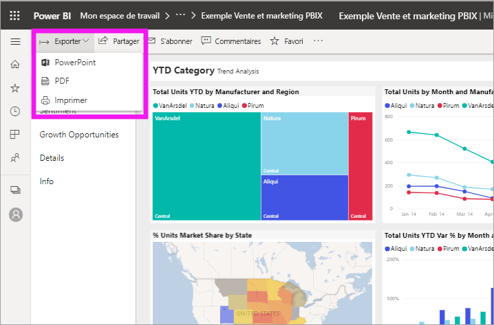
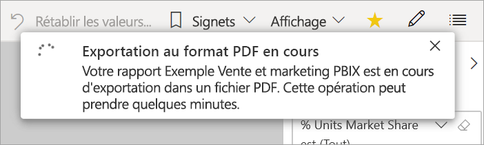
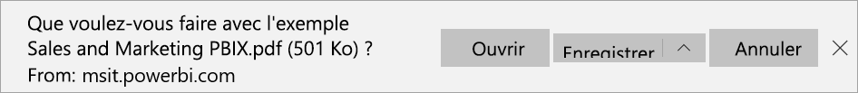

# Exporter des rapports Power BI au format PDF

[!INCLUDE[consumer-appliesto-yyny](../includes/consumer-appliesto-yyny.md)]

[!INCLUDE [power-bi-service-new-look-include](../includes/power-bi-service-new-look-include.md)]

Power BI vous permet de publier votre rapport au format PDF et de créer facilement un document basé sur votre rapport Power BI. Quand vous exportez au format PDF, chaque page du rapport Power BI devient une page individuelle du document PDF.

## Exporter votre rapport Power BI au format PDF
Dans le service Power BI, sélectionnez un rapport pour l’afficher dans le canevas. Vous pouvez également sélectionner un rapport dans votre **page d’accueil**, **vos applications** ou tout autre conteneur du volet de navigation.

1. Dans la barre de menus, sélectionnez **Exporter** > **PDF**.

    

    Une fenêtre contextuelle s’affiche, dans laquelle vous pouvez sélectionner l’option **Valeurs actuelles** ou **Valeurs par défaut**. L’option **Valeurs actuelles** exporte le rapport dans l’état actuel, qui inclut les modifications actives apportées aux valeurs de segment et de filtre. La plupart des utilisateurs choisissent cette option. Vous pouvez aussi sélectionner l’option **Valeurs par défaut**, qui exporte le rapport dans son état d’origine, tel que le *concepteur* l’a partagé, sans refléter les modifications que vous avez apportées à cet état d’origine.
    
    En outre, la fenêtre contient une case à cocher qui vous permet de spécifier si les onglets masqués d’un rapport doivent ou non être exportés. Cochez cette case si vous voulez exporter seulement les onglets du rapport qui sont visibles dans votre navigateur. Laissez-la décochée si vous préférez inclure tous les onglets masqués dans l’exportation. Si la case à cocher est grisée, cela indique que le rapport ne contient pas d’onglets masqués. Une fois que vous avez effectué vos sélections, sélectionnez **Exporter** pour continuer.
    
    Une barre de progression s’affiche en haut à droite. L’exportation peut prendre quelques minutes. Pendant ce temps, vous pouvez continuer à travailler dans Power BI.

    

    Une fois que le service Power BI a terminé le processus d’exportation, la bannière de notification change pour vous en informer.

2. Votre fichier est ensuite disponible à l’endroit où votre navigateur affiche les fichiers téléchargés. Dans l’image suivante, il est affiché sous forme de bannière de téléchargement au bas de la fenêtre du navigateur.

    

C’est tout. Vous pouvez télécharger le fichier et l’ouvrir avec n’importe quelle visionneuse PDF, comme celle disponible dans Microsoft Edge.

## Considérations et limitations
Voici quelques considérations et limitations à prendre en compte quand vous utilisez la fonctionnalité **Exporter au format PDF**.

* Les éléments visuels R et Pyhton ne sont actuellement pas pris en charge. Dans le fichier PDF, ces visuels sont vides et affichent un message d’erreur. 
* Les visuels Power BI qui ont été certifiés sont pris en charge. Pour plus d’informations sur les visuels Power BI certifiés, notamment concernant la manière de certifier un visuel Power BI, consultez [Obtenir un visuel Power BI certifié](../developer/visuals/power-bi-custom-visuals-certified.md). Les visuels Power BI qui n’ont pas été certifiés ne sont pas pris en charge. Dans le fichier PDF, ils s’affichent avec un message d’erreur.
* L’élément visuel ESRI n'est pas pris en charge
* Les rapports contenant plus de 30 pages ne peuvent actuellement pas être exportés.
* Le processus d’exportation du rapport au format PDF peut prendre quelques minutes : soyez patient. Les facteurs qui peuvent affecter la durée d’exportation sont la structure du rapport et la charge actuelle sur le service Power BI.
* Si l’option de menu **Exporter au format PDF** n’est pas disponible dans le service Power BI, il est probable que l’administrateur de votre locataire ait désactivé la fonctionnalité. Pour plus d’informations, contactez l’administrateur du locataire.
* Les images en arrière-plan sont rognées en fonction du cadre englobant du graphique. Nous vous recommandons de supprimer les images en arrière-plan avant d’exporter au format PDF.
* Vous ne pouvez pas publier au format PDF un rapport qui appartient à un utilisateur externe à votre domaine de locataire Power BI, par exemple un rapport appartenant à une personne extérieure à votre organisation et partagé avec vous.
* Si vous partagez un tableau de bord avec une personne externe à votre organisation, et donc un utilisateur qui n’est pas dans votre locataire Power BI, cet utilisateur ne peut pas exporter les rapports associés du tableau de bord partagé au format PDF. Par exemple, si vous êtes aaron@contoso.com, vous pouvez partager avec cassie@cohowinery.com. cassie@cohowinery.com ne peut cependant pas exporter les rapports associés au format PDF.
* Quand vous exportez au format PDF avec des rapports qui contiennent une image d’arrière-plan, vous pouvez voir une image déformée dans l’exportation si vous utilisez les options **Normal** ou **Remplir** pour l’**arrière-plan de la page**. Pour de meilleurs résultats, il est recommandé d’utiliser l’option **Ajuster** afin d’éviter des problèmes avec votre document exporté.
* Le service Power BI utilise votre paramètre de langue Power BI pour l’exportation au format PDF. Pour afficher ou définir vos préférences de langue, sélectionnez l’icône représentant une roue dentée  > **Paramètres** > **Général** > **Langue**.
* Les filtres d’URL ne sont actuellement pas respectés quand vous choisissez **Valeurs actuelles** pour l’exportation.
* Les rapports avec des tailles de page personnalisées inhabituelles peuvent rencontrer des problèmes dans les scénarios d’exportation. Pour optimiser les résultats, donnez une taille de page standard à votre rapport.
* Lors de l’exportation au format PDF, la police personnalisée des thèmes utilisés dans les rapports est remplacée par une police par défaut.
* Si nous veillons à fournir une expérience cohérente, nous ne pouvons néanmoins pas garantir que le fichier PDF exporté depuis le service Power BI correspondra toujours au fichier PDF exporté à partir d’un fichier Power BI Desktop local.

## Étapes suivantes
[Imprimer un rapport](end-user-print.md)
