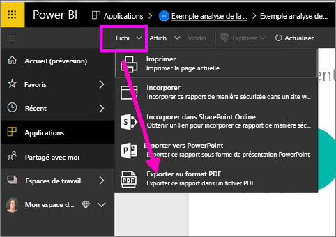
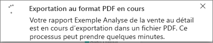
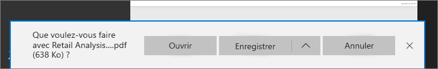

# Exporter des rapports Power BI au format PDF
Power BI vous permet de publier votre rapport au format PDF et de créer facilement un document basé sur votre rapport. Quand vous **exportez au format PDF**, chaque page du rapport Power BI devient une page individuelle du document PDF.

## Comment exporter votre rapport Power BI au format PDF
Dans le service Power BI, sélectionnez un rapport pour l’afficher dans le canevas. Vous pouvez également sélectionner un rapport dans votre page d’accueil, vos applications ou toute autre section du volet de navigation de gauche.

1. Sélectionnez **Fichier** > **Exporter au format PDF** dans la barre de menus.

    

    Une barre de progression s’affiche en haut à droite. L’exportation peut prendre quelques minutes. Pendant ce temps, vous pouvez continuer à travailler dans Power BI.

    

    Une fois que vous avez terminé, la bannière de notification change pour vous informer que le service Power BI a terminé le processus d’exportation.

2. Votre fichier est ensuite disponible à l’endroit où votre navigateur affiche les fichiers téléchargés. Dans l’image suivante, il est affiché sous forme de bannière de téléchargement au bas de la fenêtre du navigateur.

    

C’est tout. Vous pouvez télécharger le fichier et l’ouvrir avec n’importe quelle visionneuse PDF, comme celle disponible dans Microsoft Edge.

## Considérations et limitations
Voici quelques considérations et limitations à prendre en compte quand vous utilisez la fonctionnalité **Exporter au format PDF**.

- L’interactivité dans la session (mise en surbrillance, filtrage, exploration, etc.) n’est pas encore prise en charge lors de l’exportation au format PDF. Le fichier PDF exporté montre les visuels d’origine tels qu’ils ont été enregistrés dans le rapport. Si vous avez appliqué des filtres et des segments et que vous souhaitez les conserver dans l’exportation, enregistrez le rapport et procédez à l’exportation.

* Les **éléments visuels R** ne sont actuellement pas pris en charge. Dans le fichier PDF, ces visuels sont vides et affichent un message d’erreur.  

* Les **éléments visuels personnalisés** qui ont été **certifiés** sont pris en charge. Pour plus d’informations sur les éléments visuels personnalisés certifiés, notamment concernant la manière de certifier un élément visuel personnalisé, voir [Obtention d’un visuel personnalisé certifié](../power-bi-custom-visuals-certified.md). Les visuels personnalisés non certifiés ne sont pas pris en charge. Dans le fichier PDF, ils s’affichent avec un message d’erreur.   

* Les rapports contenant plus de 30 pages ne peuvent pas être exportés actuellement.

* Le processus d’exportation du rapport au format PDF peut prendre quelques minutes. Soyez patient. Les facteurs qui peuvent avoir un impact sur la durée d’exportation sont la structure du rapport et la charge actuelle sur le service Power BI.

* Si l’option de menu **Exporter au format PDF** n’est pas disponible dans le service Power BI, il est probable que votre administrateur ait désactivé la fonctionnalité. Pour plus d’informations, contactez l’administrateur du locataire.

* Les images en arrière-plan sont rognées en fonction du cadre englobant du graphique. Il est fortement recommandé de supprimer les images en arrière-plan avant d’exporter au format PDF.

* Vous ne pouvez pas publier au format PDF un rapport qui appartient à un utilisateur externe à votre domaine de locataire Power BI (par exemple, un rapport appartenant à une personne extérieure à votre organisation et partagé avec vous).

* Si vous partagez un tableau de bord avec une personne externe à votre organisation (et donc un utilisateur qui n’est pas dans votre locataire Power BI), cet utilisateur ne peut pas exporter es rapports associés du tableau de bord partagé au format PDF. Par exemple, si vous êtes aaron@contoso.com, vous pouvez partager avec cassie@cohowinery.com. Mais cassie@cohowinery.com ne peut pas exporter les rapports associés au format PDF.

* Le service Power BI utilise votre paramètre de langue Power BI pour l’exportation au format PDF. Pour afficher ou définir vos préférences de langue, sélectionnez l’icône représentant une roue dentée > **Paramètres** >  **Général** > **Langue**.

## Étapes suivantes
[Imprimer un rapport](end-user-print.md)