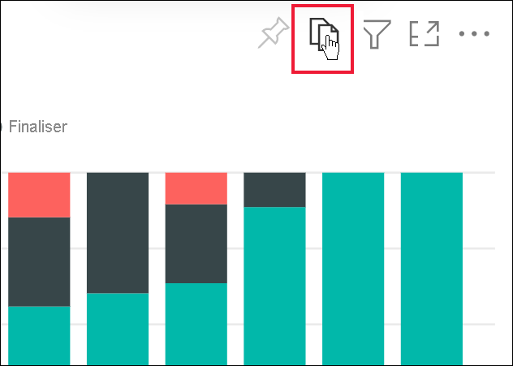
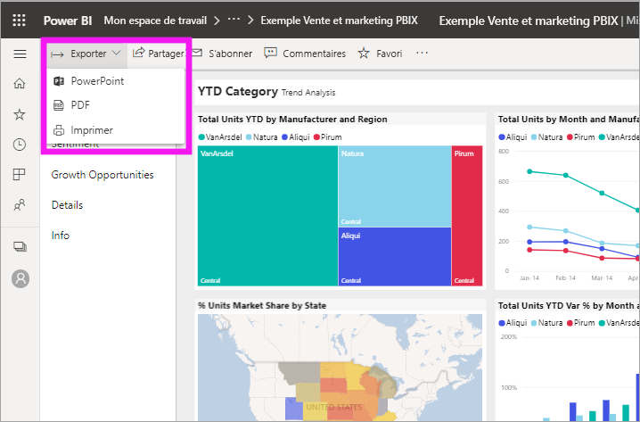
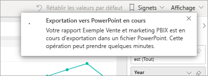
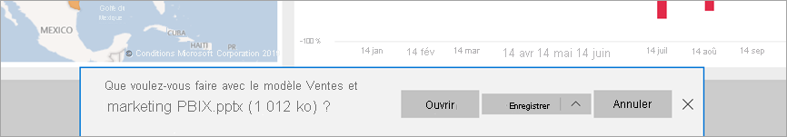
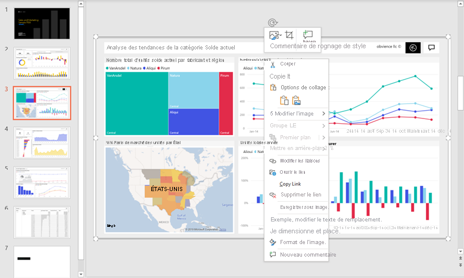

# Exporter des rapports vers PowerPoint

[!INCLUDE[consumer-appliesto-yynn](../includes/consumer-appliesto-yynn.md)]

Avec le service Power BI (app.powerbi.com), vous pouvez publier votre rapport dans Microsoft PowerPoint et créer facilement un ensemble de diapositives basées sur votre rapport Power BI. Quand vous exportez vers PowerPoint, voici ce qui se produit :

* Chaque page du rapport Power BI devient une diapositive individuelle dans PowerPoint.
* Chaque page du rapport Power BI est exportée en tant qu’image haute résolution dans PowerPoint.
* Vous pouvez conserver les paramètres des filtres et des segments que vous avez ajoutés au rapport.
* Un lien est créé dans PowerPoint vers le rapport Power BI.

L’exportation d’un **rapport Power BI** dans **PowerPoint** est rapide. Suivez les étapes décrites dans la section suivante.

Vous pouvez également copier un visuel à la fois à partir du service Power BI et le coller dans PowerPoint (ou dans tout autre programme qui prend en charge le collage). Sélectionnez l’icône **Copier en tant qu’image** pour copier le visuel dans votre Presse-papiers. Ensuite, ouvrez PowerPoint et collez le visuel. Pour plus d’informations, consultez [Copier des visuels sous forme d’images statiques](../visuals/power-bi-visualization-copy-paste.md).

## Exporter votre rapport Power BI vers PowerPoint
Dans le **service Power BI**, sélectionnez un rapport pour l’afficher sur le canevas. Vous pouvez également sélectionner un rapport dans la page d’**Accueil**, de la page **Applications** ou dans tout autre conteneur du volet de navigation.

[!INCLUDE [power-bi-service-new-look-include](../includes/power-bi-service-new-look-include.md)]

Quand le rapport que vous souhaitez exporter vers PowerPoint est affiché sur le canevas, sélectionnez **Fichier** > **Exporter vers PowerPoint** dans la barre de menus.

Une fenêtre contextuelle s’affiche, dans laquelle vous pouvez sélectionner l’option **Valeurs actuelles** ou **Valeurs par défaut**. L’option **Valeurs actuelles** exporte le rapport dans l’état actuel, qui inclut les modifications actives apportées aux valeurs de segment et de filtre.  La plupart des utilisateurs choisissent cette option. Si vous avez défilé, **Valeurs actuelles** n’inclut pas l’état de défilement de l’objet visuel, mais exporte à la place la partie supérieure des données. Vous pouvez aussi sélectionner l’option **Valeurs par défaut**, qui permet d’exporter le rapport dans son état d’origine, tel que le *concepteur* l’a partagé, sans refléter les modifications que vous avez apportées à cet état d’origine.

 
En outre, la fenêtre contient une case à cocher qui vous permet de spécifier si les onglets masqués d’un rapport doivent ou non être exportés. Cochez cette case si vous voulez exporter seulement les onglets du rapport qui sont visibles dans votre navigateur. Laissez-la décochée si vous préférez inclure tous les onglets masqués dans l’exportation. Si la case à cocher est grisée, cela indique que le rapport ne contient pas d’onglets masqués. Un onglet d’info-bulle est un exemple d’onglet masqué. Les [info-bulles personnalisées](../create-reports/desktop-tooltips.md), créées par les *concepteurs* de rapports, ne s’affichent pas sous forme d’onglets de rapport dans le service Power BI pour les *utilisateurs professionnels*. 

Vous pouvez également choisir d’exporter uniquement la page active affichée dans un rapport en cochant l’option **Exporter uniquement la page active**.  Par défaut, cette option est désactivée et toutes les pages sont exportées à partir de votre rapport.

Une fois que vous avez effectué vos sélections, sélectionnez **Exporter** pour continuer. Dans le coin supérieur droit de la fenêtre du navigateur du service Power BI, une bannière de notification indique que le rapport est en cours d’exportation vers PowerPoint. 

L’exportation peut prendre quelques minutes. Les facteurs qui peuvent affecter la durée d’exportation sont la structure du rapport et la charge actuelle sur le service Power BI. Pendant ce temps, vous pouvez continuer à travailler dans Power BI.

Une fois que le service Power BI a terminé le processus d’exportation, la bannière de notification change pour vous en informer. Votre fichier est ensuite disponible à l’endroit où votre navigateur affiche les fichiers téléchargés. Dans l’image suivante, il est affiché sous forme de bannière de téléchargement au bas de la fenêtre du navigateur.

C’est tout. Vous pouvez télécharger le fichier, l’ouvrir dans PowerPoint, puis le modifier ou l’améliorer comme vous le feriez pour n’importe quel autre diaporama PowerPoint.

## Ouvrir le fichier PowerPoint
Lorsque vous ouvrez le fichier PowerPoint que Power BI a exporté, quelques éléments intéressants et utiles s’affichent. Examinez l’image suivante et vérifiez les éléments numérotés qui décrivent certaines de ces fonctionnalités intéressantes. Les pages dans PowerPoint sont toujours créées dans la taille standard 9:16, quelles que soient les tailles de page ou dimensions d’origine dans le rapport Power BI.

1. La première page du diaporama inclut le nom de votre rapport et un lien qui vous permet d’**afficher dans Power BI** le rapport sur lequel le diaporama est basé.
2. Vous pouvez également obtenir des informations utiles sur le rapport. **Dernière actualisation des données** indique la date et l’heure sur lesquelles le rapport exporté est basé. **Téléchargé à** montre la date et l’heure d’exportation du rapport Power BI dans un fichier PowerPoint. La date **Téléchargé le** est définie sur le fuseau horaire de votre ordinateur au moment de l’exportation.

3. Chaque page du rapport est une diapositive distincte, comme indiqué dans le volet de navigation. 
4. Votre rapport publié s’affiche dans la langue définie dans vos paramètres Power BI, ou selon les paramètres régionaux de votre navigateur. Pour afficher ou définir la langue choisie dans votre navigateur, sélectionnez l’icône représentant une roue dentée  > **Paramètres** > **Général** > **Langue**. Pour obtenir des informations sur les paramètres régionaux, consultez [Langues et pays/régions pris en charge pour Power BI](../fundamentals/supported-languages-countries-regions.md).

Quand vous voyez à une diapositive, vous voyez que chaque page du rapport est une image indépendante. Le défilement n’y est pas disponible, car chaque diapositive est une image statique.

À partir de là, vous pouvez faire ce que vous voulez avec votre présentation PowerPoint ou les images haute résolution.

## Considérations et résolution des problèmes
Voici quelques considérations et limitations à prendre en compte quand vous utilisez la fonctionnalité **Exporter vers PowerPoint**.
 

* Si vous ne voyez pas l’option **Exporter**, vérifiez que vous avez bien activé « Nouvelle apparence » et que vous avez devant vous un rapport (pas un tableau de bord).

    

* Les [filtres d’URL](../collaborate-share/service-url-filters.md) ne sont actuellement pas respectés quand vous choisissez **Valeurs actuelles** pour l’exportation.

* Lors de l’exportation vers PowerPoint, si le rapport utilise une police personnalisée, cette police est remplacée par une police par défaut.

* Les types de visuels suivants ne sont pas pris en charge et ne seront pas exportés vers PowerPoint :
   - [Les visuels personnalisés qui n’ont pas été certifiés](../developer/visuals/power-bi-custom-visuals-certified.md) ne sont pas pris en charge. 
   - Le [visuel ESRI ArcGIS](../visuals/power-bi-visualizations-arcgis.md) n'est pas pris en charge
   - Les visuels R et Python ne sont pas pris en charge.
   - Les images en arrière-plan sont rognées en fonction du cadre englobant du graphique. Nous vous recommandons de supprimer les images en arrière-plan avant d’exporter vers PowerPoint.

* Certains rapports ne peuvent pas être exportés. Il s’agit des tables suivantes :
    - Si vous partagez un tableau de bord avec une personne externe à votre organisation, et donc un utilisateur qui n’est pas dans votre locataire Power BI, cet utilisateur ne peut pas exporter les rapports associés du tableau de bord partagé vers PowerPoint. Par exemple, si vous êtes aaron@contoso.com, vous pouvez partager avec david@cohowinery.com. david@cohowinery.com ne peut cependant pas exporter les rapports associés vers PowerPoint.
    - Rapports contenant plus de 50 pages de rapport. Seules les 50 premières pages sont exportées.
    - Les rapports exportés vers des versions antérieures de PowerPoint.
    - Rapports dont le traitement prend plus d’une heure. 
    - Pages de rapport dont le chargement prend plus de 6 minutes. 

* Si l’option de menu **Exporter vers PowerPoint** n’est pas disponible dans le service Power BI, c’est probablement le signe que l’administrateur Power BI ou le propriétaire du rapport a désactivé la fonctionnalité. Pour plus d’informations, contactez votre administrateur ou le propriétaire.
* Le service Power BI utilise votre paramètre de langue Power BI pour l’exportation PowerPoint. Pour afficher ou définir la langue choisie dans votre navigateur, sélectionnez l’icône représentant une roue dentée  > **Paramètres** > **Général** > **Langue**.

## Étapes suivantes
[Copier les visuels en tant qu’images statiques](../visuals/power-bi-visualization-copy-paste.md)    
[Imprimer un rapport](end-user-print.md)
