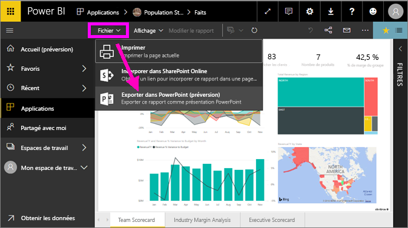
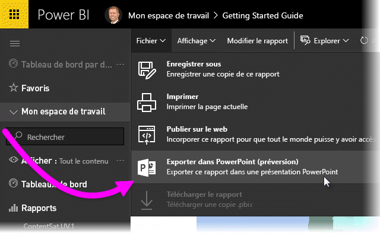
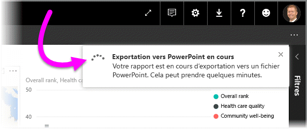
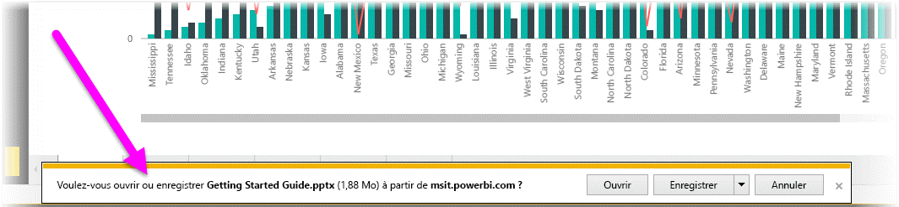
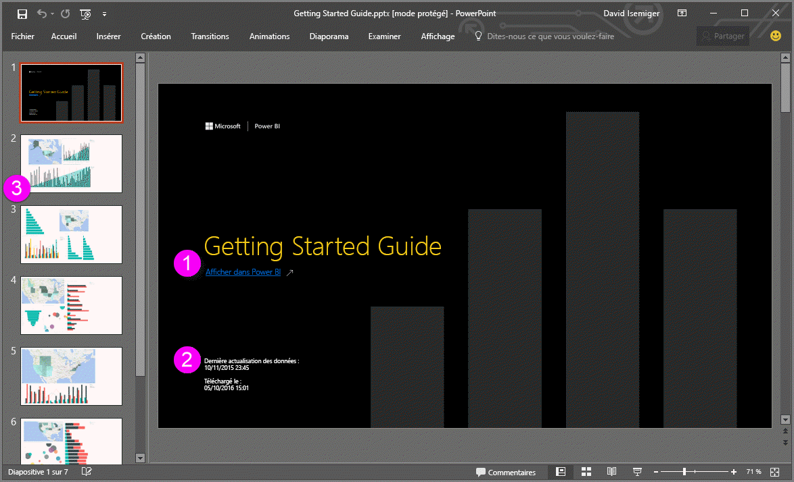

# Exporter des rapports de Power BI vers PowerPoint
Avec Power BI, vous pouvez publier votre rapport dans **Microsoft PowerPoint** et créer facilement un ensemble de diapositives en fonction de votre rapport Power BI. Lorsque vous **exportez vers PowerPoint**, les éléments suivants se produisent :

* Chaque page du rapport Power BI devient une diapositive dans PowerPoint.
* Chaque page du rapport Power BI est exportée en tant qu’image haute résolution dans PowerPoint <!-- * The filters and slicers settings that you added to the report are preserved. -->
* Dans PowerPoint, un lien est créé. Il renvoie vers le rapport Power BI. 

L’exportation d’un **rapport Power BI** dans **PowerPoint** est rapide. Suivez les étapes décrites dans la section suivante.

## Exporter un rapport Power BI vers PowerPoint
Dans le service Power BI, sélectionnez un rapport pour l’afficher dans le canevas. Vous pouvez également sélectionner un rapport dans votre page **Accueil**, vos **applications** ou toute autre section dans votre volet de navigation de gauche.

Lorsque le rapport que vous souhaitez exporter vers PowerPoint est affiché sur le canevas, sélectionnez **Fichier > Exporter vers PowerPoint** à partir de la barre de menus dans le service Power BI.

   
Une fenêtre contextuelle s’affiche, dans laquelle vous pouvez sélectionner l’option **Vue actuelle** ou **Vue par défaut**.  L’option **Vue actuelle** exporte le rapport dans l’état actuel, qui inclut les modifications actives apportées aux valeurs de segment et de filtre.  La plupart des utilisateurs choisissent cette option.  Vous pouvez aussi sélectionner l’option **Vue par défaut**, qui exporte le rapport dans l’état initial (l’état au moment du partage par l’auteur), sans refléter les modifications que vous avez apportées à l’état initial.
    
En outre, la fenêtre contient une case à cocher qui vous permet de spécifier si les onglets masqués d’un rapport doivent ou non être exportés.  Cochez cette case si vous souhaitez exporter uniquement les onglets du rapport qui sont visibles dans votre navigateur.  Laissez-la décochée si vous préférez inclure tous les onglets masqués dans l’exportation.  Si la case à cocher est grisée, cela indique que le rapport ne contient pas d’onglets masqués.  Une fois que vous avez effectué vos sélections, cliquez sur **Exporter** pour continuer.

Dans l’angle supérieur droit de la fenêtre du navigateur du service Power BI, une bannière de notification indique que le rapport est en cours d’exportation vers PowerPoint. Cette opération peut prendre quelques minutes. Pendant ce temps, vous pouvez continuer à travailler dans Power BI.

Une fois que vous avez terminé, la bannière de notification change pour vous informer que le service Power BI a terminé le processus d’exportation.

Votre fichier est ensuite disponible à l’endroit où votre navigateur affiche les fichiers téléchargés. Dans l’image suivante, il est affiché sous forme de bannière de téléchargement au bas de la fenêtre du navigateur.

C’est tout. Vous pouvez télécharger le fichier, l’ouvrir dans PowerPoint, puis le modifier ou l’améliorer tout comme vous le feriez pour n’importe quel autre diaporama PowerPoint.

## Extraction du fichier PowerPoint exporté
Lorsque vous ouvrez le fichier PowerPoint que Power BI a exporté, quelques éléments intéressants et utiles s’affichent. Examinez l’image suivante, puis vérifiez les éléments numérotés ci-dessous qui décrivent certaines de ces fonctionnalités intéressantes.

1. La première page de l’ensemble de diapositives inclut le nom de votre rapport et un lien qui vous permet d’**afficher dans Power BI** le rapport sur lequel repose l’ensemble de diapositives.
2. Vous obtenez également des informations utiles sur le rapport, y compris la *dernière actualisation des données* sur laquelle est basé le rapport exporté et l’heure et la date de *téléchargement*, qui correspondent à l’heure et à la date auxquelles le rapport Power BI a été exporté dans un fichier PowerPoint.
3. Chaque page du rapport est une diapositive distincte, comme indiqué dans le volet de navigation gauche. 
4. Votre rapport publié s’affiche dans la langue définie dans vos paramètres Power BI, ou selon les paramètres régionaux de votre navigateur. Pour voir ou définir vos préférences de langue, sélectionnez l’icône représentant une roue dentée  **> Paramètres > Général > Langue**. Pour obtenir des informations locales, consultez [Langues et pays/régions pris en charge pour Power BI](../supported-languages-countries-regions.md).
5. La présentation PowerPoint inclut une diapositive de couverture indiquant l’heure d’exportation dans le fuseau horaire correct.

Lorsque vous accédez à une diapositive, vous remarquez que chaque page de rapport est une image indépendante.

>[!NOTE]
> Avoir un seul visuel pour chaque page du rapport est un nouveau comportement. Le comportement précédent, qui fournissait une image indépendante pour chaque visuel, n’est plus implémenté. 
 

À partir de là, vous pouvez faire ce que vous voulez avec votre présentation PowerPoint ou les images haute résolution.

## Limites
Voici quelques considérations et limitations à prendre en compte lorsque vous utilisez la fonctionnalité **Exporter vers PowerPoint**.

* Les **éléments visuels R** ne sont actuellement pas pris en charge. Tout élément visuel de ce type est exporté en tant qu’image vide dans PowerPoint, avec un message d’erreur indiquant que l’élément visuel n’est pas pris en charge.
* Les **éléments visuels personnalisés** qui ont été **certifiés** sont pris en charge. Pour plus d’informations sur les éléments visuels personnalisés certifiés, notamment concernant la manière de certifier un élément visuel personnalisé, voir [Obtention d’un visuel personnalisé certifié](../power-bi-custom-visuals-certified.md). Les éléments visuel personnalisés non certifiés ne sont pas pris en charge. Tout élément visuel de ce type est exporté en tant qu’image vide dans PowerPoint, avec un message d’erreur indiquant que l’élément visuel n’est pas pris en charge.
* Les rapports contenant plus de 30 pages ne peuvent pas être exportés actuellement.
* Le processus d’exportation du rapport vers PowerPoint peut prendre quelques minutes. Soyez patient. Les facteurs qui peuvent avoir un impact sur la durée d’exportation sont la structure du rapport et la charge actuelle sur le service Power BI.
* Si l’option de menu **Exporter vers PowerPoint** n’est pas disponible dans le service Power BI, il est probable que votre administrateur ait désactivé la fonctionnalité. Pour plus d’informations, contactez l’administrateur du locataire.
* Les images en arrière-plan sont rognées en fonction du cadre englobant du graphique. Il est fortement recommandé de supprimer les images en arrière-plan avant d’exporter vers PowerPoint.
* Les pages dans PowerPoint sont toujours créées dans la taille standard 9:16, quelles que soient les tailles de page ou dimensions d’origine dans le rapport Power BI.
* Vous ne pouvez pas publier vers PowerPoint les rapports possédés par un utilisateur extérieur de votre domaine de locataire Power BI (par exemple, un rapport appartenant à une personne extérieure à votre organisation et partagé avec vous).
* Si vous partagez un tableau de bord avec une personne externe à votre organisation (et par conséquent, un utilisateur qui n’est pas dans votre locataire Power BI), cet utilisateur ne peut pas exporter vers PowerPoint les rapports associés du tableau de bord partagé. Par exemple, si vous êtes aaron@contoso.com, vous pouvez partager avec david@cohowinery.com. Mais david@cohowinery.com ne peut pas exporter les rapports associés vers PowerPoint.
* Comme mentionné précédemment, chaque page du rapport est exportée en tant qu’image unique dans le fichier PowerPoint.
* Le service Power BI utilise votre paramètre de langue Power BI pour l’exportation PowerPoint. Pour voir ou définir vos préférences de langue, sélectionnez l’icône représentant une roue dentée  **> Paramètres > Général > Langue**.
* **L’heure de téléchargement** qui apparaît sur la diapositive de couverture du fichier PowerPoint exporté est définie en fonction du fuseau horaire de l’ordinateur au moment de l’exportation.

## Étapes suivantes
[Imprimer un rapport](end-user-print.md)
