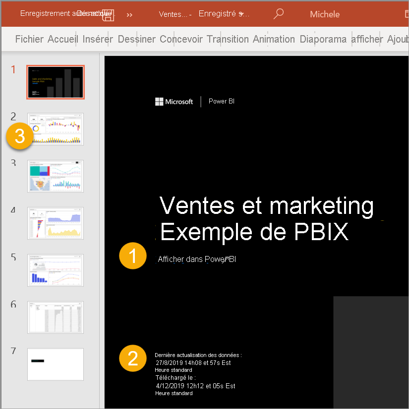

# Exporter des rapports de Power BI vers PowerPoint

[!INCLUDE [power-bi-service-new-look-include](../includes/power-bi-service-new-look-include.md)]

Avec Power BI, vous pouvez publier votre rapport dans Microsoft PowerPoint et créer facilement un ensemble de diapositives basées sur votre rapport Power BI. Quand vous exportez vers PowerPoint, voici ce qui se produit :

* Chaque page du rapport Power BI devient une diapositive individuelle dans PowerPoint.
* Chaque page du rapport Power BI est exportée en tant qu’image haute résolution dans PowerPoint.
* Vous pouvez conserver les paramètres des filtres et des segments que vous avez ajoutés au rapport.
* Un lien est créé dans PowerPoint vers le rapport Power BI.

L’exportation d’un **rapport Power BI** dans **PowerPoint** est rapide. Suivez les étapes décrites dans la section suivante.

## Exporter votre rapport Power BI vers PowerPoint
Dans le **service Power BI**, sélectionnez un rapport pour l’afficher sur le canevas. Vous pouvez également sélectionner un rapport dans la page d’**Accueil**, de la page **Applications** ou dans tout autre conteneur du volet de navigation.

Quand le rapport que vous voulez exporter vers PowerPoint est affiché sur le canevas, sélectionnez **Exporter** > **PowerPoint** dans la barre de menus.

Une fenêtre contextuelle s’affiche, dans laquelle vous pouvez sélectionner l’option **Valeurs actuelles** ou **Valeurs par défaut**. L’option **Valeurs actuelles** exporte le rapport dans l’état actuel, qui inclut les modifications actives apportées aux valeurs de segment et de filtre. La plupart des utilisateurs choisissent cette option. Vous pouvez aussi sélectionner l’option **Valeurs par défaut**, qui exporte le rapport dans l’état initial, tel que le *concepteur* l’a partagé, sans refléter les changements que vous avez apportés à l’état initial.

> [!NOTE]
> L’option **Valeurs actuelles** n’inclut pas l’état de défilement des visuels.

 
En outre, la fenêtre contient une case à cocher qui vous permet de spécifier si les onglets masqués d’un rapport doivent ou non être exportés. Cochez cette case si vous voulez exporter seulement les onglets du rapport qui sont visibles dans votre navigateur. Laissez-la décochée si vous préférez inclure tous les onglets masqués dans l’exportation. Si la case à cocher est grisée, cela indique que le rapport ne contient pas d’onglets masqués. Un onglet d’info-bulle est un exemple d’onglet masqué. Les [info-bulles personnalisées](../desktop-tooltips.md) sont créées par les *concepteurs* de rapports et ne s’affichent pas sous la forme d’onglets de rapport dans le service Power BI pour les *consommateurs*. 

Une fois que vous avez effectué vos sélections, sélectionnez **Exporter** pour continuer. Dans le coin supérieur droit de la fenêtre du navigateur du service Power BI, une bannière de notification indique que le rapport est en cours d’exportation vers PowerPoint. L’exportation peut prendre quelques minutes. Pendant ce temps, vous pouvez continuer à travailler dans Power BI.

Une fois que le service Power BI a terminé le processus d’exportation, la bannière de notification change pour vous en informer. Votre fichier est ensuite disponible à l’endroit où votre navigateur affiche les fichiers téléchargés. Dans l’image suivante, il est affiché sous forme de bannière de téléchargement au bas de la fenêtre du navigateur.

C’est tout. Vous pouvez télécharger le fichier, l’ouvrir dans PowerPoint, puis le modifier ou l’améliorer comme vous le feriez pour n’importe quel autre diaporama PowerPoint.

## Vérifier votre fichier PowerPoint exporté
Lorsque vous ouvrez le fichier PowerPoint que Power BI a exporté, quelques éléments intéressants et utiles s’affichent. Examinez l’image suivante et vérifiez les éléments numérotés qui décrivent certaines de ces fonctionnalités intéressantes.

1. La première page du diaporama inclut le nom de votre rapport et un lien qui vous permet d’**afficher dans Power BI** le rapport sur lequel le diaporama est basé.
2. Vous pouvez également obtenir des informations utiles sur le rapport. **Dernière actualisation des données** indique la date et l’heure sur lesquelles le rapport exporté est basé. **Téléchargé à** montre la date et l’heure d’exportation du rapport Power BI dans un fichier PowerPoint.
3. Chaque page du rapport est une diapositive distincte, comme indiqué dans le volet de navigation. 
4. Votre rapport publié s’affiche dans la langue définie dans vos paramètres Power BI, ou selon les paramètres régionaux de votre navigateur. Pour afficher ou définir vos préférences de langue, sélectionnez l’icône représentant une roue dentée  > **Paramètres** > **Général** > **Langue**. Pour obtenir des informations sur les paramètres régionaux, consultez [Langues et pays/régions pris en charge pour Power BI](../supported-languages-countries-regions.md).

Quand vous accédez à une diapositive, vous voyez que chaque page du rapport est une image indépendante.

À partir de là, vous pouvez faire ce que vous voulez avec votre présentation PowerPoint ou les images haute résolution.

## Considérations et résolution des problèmes
Voici quelques considérations et limitations à prendre en compte quand vous utilisez la fonctionnalité **Exporter vers PowerPoint**.

* Les visuels R ne sont actuellement pas pris en charge. Tout visuel de ce type est exporté en tant qu’image vide dans PowerPoint, avec un message d’erreur indiquant que le visuel n’est pas pris en charge.
* Les visuels personnalisés qui ont été certifiés sont pris en charge. Pour plus d’informations sur les visuels personnalisés certifiés, notamment concernant la manière de certifier un visuel personnalisé, consultez [Obtenir un visuel personnalisé certifié](../developer/power-bi-custom-visuals-certified.md). Les visuels personnalisés qui n’ont pas été certifiés ne sont pas pris en charge. Ils sont exportés en tant qu’image vide dans PowerPoint, avec un message d’erreur indiquant que le visuel n’est pas pris en charge.
* Les rapports contenant plus de 30 pages ne peuvent pas être exportés actuellement.
* Les visuels avec des barres de défilement sont exportés dans leur état par défaut. Dans PowerPoint, le visuel affiche uniquement la partie supérieure des données. Le défilement n’y est pas disponible, car chaque diapositive est une image. 
* Le processus d’exportation du rapport vers PowerPoint peut prendre quelques minutes : soyez patient. Les facteurs qui peuvent affecter la durée d’exportation sont la structure du rapport et la charge actuelle sur le service Power BI.
* Si l’option de menu **Exporter vers PowerPoint** n’est pas disponible dans le service Power BI, il est probable que l’administrateur de votre locataire ait désactivé la fonctionnalité. Pour plus d’informations, contactez l’administrateur du locataire.
* Les images en arrière-plan sont rognées en fonction du cadre englobant du graphique. Nous vous recommandons de supprimer les images en arrière-plan avant d’exporter vers PowerPoint.
* Les pages dans PowerPoint sont toujours créées dans la taille standard 9:16, quelles que soient les tailles de page ou dimensions d’origine dans le rapport Power BI.
* Les rapports appartenant à un utilisateur en dehors de votre domaine de locataire Power BI, comme un rapport appartenant à une personne extérieure à votre organisation et partagé avec vous, ne peuvent pas être publiés vers PowerPoint.
* Si vous partagez un tableau de bord avec une personne externe à votre organisation, et donc un utilisateur qui n’est pas dans votre locataire Power BI, cet utilisateur ne peut pas exporter les rapports associés du tableau de bord partagé vers PowerPoint. Par exemple, si vous êtes aaron@contoso.com, vous pouvez partager avec david@cohowinery.com. david@cohowinery.com ne peut cependant pas exporter les rapports associés vers PowerPoint.
* L’exportation peut ne pas fonctionner avec des versions antérieures de PowerPoint.
* Comme mentionné précédemment, chaque page du rapport est exportée en tant qu’image unique dans le fichier PowerPoint.
* Le service Power BI utilise votre paramètre de langue Power BI pour l’exportation PowerPoint. Pour afficher ou définir vos préférences de langue, sélectionnez l’icône représentant une roue dentée  > **Paramètres** > **Général** > **Langue**.
* **L’heure de téléchargement** qui apparaît sur la diapositive de couverture du fichier PowerPoint exporté est définie en fonction du fuseau horaire de l’ordinateur au moment de l’exportation.
* Les filtres d’URL ne sont actuellement pas respectés quand vous choisissez **Valeurs actuelles** pour l’exportation.

## Étapes suivantes
[Imprimer un rapport](end-user-print.md)
