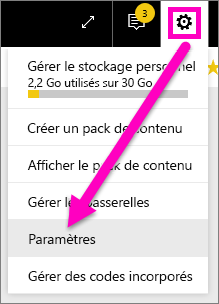
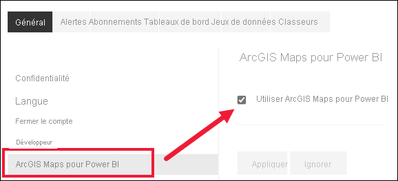

# Opter pour les fonctionnalités en version préliminaire de service Power BI
## Que sont les*fonctionnalités en version préliminaire*?
Nous apporter des améliorations au service Power BI, nous allons publier certaines nouvelles fonctionnalités en tant que *fonctionnalités en version préliminaire*. Vous pouvez activer et désactiver ces dernières afin de les essayer.

## Trouver des préversions et les activer (ou désactiver)
1. Ouvrez le menu Paramètres en sélectionnant l’icône d’engrenage dans le coin supérieur droit de votre écran Power BI et en choisissant **paramètres**.
   
   .
2. Sélectionnez l’onglet **Général**. S’il existe des préversions, vous voyez une option **Fonctionnalités en préversion** ou une fonctionnalité en préversion à gauche.  Dans cet exemple, il existe une préversion répertoriée pour ArcGIS Maps. 
   
   
3. Sélectionnez le bouton radio **Activé** ou cochez la case pour essayer la nouvelle expérience. Sélectionnez ensuite **Appliquer**.
4. Pour désactiver les fonctionnalités en version préliminaire, suivez les étapes 1 à 3 ci-dessus, à l’étape 3, choisissez **hors**, ou décochez la case, puis sélectionnez **appliquer**.

Vous avez des questions ou des commentaires ? [Visitez le forum de la communauté Power BI](http://community.powerbi.com/t5/Navigation-Preview-Forum/bd-p/NavigationPreview).

