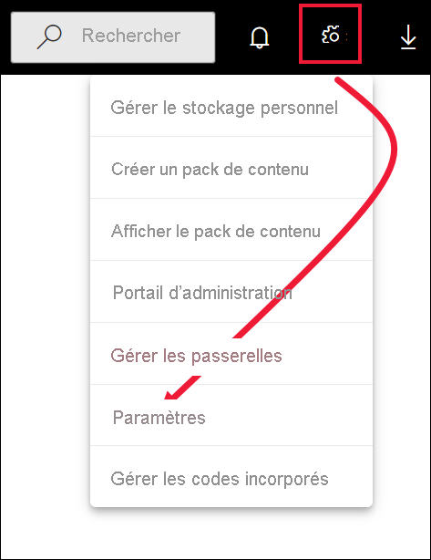

# Accéder aux fonctionnalités de préversion du service Power BI

[!INCLUDE[consumer-appliesto-yynn](../includes/consumer-appliesto-yynn.md)]

## Que sont les *fonctionnalités en version préliminaire*?
Dans le cadre des améliorations que nous apportons à Power BI, nous allons publier certaines nouvelles fonctionnalités sous la forme de *fonctionnalités de préversion*. Vous pouvez activer et désactiver ces dernières afin de les essayer.

Certaines fonctionnalités en préversion peuvent être activées ou désactivées à partir de votre tableau de bord Power BI, de votre page d’accueil ou de votre rapport lui-même. Vous pouvez activer ou désactiver la fonctionnalité d’évaluation **Nouvelle apparence** dans la barre de menus Power BI qui s’affiche au-dessus de l’Accueil, des rapports et des tableaux de bord. 

   

Tandis que d’autres fonctionnalités en préversion sont disponibles à partir de votre menu *Paramètres*. Cet article vous montre comment accéder aux fonctionnalités en préversion via le menu Paramètres.

## Trouver des préversions et les activer (ou désactiver)
1. Ouvrez le menu Paramètres en sélectionnant l’icône en forme de roue dentée située en haut à droite de l’écran Power BI, puis choisissez **Paramètres**.
   
   .
2. Sélectionnez l’onglet **Général**. S’il existe des préversions, vous voyez une option **Fonctionnalités en préversion** ou une fonctionnalité en préversion à gauche.  Dans cet exemple, il existe une préversion répertoriée pour ArcGIS Maps. 
   
   
3. Sélectionnez le bouton radio **Activé** ou cochez la case pour essayer la nouvelle expérience. Ensuite, sélectionnez **Appliquer**.
4. Pour désactiver les fonctionnalités d’évaluation, suivez les étapes 1 à 3 ci-dessus, puis, à l’étape 3, sélectionnez **Désactiver** ou décochez la case, puis sélectionnez **Appliquer**.

Avez-vous des questions ou des commentaires ? [Visitez le forum de la communauté Power BI](https://community.powerbi.com/t5/Navigation-Preview-Forum/bd-p/NavigationPreview).

