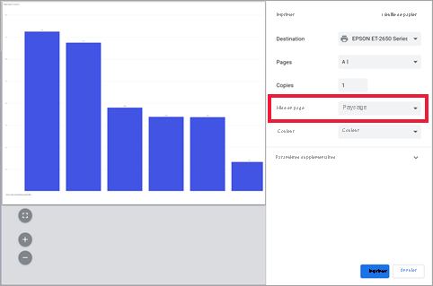
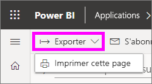
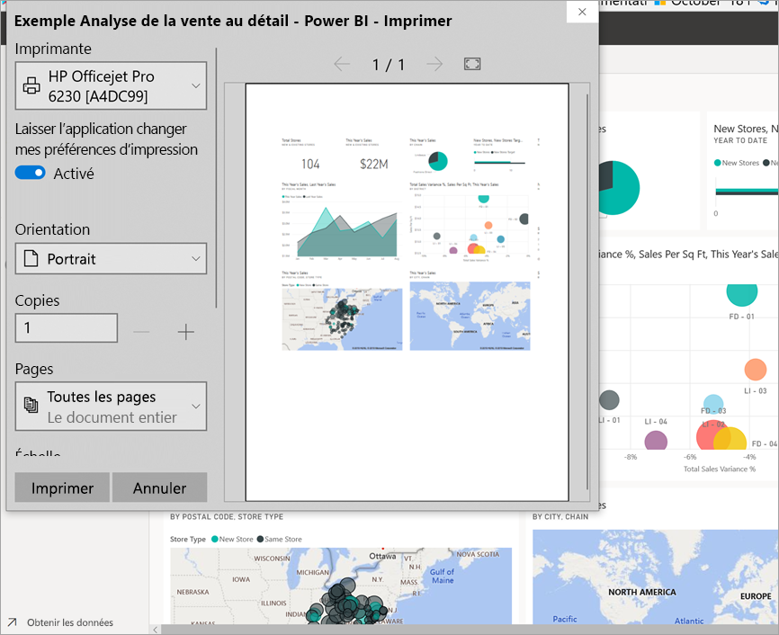
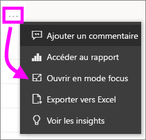
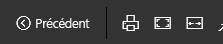
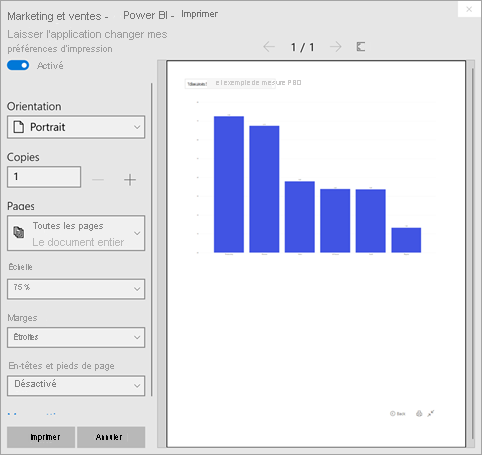
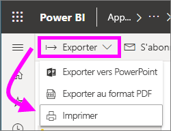

# Impression à partir du service Power BI

[!INCLUDE[consumer-appliesto-yynn](../includes/consumer-appliesto-yynn.md)]
## Ce qui peut être imprimé
[!INCLUDE [power-bi-service-new-look-include](../includes/power-bi-service-new-look-include.md)]

Vous pouvez imprimer un tableau de bord entier, une vignette de tableau de bord, une page de rapport ou un visuel de rapport à partir du service Power BI. Si votre rapport contient plusieurs pages, vous devrez imprimer chaque page séparément. 

## Éléments à prendre en compte concernant l’impression

La plupart des tableaux de bord et des rapports Power BI sont créés par des *concepteurs* de rapports en vue d’être utilisés en ligne et de s’afficher parfaitement sur divers types d’appareils. Lorsque vous imprimez un rapport, la façon dont le contenu s’affiche sur papier dépend de votre navigateur. 

Vous pouvez utiliser certains paramètres du navigateur pour ajuster l’impression. Toutefois, vous risquez malgré cela de ne pas obtenir le résultat souhaité. Il est conseillé d’[exporter le rapport au format PDF](end-user-pdf.md) et d’imprimer le fichier PDF. 

## Ajuster les paramètres d’impression de votre navigateur
Lorsque vous imprimez dans Power BI, votre navigateur ouvre une fenêtre d’impression. Les fenêtres d’impression diffèrent selon le navigateur. Toutefois, vous constaterez qu’elles ont toutes des options plus ou moins similaires pour contrôler l’apparence de votre impression. 

Voici quelques conseils rapides pour mettre en forme votre impression.

   > 
1. Si votre tableau de bord, votre rapport ou votre visuel est plus large que haut, il est conseillé d’utiliser la disposition **Paysage**. 

   

2. Pour ajuster davantage de contenu dans une page imprimée, ajustez les marges ou l’échelle, par exemple. 

    

Testez les paramètres de votre navigateur jusqu’à ce que vous obteniez l’aspect souhaité. Certains navigateurs disposent même d’options permettant d’imprimer des graphismes d’arrière-plan. 

## Imprimez un tableau de bord
1. Ouvrez le tableau de bord que vous souhaitez imprimer.
2. Dans l’angle supérieur gauche, sélectionnez Exporter, puis choisissez **Imprimer cette page**.
   
    

3. La fenêtre d’impression de votre navigateur s’ouvre. Choisissez les paramètres. Par exemple, si votre tableau de bord est plus large que long, vous souhaiterez peut-être passer en mode **Paysage**. Sélectionnez **Imprimer**.
   
    

## Imprimez une vignette de tableau de bord
1. Ouvrez le tableau de bord en [mode Plein écran](end-user-focus.md) en sélectionnant l’icône Plein écran  dans la barre de menus supérieure.

3. Pour [ouvrir la vignette en mode Focus](end-user-focus.md), passez le pointeur sur le tableau de bord pour afficher **Plus d’options** (...), sélectionnez ce bouton, puis choisissez l’option **Ouvrir en mode Focus** ou l’icône Focus .
   
    

4. Pointez sur la vignette pour afficher le menu Options
   
    

4. Sélectionnez l’icône d’impression .     

5. La fenêtre d’impression de votre navigateur s’ouvre. Choisissez les paramètres. Par exemple, si votre vignette ne rentre pas dans la page, vous pouvez choisir une échelle de 75 %. Sélectionnez **Imprimer**.

     

> [!TIP]
> Si vous avez suivi toutes ces étapes et si votre vignette ne s’affiche toujours pas comme vous le souhaitez, essayez ce qui suit.
> 1. Ouvrez la fenêtre d’impression et modifiez les paramètres d’impression pour obtenir le meilleur résultat. Par exemple, vous pouvez changer la disposition, les marges ou l’échelle. 
> 2. Toutefois, au lieu d’imprimer, sélectionnez **Annuler**. 
> 3. Effectuez à nouveau les étapes 1 à 5. Votre vignette s’ajustera aux nouveaux paramètres de la fenêtre d’impression et sera prête pour l’impression.

## Imprimez une page de rapport
Vous pouvez imprimer les rapport une seule page à la fois.

1. Ouvrez le rapport, puis sélectionnez **Exporter** > **Imprimer** pour imprimer la page de rapport active.
   
    
2. La fenêtre d’impression de votre navigateur s’ouvre.

3. Suivez les étapes d’impression fournies dans la section **Imprimer un tableau de bord** ci-dessus.
   

## Imprimez un visuel de rapport
1. [Ouvrez le visuel en mode Focus](end-user-focus.md) en pointant sur la vignette et en sélectionnant l’icône Focus  en haut à droite.

2. Dans l’angle supérieur gauche, sélectionnez **Exporter** > **Imprimer** pour imprimer le visuel.

    

3. Suivez les étapes d’impression fournies dans la section **Imprimer un tableau de bord** ci-dessus.

## Considérations et résolution des problèmes

* Q : Je ne peux pas imprimer toutes les pages de rapport à la fois.    
* R : C’est exact. Vous ne pouvez imprimer qu’une page de rapport à la fois.
* Q : Je ne peux pas imprimer au format PDF.    
* R : Vous ne voyez cette option que si vous avez déjà configuré le pilote PDF dans votre navigateur.    
* Q : Ce que je vois lorsque je sélectionne **Imprimer** ne correspond pas à ce qui est affiché ici.    
* R : Les fenêtres d’impression varient selon la version du navigateur et des logiciels.
* Q : Mon impression n’est pas dimensionnée correctement.  Mon tableau de bord ne tient pas sur la page. Autres questions sur la mise à l’échelle et l’orientation.    
* R : Nous ne pouvons pas garantir que la copie imprimée aura exactement la même apparence que dans le service Power BI. Les fonctionnalités telles que la mise à l’échelle, les marges, les détails des visuels, l’orientation et la taille ne sont pas contrôlées par Power BI. Essayez d’ajuster les paramètres d’impression de votre navigateur. Nous vous suggérons notamment de modifier l’orientation des pages (Portrait ou Paysage), la taille des marges ou l’échelle. Si cela ne résout pas le problème, reportez-vous à la documentation de votre navigateur.      
* Q : Lorsque j’imprime en mode Plein écran, je ne vois pas l’option d’impression lorsque je pointe sur le visuel.   
* R : Revenez au tableau de bord ou au rapport dans la vue par défaut, puis rouvrez le visuel en mode Focus, puis en mode Plein écran. 

## Étapes suivantes
[Partager des tableaux de bord et des rapports avec des collègues et d’autres utilisateurs](../collaborate-share/service-share-dashboards.md)

D’autres questions ? [Posez vos questions à la communauté Power BI](https://community.powerbi.com/)
