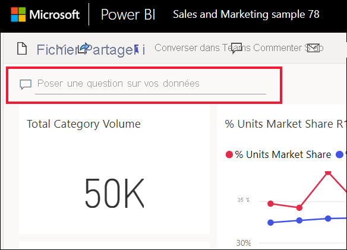
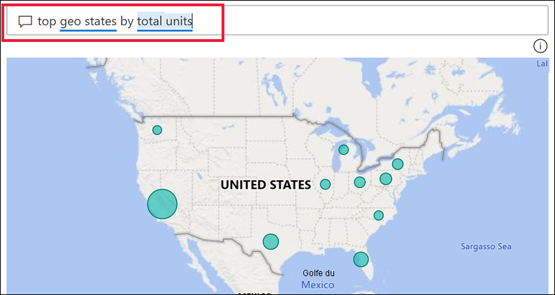
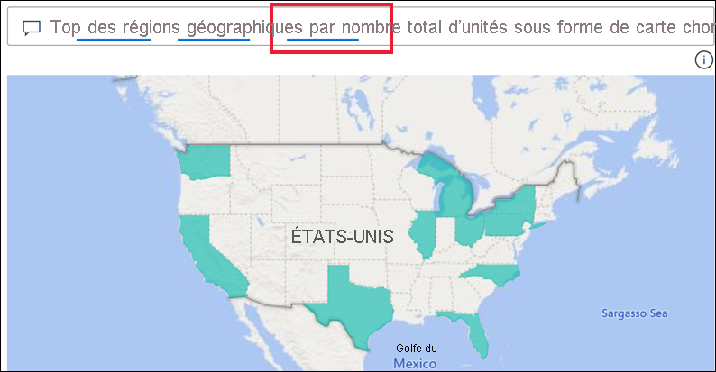
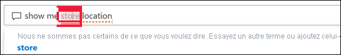
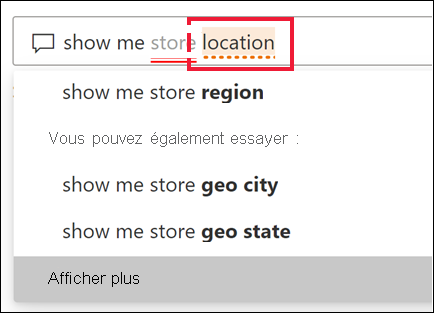
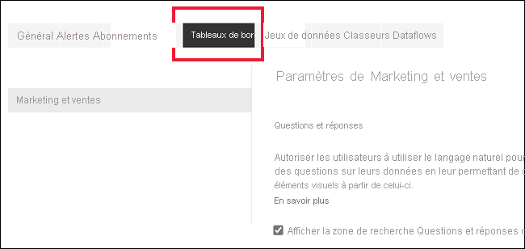
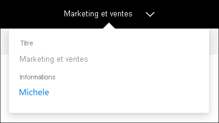
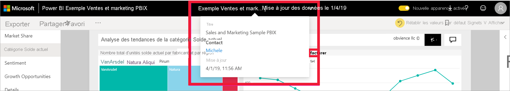

# Questions et réponses pour les utilisateurs professionnels Power BI

[!INCLUDE[consumer-appliesto-yyny](../includes/consumer-appliesto-yyny.md)]

[!INCLUDE [power-bi-service-new-look-include](../includes/power-bi-service-new-look-include.md)]

## Qu’est-ce que Q&R ?
Il est parfois plus rapide d’obtenir des informations à partir de vos données en posant une question dans un langage naturel. Par exemple, « quel était le total des ventes l’année dernière ».

Utilisez l’outil Q&R pour explorer vos données à l’aide des fonctionnalités intuitives du langage naturel et recevez des réponses sous la forme de graphiques et de diagrammes. Q&R diffère d’un moteur de recherche, car il ne fournit que des résultats sur les données de Power BI.

## Quelles visualisations la fonctionnalité Q&R utilise-t-elle ?
Q&R choisit la meilleure visualisation en fonction des données affichées. Parfois les données du jeu sous-jacent sont définies en tant que type ou catégorie, ce qui aide Questions et réponses à savoir comment les afficher. Par exemple, si les données sont définies en tant que date, elles seront davantage susceptibles de s’afficher sous la forme d’un graphique en courbes. Les données appartenant à la catégorie « Ville » seront davantage susceptibles de s’afficher sous forme de carte.

Vous pouvez également indiquer à Q&R quel visuel utiliser en l’ajoutant à votre question. Gardez toutefois à l’esprit qu’il n’est pas toujours possible pour Q&R d’afficher les données avec le visuel demandé. Questions et réponses vous fournit une liste de types de visuels applicables.

## Où puis-je utiliser Questions et réponses ?
Vous trouverez Questions et réponses sur les tableaux de bord dans le service Power BI et en bas du tableau de bord dans Power BI Mobile. À moins que le concepteur vous ait donné des autorisations de modification, vous pouvez utiliser Questions et réponses pour explorer les données, mais vous ne pouvez pas enregistrer les visualisations créées avec cette fonctionnalité.

Vous trouverez également des questions et réponses sur les rapports, si le *concepteur* de rapports a ajouté un [visuel de Questions et réponses](../visuals/power-bi-visualization-q-and-a.md).   

## Questions et réponses sur les tableaux de bord

La fonction **Questions et réponses Power BI** est disponible avec une licence Pro ou Premium.  [Questions et réponses dans les apps mobiles Power BI](mobile/mobile-apps-ios-qna.md) et [Questions et réponses avec Power BI Embedded](../developer/embedded/qanda.md) sont traités dans différents articles. À l’heure actuelle, **Questions et réponses Power BI** prend uniquement en charge les réponses aux requêtes en langage naturel formulées en anglais, mais votre administrateur Power BI peut activer une préversion disponible en espagnol.

Les questions ne sont qu’un début.  Amusez-vous à explorer vos données, affinez ou développez vos questions, découvrez de nouvelles informations fiables et obtenez une vue d’ensemble de vos données. Vous serez ravi des informations précieuses que vous allez découvrir.

Cet outil est réellement interactif et surtout très rapide ! Grâce à son stockage en mémoire, il fournit des réponses de manière quasi instantanée.

## Utiliser Questions et réponses sur un tableau de bord dans le service Power BI
Dans le service Power BI (app.powerbi.com), un tableau de bord contient des vignettes épinglées à partir d’un ou plusieurs jeux de données. Vous pouvez donc poser des questions sur les données contenues dans un de ces jeux de données. Pour afficher les rapports et jeux de données utilisés pour créer le tableau de bord, sélectionnez **Voir le contenu associé** à partir de la liste déroulante **Autres actions**.

## Comment commencer ?
Tout d’abord, familiarisez-vous avec le contenu. Examinez les visuels sur le tableau de bord et dans le rapport. Familiarisez-vous avec le type et la plage de données qui sont à votre disposition. 

Par exemple :

* Si les étiquettes et les valeurs d’axe des visuels comprennent les mots « ventes », « compte », « mois » et « opportunités », vous pouvez poser des questions telles que : « quel *compte* possède le nombre le plus élevé d’*opportunités*? » ou « afficher les *ventes* par mois sous la forme d’un graphique à barres ».

* Si vous disposez de données de performances de site web dans Google Analytics, vous pouvez interroger Questions et réponses concernant le temps passé sur une page web, le nombre de visites uniques et les taux d’engagement utilisateur. Si vous interrogez des données démographiques, vous pourriez poser des questions sur l’âge et sur les revenus par zone géographique.

Une fois que vous vous êtes familiarisé avec les données, retournez ensuite au tableau de bord et placez votre curseur dans la zone de question. Cette opération ouvre l’écran Questions et réponses.

 

Avant même que vous commenciez à taper votre question, Q&R affiche dans un nouvel écran des suggestions de formulation de votre question. Vous voyez des phrases et des questions contenant le nom des tables dans les jeux de données sous-jacents et vous pouvez également voir les questions *proposées* créées par le propriétaire du jeu de données.

Vous pouvez sélectionner une d'entre elles pour les ajouter à la question et l’affiner afin de trouver une réponse spécifique. 

 

Power BI peut aussi vous aider à poser des questions à l’aide de fonctionnalités telles que des invites, l’autocomplétion et des signaux visuels. Power BI fournit cette aide pour la fonctionnalité Questions et réponses qui est disponible dans les tableaux de bord, ainsi que pour le visuel Questions et réponses. Nous abordons ces fonctionnalités en détail ci-dessous, dans la section [Créer un visuel Questions et réponses en tapant votre propre requête en langage naturel](#create-a-visual-using-your-own-qa-question)

## Visuel Questions et réponses dans les rapports Power BI

Le visuel Questions et réponses vous permet de poser des questions en langage naturel et d’obtenir des réponses sous la forme d’un visuel. Le visuel Questions et réponses se comporte comme les autres types de visuels de rapport. Il prend en charge le filtrage croisé, la sélection croisée, les signets et les commentaires. 

Vous pouvez identifier un visuel Questions et réponses par sa zone de question dans la partie supérieure. C’est là que vous entrez ou tapez des questions en langage naturel. Le visuel Questions et réponses peut être réutilisé pour poser des questions sur vos données. Quand vous quittez le rapport, le visuel de Questions et réponses retrouve sa configuration par défaut. 

## Utiliser Questions et réponses 
Pour utiliser Questions et réponses dans un tableau de bord ou pour utiliser le visuel Questions et réponses dans un rapport, sélectionnez l’une des questions suggérées ou tapez votre propre question en langage naturel. 

### Créer un visuel à l’aide d’une question suggérée

Ici, nous avons sélectionné **top geo states by total units** (principaux États géographiques par nombre total d’unités). Power BI essaie de sélectionner le type de visuel le plus adapté pour représenter les données. Dans ce cas, il s’agit d’une carte de base.

Toutefois, vous pouvez indiquer à Power BI un type de visuel spécifique à utiliser, en l’ajoutant à votre requête en langage naturel. Gardez à l’esprit que les types de visuels ne sont pas tous toujours disponibles ou adaptés pour vos données. Par exemple, la représentation de ces données dans un graphique en nuages de points ne serait pas pertinente. En revanche, l’utilisation d’une carte choroplèthe serait une bonne option.

Si vous n’êtes pas sûr du type de questions à poser ou de la terminologie à employer, développez **Montrer toutes les suggestions** ou examinez les autres visuels dans le rapport. Vous pourrez ainsi vous familiariser avec les termes et le contenu du jeu de données.

### Créer un visuel à l’aide de votre propre question

1. Tapez votre question dans le champ Questions et réponses en langage naturel. À mesure que vous tapez votre question, Power BI vous aide avec l’autocomplétion, des signaux visuels et des commentaires.

    **Autocomplétion** : à mesure que vous tapez votre question, la fonctionnalité Questions et réponses de Power BI affiche des suggestions pertinentes et contextuelles qui vous aident à devenir rapidement productif avec le langage naturel. Pendant la saisie, vous recevez des commentaires et des résultats immédiats. L’expérience est similaire à la saisie dans un moteur de recherche.

    Dans cet exemple, la suggestion que nous voulons est la dernière. 

    

    **Traits de soulignement continus et en pointillés** : la fonctionnalité Questions et réponses de Power BI affiche des mots avec des traits de soulignement pour vous aider à voir les mots qu’a reconnus Power BI et ceux qu’il n’a pas reconnus. 

    Un trait de soulignement bleu plein indique que Power BI a reconnu le mot. L’exemple ci-dessous montre que les questions et réponses ont reconnu les termes **sales fact sentiment** et **region**.

    

    Un double soulignement rouge indique un mot que Power BI ne reconnaît pas du tout. L’utilisation du mot « geography » alors qu’il ne figure pas dans les données en est un exemple. Le mot figure dans le dictionnaire anglais, mais Questions et réponses marque ce terme d’un trait de soulignement rouge. La fonctionnalité Questions et réponses de Power BI ne peut pas créer de visualisation et vous suggère de demander au concepteur de rapports d’ajouter le terme.  

    

    Si Power BI n’est pas sûr d’un mot, vous verrez un trait de soulignement en pointillés. Sélectionnez le mot pour afficher une liste de suggestions. Le mot « Location » (Emplacement) en est un exemple. Plusieurs champs peuvent contenir le mot « Location », si bien que le système vous invite à choisir le champ que vous souhaitez.  

    

    
    
    La fonctionnalité Questions et réponses Power BI reconnaît les mots de même signification, grâce à son intégration à Bing et Office. Questions et réponses souligne le mot pour vous indiquer qu’il ne s’agit pas d’une correspondance directe

    

    **Suggestions** : lorsque vous tapez la question, Power BI vous signale s’il ne la comprend pas et tente de vous aider. Dans l’exemple ci-dessous, Power BI suggère deux champs différents qu’il reconnaît pour « VanArsdel ». 

    

    Après avoir sélectionné la correction de Power BI, notez que tous les mots sont reconnus et soulignés en bleu. Vos résultats sont affichés sous forme de graphique en courbes. 

    

    Toutefois, vous pouvez remplacer le graphique en courbes par un autre type de visuel.  

    

## Considérations et résolution des problèmes

**Question** : Je ne vois pas Questions et réponses sur ce tableau de bord.    
**Réponse 1** : Si vous ne voyez pas de zone de question, commencez par vérifier vos paramètres. Pour ce faire, sélectionnez l’icône d’engrenage en haut à droit de votre barre d’outils Power BI ou dans le menu déroulant **Autres options (...).   

Choisissez ensuite **Paramètres** > **Tableaux de bord**. Vérifiez qu’il y a une coche à côté de l’option **Afficher la zone de recherche de Questions et réponses dans ce tableau de bord**.    
  

**Réponse 2** : Parfois, vous n’avez pas accès aux paramètres. Si le propriétaire du tableau de bord ou votre administrateur a désactivé Questions et réponses, vérifiez auprès d’eux s’il est possible de le réactiver. Pour rechercher le propriétaire, sélectionnez le nom du tableau de bord dans la barre de menus supérieure.

    

**Question** : Je n’obtiens pas les résultats attendus quand je tape une question.    
**Réponse** : Sélectionnez l’option permettant de contacter le propriétaire du rapport ou du tableau de bord. Vous pouvez le faire directement à partir de la page de tableau de bord Questions et réponses ou du visuel Questions et réponses. Ou bien vous pouvez rechercher le propriétaire à partir de l’en-tête Power BI.  Il y a beaucoup de choses que le propriétaire peut faire pour améliorer les résultats de Questions et réponses. Par exemple, il peut renommer des colonnes dans le jeu de données pour utiliser des termes qui sont faciles à comprendre (`CustomerFirstName` au lieu de `CustFN`). Étant donné que le propriétaire connaît parfaitement le jeu de données, il peut également trouver des questions utiles et les ajouter aux questions suggérées de Questions et réponses.

## Confidentialité

Microsoft est susceptible d’utiliser vos questions pour améliorer Power BI. Pour plus d’informations, consultez la [Déclaration de confidentialité Microsoft](https://go.microsoft.com/fwlink/?LinkId=521839).

## Étapes suivantes
Pour savoir comment un visuel Questions et réponses est créé et géré par un *concepteur* de rapports, consultez [Type de visuel Questions et réponses](../visuals/power-bi-visualization-q-and-a.md).
