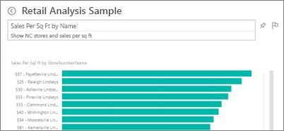
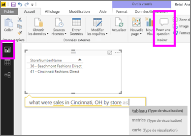

# Questions et réponses dans Power BI Desktop et le service Power BI
## Qu’est-ce que Q&R ?
Il est parfois plus rapide d’obtenir des informations à partir de vos données en posant une question dans un langage naturel. Par exemple, « quel était le total des ventes l’année dernière ».  Utilisez l’outil Q&R pour explorer vos données à l’aide des fonctionnalités intuitives du langage naturel et recevez des réponses sous la forme de graphiques et de diagrammes. Q&R diffère d’un moteur de recherche, car il ne fournit que des résultats sur les données de Power BI.

Cet article est le point de départ pour tout ce qui concerne le moteur Questions et réponses. Sélectionnez un lien ci-dessous pour apprendre comment Questions et réponses fonctionne dans le service Power BI (tableaux de bord et rapports), Power BI Desktop (rapports), Power BI Embedded et Power BI Mobile.  

> [!NOTE]
> **Questions et réponses de Power BI** prend uniquement en charge les réponses aux questions en langage naturel formulées en anglais. Vous pouvez également essayer une fonctionnalité en préversion pour les questions posées en espagnol. Dans **Power BI Desktop**, accédez à **Fichier**, **Options et paramètres**, **Options** et recherchez l’onglet **Fonctionnalités en préversion**. Cochez la case **Prise en charge de l’espagnol dans Questions et réponses**.  
>
>

Les questions ne sont qu’un début.  Amusez-vous à explorer vos données, affinez ou développez vos questions, découvrez de nouvelles informations fiables et obtenez une vue d’ensemble de vos données. Vous serez ravi des informations précieuses que vous allez découvrir.

Cet outil est réellement interactif et surtout très rapide ! Grâce à son stockage en mémoire, il fournit des réponses de manière quasi instantanée.

##  Questions et réponses pour les *consommateurs*
Quand un collègue partage un tableau de bord avec vous, la zone de questions du moteur Questions et réponses est située sur le tableau de bord dans le service Power BI (app.powerbi.com), en bas du tableau de bord dans Power BI Mobile et au-dessus de la visualisation dans Power BI Embedded. À moins que le propriétaire vous ait donné des autorisations de modification, vous êtes en mesure d’utiliser Questions et réponses pour explorer les données, mais vous ne pouvez pas enregistrer les visualisations créées avec Questions et réponses.

## Questions et réponses pour les *créateurs*
Si vous êtes un *créateur* de rapports Power BI ou que vous disposez d’autorisations de modification d’un jeu de données, la zone de questions du moteur Questions et réponses s’affiche sur le tableau de bord dans le service Power BI et sur chaque page du rapport dans le service Power BI et Power BI Desktop. Les visualisations que vous créez à l’aide de Questions et réponses peuvent être enregistrées sur un tableau de bord et dans un rapport.

Outre l’utilisation de Questions et réponses pour explorer leurs données, les créateurs et propriétaires de jeux de données peuvent améliorer l’expérience Questions et réponses pour les consommateurs en [modifiant leurs jeux de données](../service-prepare-data-for-q-and-a.md), en ajoutant des [questions proposées](../service-q-and-a-create-featured-questions.md) et en [activant et désactivant Questions et réponses ](end-user-q-and-a-direct-query.md) pour les jeux de données de connexions actives en local. Dans les [scénarios Power BI Embedded](../developer/qanda.md), les développeurs peuvent choisir entre les 2 modes : **interactif** et **résultat uniquement**.

## Comment la fonctionnalité Q&R sait-elle répondre aux questions ?
### Quels jeux de données la fonctionnalité Q&R utilise-t-elle ?
Comment la fonctionnalité Q&R réussit-elle à répondre à des questions spécifiques aux données ? Elle s’appuie sur le nom des tables, des colonnes et des champs calculés du jeu de données sous-jacent. La façon dont vous (ou le propriétaire du jeu de données) nommez les éléments est donc très importante.

Par exemple, supposons que vous disposiez d’un tableau Excel nommé « Ventes » et comprenant les colonnes suivantes : « Produit », « Mois », « Unités vendues », « Ventes brutes » et « Bénéfices ». Vous pouvez poser des questions sur n’importe laquelle de ces entités.  Vous pouvez demander ce qui suit : « afficher les *ventes*», « total des *bénéfices* par *mois*», « trier les *produits* par *unités vendues*» et ainsi de suite.

Q&R peut répondre aux questions qui sont basées sur la façon dont votre jeu de données est organisé. Comment cela fonctionne-t-il pour les données issues de Salesforce ? Quand vous vous connectez à votre compte salesforce.com, Power BI génère automatiquement un tableau de bord.  Avant de commencer à poser des questions, regardez les données qui s’affichent dans les visualisations du tableau de bord, ainsi que les données affichées dans la liste déroulante de Q&R.

* Si les étiquettes et les valeurs d’axe des visualisations comprennent les mots « ventes », « compte », « mois » et « opportunités », vous pouvez poser des questions telles que : « quel *compte* possède le nombre le plus élevé d’*opportunités* ? » ou « afficher les *ventes* par mois sous la forme d’un graphique à barres ».
* Si la liste déroulante inclut les mots « vendeur », « état » et « année », vous pouvez poser des questions telles que : « quel *vendeur* a obtenu les *ventes* les plus basses en *Floride* en *2013* ? »

Si vous disposez de données de performances de site web Google Analytics, vous pouvez poser une question sur le temps passé sur une page web particulière, sur le nombre de visites uniques et sur le taux d’engagement utilisateur. Si vous interrogez des données démographiques, vous pourriez poser des questions sur l’âge et sur les revenus par zone géographique.

### Quelles visualisations la fonctionnalité Q&R utilise-t-elle ?
Q&R choisit la meilleure visualisation en fonction des données affichées. Parfois les données du jeu sous-jacent sont définies en tant que type ou catégorie, ce qui aide Q&R à savoir comment les afficher. Par exemple, si les données sont définies en tant que date, elles seront davantage susceptibles de s’afficher sous la forme d’un graphique en courbes. Les données appartenant à la catégorie « Ville » seront davantage susceptibles de s’afficher sous forme de carte.

Vous pouvez également indiquer à Q&R quelle visualisation utiliser en l’ajoutant à votre question. Gardez toutefois à l’esprit qu’il n’est pas toujours possible pour Q&R d’afficher les données avec la visualisation demandée.

Pour plus d’informations sur les mots clés reconnus par Q&R, consultez [Conseils pour poser des questions](end-user-q-and-a-tips.md).

## Pour plus d’informations sur les Questions et réponses de Power BI :
[Présentation : Utilisation du moteur Questions et réponses dans les rapports et tableaux de bord Power BI](../power-bi-tutorial-q-and-a.md) : instructions étape par étape sur l’utilisation du moteur Questions et réponses et vue d’ensemble de son fonctionnement.

[Application Microsoft Power BI](mobile/mobile-apps-ios-qna.md) pour iOS sur les appareils iPad, iPhone et iPod Touch.

[Microsoft Power BI Embedded](../developer/qanda.md) Incorporez Questions et réponses dans une application.

[Conseils pour poser des questions dans Questions et réponses](end-user-q-and-a-tips.md) : découvrez comment vous exprimer dans Questions et réponses pour obtenir les meilleurs résultats possibles.

[Ajouter des questions exemplaires à vos jeux de données](../service-q-and-a-create-featured-questions.md)Q&R suggère ces questions à vos collègues.

[Activer Questions et réponses pour vos jeux de données locaux](end-user-q-and-a-direct-query.md) Si vous avez besoin d’une passerelle pour vous connecter au jeu de données, utilisez les paramètres Power BI pour activer et désactiver Questions et réponses.

[Didacticiel : Utiliser le moteur Questions et réponses avec l’exemple Analyse de la vente au détail dans Power BI](../power-bi-visualization-introduction-to-q-and-a.md) : utilisez Questions et réponses dans le cadre d’un didacticiel proposant des cas concrets.

[Optimiser vos données avec Questions et réponses](../service-prepare-data-for-q-and-a.md) : vous êtes chargé de la création de jeux de données et de modèles de données ?  Cette rubrique est pour vous.

D’autres questions ? [Posez vos questions à la communauté Power BI](http://community.powerbi.com/)
