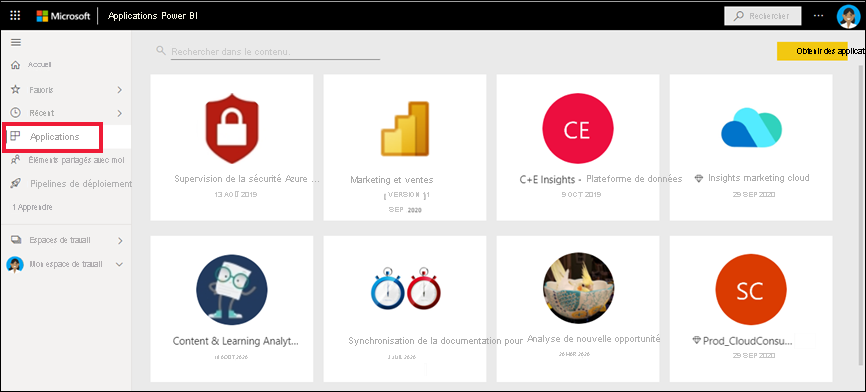
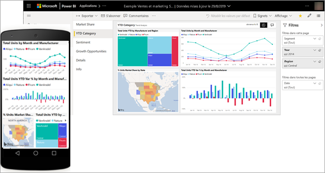
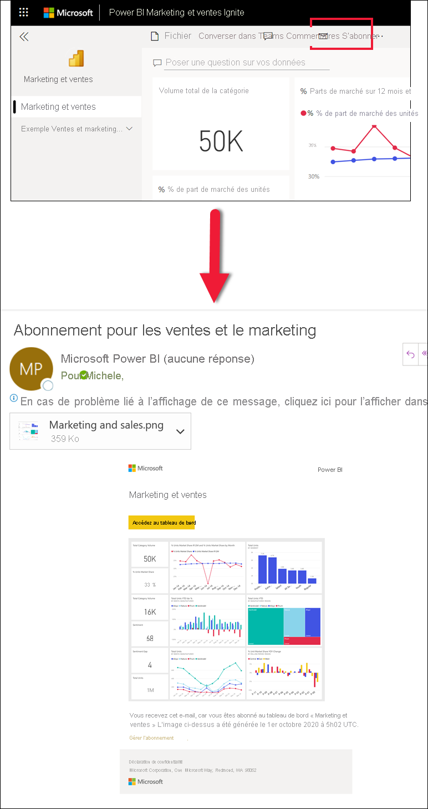
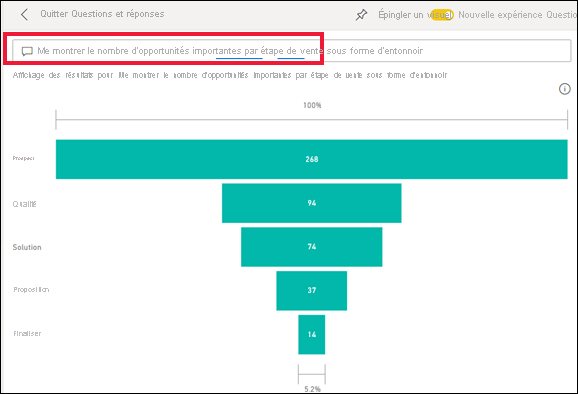
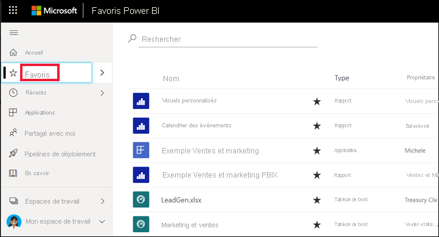
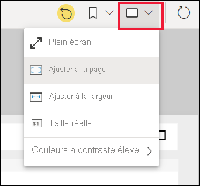
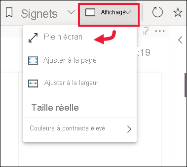
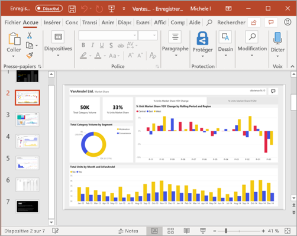

# Démarrage rapide : en savoir plus sur les fonctionnalités de Power BI pour les *utilisateurs professionnels*

[!INCLUDE[consumer-appliesto-ynny](../includes/consumer-appliesto-ynny.md)]

Dans ce démarrage rapide, vous allez apprendre à interagir avec Power BI pour découvrir des insights d’entreprise pilotés par les données. Cet article n’est pas destiné à aller au fond des choses. Il brosse en revanche un tableau rapide de la plupart des actions accessibles aux **utilisateurs professionnels** de Power BI.

Si vous n’êtes pas inscrit à Power BI, [inscrivez-vous à un essai gratuit](https://app.powerbi.com/signupredirect?pbi_source=web) avant de commencer.

## Qu’est-ce que Power BI ? 
Power BI est un ensemble de services logiciels, d’applications et de connecteurs qui œuvrent ensemble pour transformer des sources de données disparates en insights cohérents, visuellement immersifs et interactifs. Quelle que soit la nature de vos données, une simple feuille de calcul Excel ou une collection de données provenant de différentes sources, Power BI vous permet de vous connecter facilement à vos sources de données, de visualiser (ou de découvrir) les informations importantes et de les partager avec les personnes de votre choix. 

Ouvrez le service Power BI dans un navigateur ou sur un appareil mobile. Vos collègues et vous-même travaillez à partir des mêmes applications, tableaux de bord et rapports approuvés, qui sont mis à jour et actualisés automatiquement : vous partez donc toujours du contenu le plus récent.   

## Mode Lecture
Il existe deux modes d’interaction avec les rapports dans le service Power BI : Mode Édition et mode Lecture.  Si vous êtes un *utilisateur professionnel*, vous êtes plus susceptible d’utiliser le mode Lecture pour consommer des rapports créés par d’autres utilisateurs. Le mode Édition est utilisé par les *concepteurs* de rapport, qui créent les rapports et les partagent avec vous. Le mode Lecture vous permet d’explorer et d’interagir avec les rapports créés par des collègues. 

Même en mode Lecture, le contenu n’est pas statique. Vous pouvez l’explorer, à la recherche de tendances, d’insights et d’autres données décisionnelles. Segmentez le contenu et posez même des questions avec vos propres mots. Vous pouvez aussi ne rien faire et laisser vos données découvrir des insights qui vous intéressent, et vous envoyer des alertes quand des données sont modifiées et des rapports par e-mail selon une planification que vous définissez. Toutes vos données, à tout moment, dans le cloud ou localement, depuis n’importe quel appareil. 

Lisez la suite pour en savoir plus à leur sujet et découvrir d’autres fonctionnalités de ce type.

## Contenu Power BI
Lorsque nous utilisons le terme « contenu » dans Power BI, nous faisons référence aux rapports, tableaux de bord et applications. Il s’agit des modules que vous allez utiliser pour explorer vos données et prendre des décisions métier. 

> [!NOTE]
> Vous pouvez aussi consulter et partager les tableaux de bord, rapports et applications sur des appareils mobiles.

###  Applications

Une *application* est un type de contenu Power BI qui regroupe dans un même endroit des tableaux de bord et des rapports connexes. Une application peut ainsi rassembler un ou plusieurs tableaux de bord et un ou plusieurs rapports. Les applications sont créées par des *concepteurs* Power BI qui distribuent et partagent leurs applications avec des *utilisateurs professionnels* comme vous. 

Pour voir vos applications, vous pouvez notamment sélectionner **Applications** dans le volet de navigation et choisir une application à ouvrir.

Pour en savoir plus sur la consultation des applications, consultez [Applications Power BI](end-user-apps.md).

### Rapports

Un rapport Power BI est un affichage sous plusieurs angles d’un jeu de données, avec des visuels représentant différents résultats et insights de ce jeu de données. Un rapport peut avoir un seul visuel ou des pages entières de visuels. Les rapports sont créés par des *concepteurs* Power BI qui distribuent et partagent leurs rapports avec des *utilisateurs professionnels* comme vous.

Pour savoir comment visualiser les rapports, consultez [Rapports Power BI](end-user-reports.md).

### Tableaux de bord

Un tableau de bord Power BI est une page unique, souvent appelée canevas, qui utilise des visualisations pour raconter une histoire. Comme il est limité à une seule page, un tableau de bord bien conçu contient uniquement les éléments les plus importantes de cette histoire.

Les visualisations que vous voyez dans le tableau de bord sont appelées vignettes et sont épinglées au tableau de bord par les *concepteurs* de rapports. Dans la plupart des cas, la sélection d’une vignette ouvre la page de rapport où la visualisation a été créée. 

Pour savoir comment visualiser les tableaux de bord, consultez [Tableaux de bord Power BI](end-user-dashboards.md)
 
## Interagir dans le service Power BI

### Collaborer avec des collègues
Inutile de passer par votre e-mail. Ajoutez un commentaire personnel ou démarrez une conversation avec des collègues à propos d’un tableau de bord, directement dans ce même tableau de bord. Les commentaires constituent l’une des fonctionnalités qui vous permettent de collaborer avec d’autres personnes. 

En savoir plus sur les [commentaires](end-user-comment.md)

### Adossez-vous à votre fauteuil et laissez Power BI travailler pour vous
Les abonnements et les alertes sont les deux moyens dont se sert le service Power BI pour faire le travail à votre place. 

#### S’abonner à un tableau de bord (ou à un rapport)
Il n’est pas nécessaire d’ouvrir Power BI pour analyser un tableau de bord.  Vous pouvez vous abonner pour que Power BI vous envoie par e-mail un instantané de ce tableau de bord à la fréquence de votre choix. 

 En savoir plus sur les [abonnements Power BI](end-user-subscribe.md)

#### Recevoir des alertes lorsque vos données atteignent un seuil
Vos données changent sans arrêt et vos visuels sont automatiquement mis à jour pour refléter ces changements. Si vous souhaitez être notifié quand des données passent au-dessus ou en dessous d’un seuil que vous définissez, utilisez des alertes de données. Les alertes fonctionnent sur les jauges, les indicateurs de performance clés et les cartes.    

Power BI vous envoie un e-mail lorsque la valeur augmente ou diminue par rapport à la limite que vous avez définie.  

En savoir plus sur les [alertes Power BI](end-user-alerts.md)

### Utilisez Questions et réponses pour poser des questions en langage naturel
Il est parfois plus rapide d’obtenir des informations à partir de vos données en posant une question dans un langage naturel. La zone de questions Questions et réponses se trouve en haut de votre tableau de bord. Exemple : « Montre-moi le nombre d’opportunités importantes par étape de vente sous forme d’entonnoir ». 

En savoir plus sur [Questions et réponses Power BI](end-user-q-and-a.md)

### Afficher des détails sur une visualisation
Les visuels sont constitués de points de données et en plaçant votre curseur sur un point de données, vous pouvez en voir les détails.

### Ajouter un tableau de bord aux favoris
Quand vous définissez un contenu comme *favori*, vous pouvez y accéder depuis l’[Accueil](end-user-home.md) et le volet de navigation. Le volet de navigation est visible de presque partout dans le service Power BI. Les favoris sont généralement les tableaux de bord, les pages de rapport et les applications que vous consultez le plus souvent.

Pour enregistrer du contenu en tant que favori, dans l’angle supérieur droit du service Power BI, sélectionnez l’icône en forme d’étoile. 
   

Pour afficher vos favoris, sélectionnez **Favoris** dans le volet de navigation.

Jetez un coup d’œil aux autres actions disponibles dans la barre de menus.  Nous ne les abordons pas toutes dans cet article, mais dans d’autres articles.  Explorez davantage en utilisant la table des matières de Power BI ou le champ **Rechercher**. 

En savoir plus sur les [favoris et les fonctionnalités proposées](end-user-favorite.md)

### Ajuster les dimensions d’affichage
Les rapports peuvent être affichés sur différents appareils dont les tailles d’écran et les proportions peuvent varier.  Le rendu par défaut peut ne pas vous convenir sur certains appareils.  

Pour l’ajuster, dans la barre de menus en haut à droite, sélectionnez l’icône **Affichage** et choisissez l’une des options d’affichage. 

### Voir les interconnexions entre tous les éléments visuels d’une page
Effectuez une sélection et un filtrage croisés des visualisations connexes sur une page de rapport. Les visualisations situées sur une même page de rapport sont toutes « connectées » les unes aux autres.  Par conséquent, si vous sélectionnez une ou plusieurs valeurs dans une visualisation, les autres visualisations qui utilisent les mêmes valeurs changent en fonction de votre sélection.

> 

En savoir plus sur les [interactions avec les visuels](end-user-interactions.md)

<!-- ###  Open the **Selection** pane
Easily navigate between the visualizations on the report page. 

1. Select **View > Selection pane** to open the Selection pane. Toggle **Selection pane** to On.

    

2. The Selection pane opens on your report canvas. Select a visual from the list to make it active.

     -->

### Zoom avant sur des éléments visuels individuels
Pointez sur un visuel, puis sélectionnez l’icône **Mode Focus** . Lorsque vous ouvrez une visualisation en mode Focus, celle-ci se développe de manière à occuper entièrement la zone de dessin du rapport, comme illustré ci-dessous.

Pour afficher cette même visualisation sans les barres de menus, le volet des filtres et autres éléments superflus, sélectionnez **Plein écran** dans la liste déroulante Affichage.   

En savoir plus sur le [mode Focus et le mode Plein écran](end-user-focus.md)

### Trier une visualisation
Il est possible de trier les éléments visuels d’une page de rapport et de les enregistrer une fois les modifications appliquées. 

Pointez sur un visuel pour l’activer, puis sélectionnez **Plus d’options** (...) pour ouvrir les options de tri.

 

En savoir plus sur le [tri des visuels](end-user-search-sort.md)

### Afficher les données utilisées pour créer une visualisation
Une visualisation Power BI se construit à l’aide des données des jeux de données sous-jacents. Si vous voulez voir les calculs sous-jacents, Power BI vous permet d’*afficher* les données utilisées pour créer le visuel. Quand vous sélectionnez **Afficher sous forme de tableau**, Power BI affiche les données sous ou à côté de la visualisation.

Avec un visuel actif, sélectionnez **Plus d’options** (...) et choisissez **Afficher sous forme de table**.
   
   

### Exporter des données vers Excel
En plus d’afficher les données utilisées pour créer un visuel, vous pouvez également exporter ces données et les consulter dans Microsoft Excel. Lorsque vous exportez vers Excel, vous créez un document distinct, une feuille de calcul qui ne fait pas partie de Power BI. Les changements que vous effectuez dans le fichier Excel n’ont pas d’impact sur les données de Power BI. Que vous souhaitiez examiner de plus près les données ou utiliser les données dans une autre application ou à d’autres fins, Power BI vous offre cette flexibilité.

<!-- Exporting isn't limited to individual visuals; you can export entire reports to PowerPoint or PDF to share with your colleagues.

 -->

Cet article est juste un petit aperçu de ce que les *utilisateurs professionnels* peuvent réaliser avec le service Power BI.  

## Nettoyer les ressources
- Si vous avez établi une connexion avec une application, sélectionnez **Applications** dans le volet de navigation pour ouvrir la liste de contenu des applications. Placez le curseur sur l’application à supprimer, puis sélectionnez l’icône de la corbeille.

- Si vous avez établi une connexion ou importé un exemple de rapport Power BI, ouvrez **Mon espace de travail** dans le volet de navigation. Avec les onglets situés en haut, recherchez le tableau de bord, le rapport et le jeu de données, puis sélectionnez pour chacun l’icône de la corbeille.

## Étapes suivantes
[Power BI pour les utilisateurs professionnels](end-user-consumer.md)

