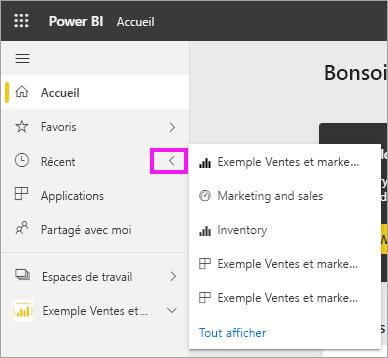
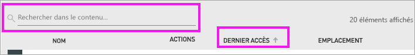

# Contenus **récents** dans le service Power BI

[!INCLUDE[consumer-appliesto-yyny](../includes/consumer-appliesto-yyny.md)]

Les contenus récents sont les derniers éléments que vous avez consultés dans le service Power BI, jusqu’à un maximum de 20.  Ceci inclut les tableaux de bord, les rapports, les applications et les classeurs.

Regardez Amanda montrer comment les listes de contenu **Récent** du service Power BI sont remplies, puis suivez les instructions détaillées sous la vidéo pour essayer vous-même.

<iframe width="560" height="315" src="https://www.youtube.com/embed/G26dr2PsEpk" frameborder="0" allowfullscreen></iframe>

> [!NOTE]
> Cette vidéo utilise une version plus ancienne du service Power BI.

## Afficher le contenu récent
Pour voir vos cinq éléments récemment consultés, dans le volet de navigation de gauche, sélectionnez la flèche à droite de **Récents**.  À partir de là, vous pouvez sélectionner un contenu récent pour l’ouvrir. Seuls les cinq éléments les plus récents sont répertoriés.

Si vous avez plus de cinq éléments récemment visités, sélectionnez **Afficher tout** pour ouvrir l’écran Récents. Vous pouvez également sélectionner **Récents** ou l’icône Récents  dans le volet de navigation.

## Actions disponibles dans la liste des contenus **Récents**
Les actions disponibles dépendent des paramètres affectés par le *concepteur* du contenu. Certaines de vos options peuvent inclure :
* Sélectionnez l’étoile pour [ajouter un tableau de bord, un rapport ou une application aux favoris](end-user-favorite.md) .
* Certains tableaux de bord et rapports peuvent être repartagés  .
* [Ouvrir le rapport dans Excel](end-user-export.md)  
* [Voir les insights](end-user-insights.md) que Power BI trouve dans les données .
* De plus, si vos listes s’allongent, [utilisez le champ de recherche et le tri pour trouver ce que vous cherchez](end-user-search-sort.md). Pour déterminer si une colonne peut être triée, pointez sur celle-ci pour voir si une flèche apparaît. Dans cet exemple, pointer sur **Dernier accès** fait apparaître une flèche : vos contenus récents peuvent être triés par date d’accès. 

    

## Étapes suivantes
[Applications du service Power BI](end-user-apps.md)

D’autres questions ? [Posez vos questions à la communauté Power BI](https://community.powerbi.com/)

