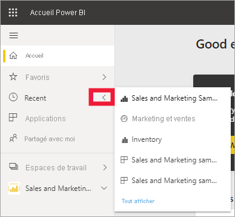
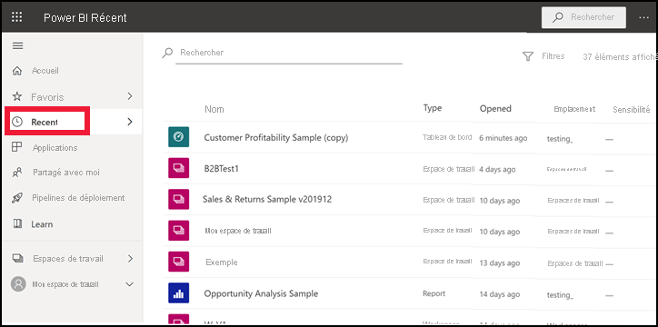
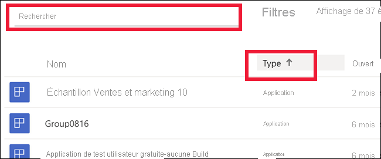

# Contenus **récents** dans le service Power BI

[!INCLUDE[consumer-appliesto-yyny](../includes/consumer-appliesto-yyny.md)]

Le contenu **récent** comprend les derniers éléments que vous avez consultés dans le service Power BI. Ceci inclut les tableaux de bord, les rapports, les applications et les classeurs. Lorsque vous sélectionnez **Récent** dans la barre de navigation, Power BI affiche ce contenu par date, dans l’ordre décroissant.  Pour changer l’ordre de tri, sélectionnez l’un des en-têtes, puis choisissez Croissant ou Décroissant.

Notez que deux des éléments sont des [favoris](end-user-favorite.md), car ils sont signalés par une étoile. Notez également que l’élément Customer Profitability Sample est stocké dans [Capacité Premium](end-user-license.md).

## Consulter les cinq éléments les plus récents

Pour afficher uniquement les cinq éléments les plus récemment consultés, dans le volet de navigation, sélectionnez la flèche à droite de **Récent**.  Ensuite, sélectionnez le contenu pour l’ouvrir. 

## Afficher tout le contenu récent

Si vous avez plus de cinq éléments récemment visités, sélectionnez **Afficher tout** pour ouvrir l’écran **Récent**. Comme nous l’avons fait au début de cet article, vous pouvez ignorer le menu volant et ouvrir l’écran **Récent** en sélectionnant le mot **Récent** ou son icône  à partir du volet de navigation.

## Rechercher et trier votre liste de contenu récent

Si vos listes s’allongent, [utilisez le champ de recherche et le tri pour trouver ce que vous cherchez](end-user-search-sort.md). Pour déterminer si une colonne peut être triée, pointez sur celle-ci pour voir si une flèche apparaît. Dans cet exemple, pointer sur **Type** fait apparaître une flèche : votre contenu récent peut être trié par ordre alphabétique et par type de contenu. 

Regardez Amanda montrer comment les listes de contenu **Récent** du service Power BI sont remplies, puis suivez les instructions détaillées sous la vidéo pour essayer vous-même.

<iframe width="560" height="315" src="https://www.youtube.com/embed/G26dr2PsEpk" frameborder="0" allowfullscreen></iframe>

> [!NOTE]
> Cette vidéo utilise une version plus ancienne du service Power BI.

<!--
## Actions available from the **Recent** content list
The actions available to you will depend on the settings assigned by the content *designer*. Some of your options may include:
* Select the star icon to [favorite a dashboard, report, or app](end-user-favorite.md) .
* Some dashboards and reports can be re-shared  .
* [Open the report in Excel](end-user-export.md)  
* [View insights](end-user-insights.md) that Power BI finds in the data . -->

## Étapes suivantes
[Applications du service Power BI](end-user-apps.md)

D’autres questions ? [Posez vos questions à la communauté Power BI](https://community.powerbi.com/)

