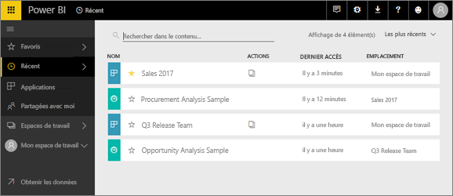
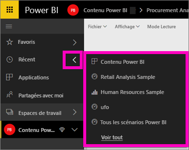

# Contenu **récent** dans le service Power BI

## Qu’est ce que le contenu récent
Le contenu récent regroupe les derniers éléments que vous avez consultés dans le service Power BI (maximum 20).  Il peut s’agir de tableaux de bord, de rapports, d’applications et de classeurs dans l’ensemble de vos espaces de travail.

Regardez Amanda montrer comment les listes de contenu **Récent** du service Power BI sont remplies, puis suivez les instructions détaillées sous la vidéo pour essayer vous-même.

<iframe width="560" height="315" src="https://www.youtube.com/embed/G26dr2PsEpk" frameborder="0" allowfullscreen></iframe>

## Afficher le contenu récent
Pour voir vos cinq éléments visités le plus récemment, dans le volet de navigation de gauche, sélectionnez la flèche à droite de **Récents**.  À partir de là, vous pouvez sélectionner un contenu récent pour l’ouvrir. Seuls les cinq éléments les plus récents sont répertoriés.

Si vous avez plus de cinq éléments récemment visités, sélectionnez **Afficher tout** pour ouvrir l’écran Récents (voir ci-dessous). Vous pouvez également sélectionner **Récents** ou l’icône Récents  dans le volet de navigation de gauche.

À partir de là, vous pouvez interagir avec le contenu comme vous le feriez sous les onglets [**Tableaux de bord**](end-user-dashboards.md), [**Rapports**](end-user-reports.md) et **Classeurs**, ainsi que sur l’écran [**Applications**](end-user-apps.md).

## Étapes suivantes
[Applications du service Power BI](end-user-apps.md)

D’autres questions ? [Posez vos questions à la communauté Power BI](http://community.powerbi.com/)

