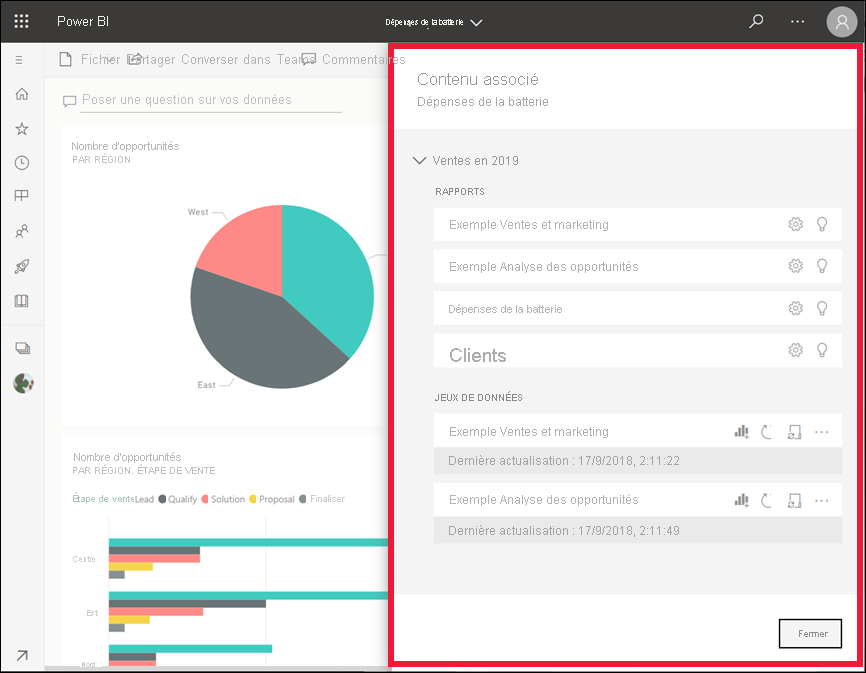

# Voir le contenu associé dans le service Power BI

[!INCLUDE[consumer-appliesto-yyny](../includes/consumer-appliesto-yyny.md)]

[!INCLUDE [power-bi-service-new-look-include](../includes/power-bi-service-new-look-include.md)]

Le volet **Contenu associé** montre les interconnexions entre les éléments de contenu du service Power BI (tableaux de bord, rapports et jeux de données). Le volet **Contenu associé** est également une plateforme de lancement pour prendre des mesures. À partir de là, vous pouvez effectuer des opérations telles que l’ouverture d’un tableau de bord, l’ouverture d’un rapport, la génération d’insights, l’analyse des données dans Excel et bien plus encore.  

Dans le service Power BI, les rapports sont générés à partir de jeux de données, leurs visuels sont ensuite épinglés aux tableaux de bord, puis les visuels des tableaux de bord sont reliés aux rapports. Mais comment savoir quels tableaux de bord hébergent les visuels de votre rapport Marketing ? Et comment localiser ces tableaux de bord ? Votre tableau de bord d’approvisionnement utilise-t-il des visuels de plusieurs jeux de données ? Si tel est le cas, quels sont leur noms et comment les ouvrir et les modifier ? Votre jeu de données HR est-il utilisé dans des rapports ou des tableaux de bord ? Ou peut-il être déplacé sans provoquer des liens rompus ? Le volet **Contenu associé** répond à toutes ces questions.  En plus d’afficher le contenu associé, ce volet permet d’agir sur celui-ci et de naviguer aisément entre ses éléments.

> [!NOTE]
> La fonctionnalité Contenu associé ne fonctionne pas pour les jeux de données de streaming.
> 
> 

## Voir le contenu associé d’un tableau de bord ou rapport
Regardez Will pendant qu’il affiche le contenu associé d’un tableau de bord. Suivez ensuite les instructions détaillées sous la vidéo pour essayer par vous-même en utilisant l’exemple Analyse de l’approvisionnement.

> [!NOTE]
> Cette vidéo est basée sur une version antérieure du service Power BI. 

<iframe width="560" height="315" src="https://www.youtube.com/embed/B2vd4MQrz4M#t=3m05s" frameborder="0" allowfullscreen></iframe>

Une fois le tableau de bord ou le rapport ouvert, sélectionnez **Plus d’options** (...) dans la barre de menus, puis choisissez **Voir le contenu associé** dans la liste déroulante.

Le volet **Contenu associé** s’ouvre. Pour un tableau de bord, il affiche tous les rapports dont des visualisations sont épinglées au tableau de bord ainsi que les jeux de données associés. Pour ce tableau de bord, il existe des visualisations épinglées à partir d’un seul rapport, et ce rapport est basé sur un seul jeu de données. Si vous examinez l’image au début de cet article, vous verrez le contenu associé d’un tableau de bord dont les visualisations sont épinglées à partir de quatre rapports et deux jeux de données.

À partir de là, vous pouvez effectuer une action directe sur le contenu associé, en fonction de vos autorisations.  Par exemple, sélectionnez un nom de rapport ou tableau de bord pour ouvrir celui-ci.  Pour un rapport listé, sélectionnez une icône pour ouvrir et modifier les paramètres du rapport, [Obtenir des insights](end-user-insights.md) et bien plus encore. Pour un jeu de données, vérifiez la date et l’heure de la dernière actualisation, [Analysez dans Excel](../collaborate-share/service-analyze-in-excel.md), [Obtenez des insights](end-user-insights.md), actualisez et bien plus encore.  

<!-- ## See related content for a dataset
You'll need at least *view* permissions to a dataset to open the **Related content** pane. In this example, we're using the [Procurement Analysis sample](../create-reports/sample-procurement.md).

From the nav pane, locate the **Workspaces** heading and select a workspace from the list. If you have content in a workspace, it will display in the canvas to the right. 

In a workspace, select the **Datasets** tab and locate the **See related** icon .

Select the icon to open the **Related content** pane.

From here, you can take direct action on the related content. For example, select a dashboard or report name to open it.  For any dashboard in the list, select an icon to [share the dashboard with others](../collaborate-share/service-share-dashboards.md) or to open the **Settings** window for the dashboard. For a report, select an icon to [analyze in Excel](../collaborate-share/service-analyze-in-excel.md), [rename](../create-reports/service-rename.md), or [get insights](end-user-insights.md).  -->

## Limitations et résolution des problèmes
* Si vous ne voyez pas « Afficher les éléments associés », recherchez  à la place. Sélectionnez l’icône pour ouvrir le volet **Contenu associé**.
* Pour ouvrir le contenu associé d’un rapport, vous devez être en [Mode lecture](end-user-reading-view.md).
* La fonctionnalité Contenu associé ne fonctionne pas pour les jeux de données de streaming.

## Étapes suivantes
* [Prise en main du service Power BI](../fundamentals/service-get-started.md)
* D’autres questions ? [Posez vos questions à la communauté Power BI](https://community.powerbi.com/)
