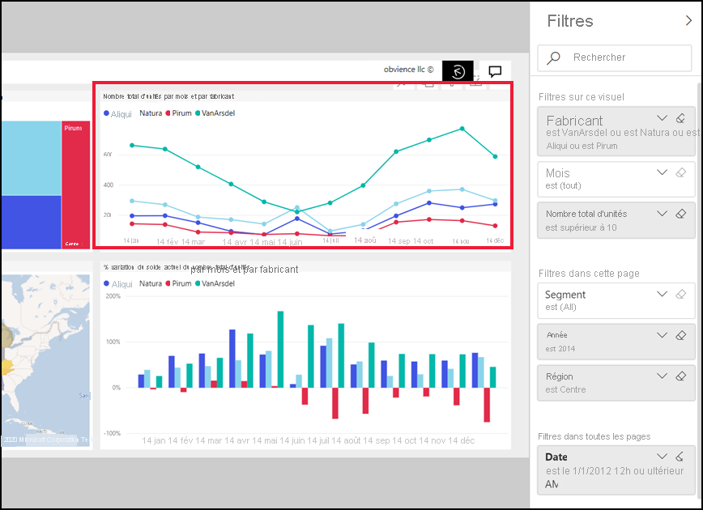

# Découvrir le volet Filtres de rapport
Cet article examine le volet filtres de rapport dans le service Power BI. Utilisez les filtres pour découvrir de nouvelles informations dans vos données.

Il existe de nombreuses façons de filtrer des données dans Power BI. Nous vous recommandons de commencer par lire l’article [À propos des filtres et de la mise en évidence](../power-bi-reports-filters-and-highlighting.md).

## Utiliser le volet Filtres des rapports
Quand un collègue partage un rapport avec vous, recherchez le volet **Filtres**. Il est parfois réduit le long du bord droit du rapport. Sélectionnez-le pour le développer.   

Le volet Filtres contient les filtres qui ont été ajoutés au rapport par le *concepteur* du rapport. *Consommateurs* comme vous, peut interagir avec les filtres existants, puis enregistrez vos modifications, mais ne peut pas ajouter de nouveaux filtres au rapport. Par exemple, dans la capture d’écran ci-dessus, le concepteur ajouté deux filtres au niveau de la page : Segmenter et année en cours d’exécution. Vous pouvez interagir avec ces filtres et les modifier, mais vous ne pouvez pas ajouter de troisième filtre au niveau de la page.

Dans le service Power BI, les rapports conservent les modifications que vous apportez dans le volet filtres, et ces modifications sont transmises à la version mobile du rapport. Pour réinitialiser le volet Filtres aux valeurs par défaut du concepteur, sélectionnez **Rétablir les valeurs par défaut** dans la barre de menus du haut.  

   

## Afficher tous les filtres pour une page de rapport
Le volet Filtres affiche tous les filtres ajoutés au rapport par le *concepteur*. Le volet filtres est également la zone où vous pouvez afficher des informations sur les filtres et interagir avec eux. Vous pouvez enregistrer les modifications que vous faites ou utiliserez **par défaut** pour rétablir les paramètres de filtre d’origine.

Si vous souhaitez enregistrer des modifications sont apportées, vous pouvez également créer un signet personnel.  Pour plus d’informations, consultez [ajouter un signet à un rapport](end-user-bookmarks.md).

Il existe plusieurs types de filtres de rapport qui sont affichés et gérés dans le volet filtres, ceux que vous appliquez à un élément visuel, une page de rapport et l’intégralité du rapport.

Dans cet exemple, nous avons sélectionné un élément visuel contenant les filtres de 2. La page de rapport dispose également de filtres, répertoriés sous le **filtres sur cette page** titre. Et l’intégralité du rapport a un filtre de Date.

Certains des filtres sont accompagnés du mot **Tout**, ce qui signifie que toutes les valeurs sont incluses dans le filtre.  Par exemple, **Segment(All)** dans la capture d’écran ci-dessus indique que cette page de rapport inclut des données sur tous les segments de produit.  En revanche, le niveau de la page Filtrer de **région est ouest** indique que la page de rapport inclut uniquement des données de la région Ouest.

Toute personne qui consulte ce rapport peut interagir avec ces filtres comme suit :

### Afficher uniquement les filtres appliqués à un élément visuel
Pour obtenir les examiner plus en détail les filtres appliqués à un visuel spécifique, placez le curseur sur l’élément visuel pour afficher l’icône de filtre . Sélectionnez cette icône de filtre pour afficher une fenêtre contextuelle avec tous les filtres, les segments et ainsi de suite, qui affectent ce visuel. Les filtres dans la fenêtre contextuelle sont les mêmes filtres affichées sur le **filtres** volet. 

 
Voici les types de filtres de que cette vue peut afficher :
- Filtres de base
- Segments
- Mise en surbrillance croisée
- Filtrage croisé
- Filtres avancés
- N filtres principaux
- Filtres de date relative
- Segments synchronisés
- Filtres Inclure/Exclure
- Filtres transmis via une URL

Dans l’exemple, ci-dessous :
1. Nous pouvons voir que l’histogramme a été de filtrage croisé.
2. **Inclus** nous indique que le filtrage croisé concerne **Segment**, et trois sont inclus. 
3. Un segment a été appliqué pour **trimestre**.
4. **Région** est un filtre appliqué à cette page de rapport, et
5. **isVanArsdel** et **année** sont appliqués à ce visuel.

### Recherche dans un filtre
Parfois, un filtre peut avoir une longue liste de valeurs. Utilisez la zone de recherche pour rechercher et sélectionner la valeur souhaitée. 

### Filtre l’affichage des détails
Pour comprendre un filtre, examinez les valeurs disponibles et les décomptes.  Afficher les détails du filtre en sélectionnant la flèche en regard du nom de filtre. 
  

### Modifier les sélections de filtre
Une pour rechercher les données consiste à interagir avec les filtres. Vous pouvez modifier les sélections de filtre à l’aide de la flèche déroulante en regard du nom de champ.  Selon le filtre et le type de données qui est filtrées, vos options seront comprise entre les sélections simples dans la liste pour identifier les plages de dates ou des nombres. Dans le filtre avancé ci-dessous, nous avons modifié le filtre **Total unités YTD** sur le graphique de compartimentage pour être comprise entre 2 000 et 3 000. Notez que cela supprime Prirum le treemap. 
  

> [!TIP]
> Pour sélectionner plusieurs valeurs de filtre à la fois, maintenez la touche CTRL enfoncée. La plupart des filtres prennent en charge la sélection multiple. 

### Réinitialiser le filtre par défaut
Si vous souhaitez annuler toutes les modifications apportées aux filtres, sélectionnez **par défaut** à partir de la barre de menus supérieure.  Cela permet de passer les filtres à leur état d’origine, telle que définie par le rapport *concepteur*. 

    
### Supprimer un filtre
S’il est simplement un filtre que vous souhaitez définir **(All)** , désactivez-la en sélectionnant l’icône de gomme  en regard du nom de filtre.
  
<!--  too much detail for consumers

## Types of filters: text field filters
### List mode
Ticking a checkbox either selects or deselects the value. The **All** checkbox can be used to toggle the state of all checkboxes on or off. The checkboxes represent all the available values for that field.  As you adjust the filter, the restatement updates to reflect your choices. 

Note how the restatement now says "is Mar, Apr or May".

### Advanced mode
Select **Advanced Filtering** to switch to advanced mode. Use the dropdown controls and text boxes to identify which fields to include. By choosing between **And** and **Or**, you can build complex filter expressions. Select the **Apply Filter** button when you've set the values you want.  

## Types of filters: numeric field filters
### List mode
If the values are finite, selecting the field name displays a list.  See **Text field filters** &gt; **List mode** above for help using checkboxes.   

### Advanced mode
If the values are infinite or represent a range, selecting the field name opens the advanced filter mode. Use the dropdown and text boxes to specify a range of values that you want to see. 

By choosing between **And** and **Or**, you can build complex filter expressions. Select the **Apply Filter** button when you've set the values you want.

## Types of filters: date and time
### List mode
If the values are finite, selecting the field name displays a list.  See **Text field filters** &gt; **List mode** above for help using checkboxes.   

### Advanced mode
If the field values represent date or time, you can specify a start/end time when using Date/Time filters.  

-->

## Étapes suivantes
[Découvrez comment et pourquoi le filtrage croisé et la sélection croisée affectent les visuels d’une page de rapport](end-user-interactions.md)