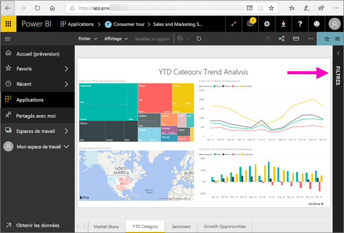
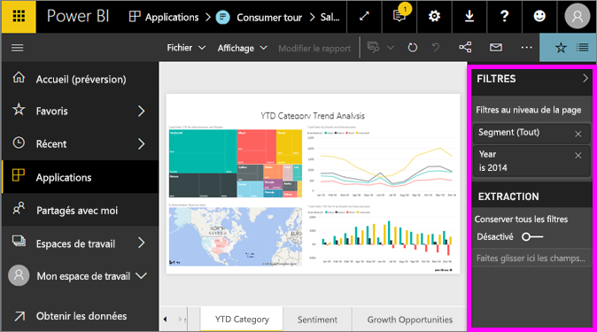
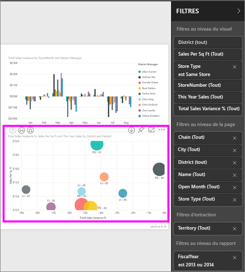
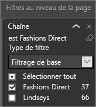
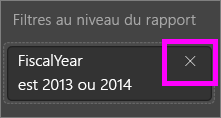
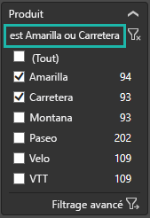
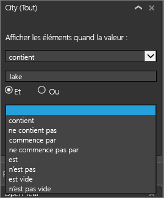
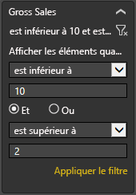
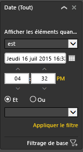

# Découvrir le volet Filtres de rapport
Cet article présente le volet Filtres de rapport du service Power BI.

Il existe de nombreuses façons de filtrer des données dans Power BI. Nous vous recommandons de commencer par lire l’article [À propos des filtres et de la mise en évidence](../power-bi-reports-filters-and-highlighting.md).

## Utiliser le volet Filtres des rapports
Quand un collègue partage un rapport avec vous, recherchez le volet **Filtres**. Il est parfois réduit le long du bord droit du rapport. Sélectionnez-le pour le développer.   

Le volet Filtres contient les filtres qui ont été ajoutés au rapport par le *concepteur* du rapport. Les *consommateurs* comme vous peuvent interagir avec les filtres et enregistrer leurs modifications, mais ils ne peuvent pas ajouter de nouveaux filtres au rapport.

Dans le service Power BI, les rapports conservent les modifications que vous apportez dans le volet Filtres, et ces modifications sont passées à la version mobile du rapport. Pour réinitialiser le volet Filtres aux valeurs par défaut du concepteur, sélectionnez **Rétablir les valeurs par défaut** dans la barre de menus du haut.     

## Ouvrir le volet Filtres
Quand un rapport est ouvert en mode Lecture, le volet Filtres s’affiche sur le côté droit du canevas du rapport. Si vous ne voyez pas le volet, sélectionnez la flèche dans le coin supérieur droit pour le développer.  

Dans cet exemple, nous avons sélectionné un élément visuel contenant 6 filtres. La page de rapport dispose également de filtres qui sont répertoriés sous le titre **Filtres au niveau de la page**. Il y a un [filtre Extraction](../power-bi-report-add-filter.md), et le rapport entier a également un filtre, **AnnéeFiscale**, défini sur 2013 ou 2014.

Certains des filtres sont accompagnés du mot **Tout**, ce qui signifie que toutes les valeurs sont incluses dans le filtre.  Par exemple, dans la capture d’écran ci-dessous, **Chain(Tout)** indique que cette page de rapport inclut des données sur toutes les chaînes de magasin.  En revanche, le filtre au niveau du rapport **AnnéeFiscale est 2013 ou 2014** indique que le rapport inclut des données uniquement pour les années fiscales 2013 et 2014.

Toute personne qui consulte ce rapport peut interagir avec ces filtres comme suit :

* Affichez les détails du filtre en sélectionnant la flèche en regard du filtre.
  
   
* Changez le filtre, par exemple en passant de **Lindseys** à **Fashions Direct**.
  
     

* Réinitialisez les filtres à leur état d’origine en sélectionnant **Rétablir les valeurs par défaut** dans la barre de menus du haut.    
    
    
* Supprimez le filtre en sélectionnant la croix (**x**) en regard de son nom.
  
  La suppression d’un filtre le supprime de la liste, mais ne supprime pas les données du rapport.  Par exemple, si vous supprimez le filtre **AnnéeFiscale est 2013 ou 2014**, les données relatives à l’année fiscale figurent toujours dans le rapport, mais elles ne sont plus filtrées pour afficher uniquement les années 2013 et 2014 ; toutes les années fiscales contenues dans les données sont affichées.  Néanmoins, une fois que vous supprimez le filtre, vous ne pouvez pas le modifier à nouveau, car il est supprimé de la liste. Une meilleure option consiste à effacer le filtre en sélectionnant l’icône représentant une gomme .
  
  

## Supprimer un filtre
 En mode Filtrage de base ou avancé, sélectionnez l’icône de gomme.   pour effacer le filtre. 

## Types de filtres : filtres de champ de texte
### Mode Liste
Le fait de cocher une case sélectionne ou désélectionne la valeur. La case **Tout** peut être utilisée pour activer ou désactiver l’ensemble des cases à cocher. Les cases à cocher représentent toutes les valeurs disponibles pour ce champ.  Quand vous ajustez le filtre, la reformulation est mise à jour pour refléter vos choix. 

Notez que la reformulation est à présent « est Amarilla ou Carretera ».

### Mode Avancé
Sélectionnez **Filtrage avancé** pour basculer en mode Avancé. Utilisez les contrôles de liste déroulante et les zones de texte pour identifier les champs à inclure. En choisissant **Et** ou **Ou**, vous pouvez créer des expressions de filtre complexes. Cliquez sur le bouton **Appliquer le filtre** une fois que vous avez défini les valeurs souhaitées.  

## Types de filtres : filtres de champ numérique
### Mode Liste
Si les valeurs sont limitées, le fait de sélectionner le nom du champ affichera une liste.  Consultez **Filtres de champ de texte** &gt; **Mode Liste** ci-dessus pour plus d’informations sur l’utilisation des cases à cocher.   

### Mode Avancé
Si les valeurs sont infinies ou représentent une plage, le fait de sélectionner le nom du champ ouvrira le mode Filtre avancé. Utilisez la liste déroulante et les zones de texte pour spécifier la plage de valeurs que vous voulez afficher. 

En choisissant **Et** ou **Ou**, vous pouvez créer des expressions de filtre complexes. Cliquez sur le bouton **Appliquer le filtre** une fois que vous avez défini les valeurs souhaitées.

## Types de filtres : date et heure
### Mode Liste
Si les valeurs sont limitées, le fait de sélectionner le nom du champ affichera une liste.  Consultez **Filtres de champ de texte** &gt; **Mode Liste** ci-dessus pour plus d’informations sur l’utilisation des cases à cocher.   

### Mode Avancé
Si les valeurs de champ représentent une date ou une heure, vous pouvez spécifier une heure de début et une heure de fin avec les filtres Date/Heure.  

## Étapes suivantes
[Découvrez comment et pourquoi le filtrage croisé et la sélection croisée affectent les visuels d’une page de rapport](end-user-interactions.md)