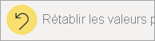
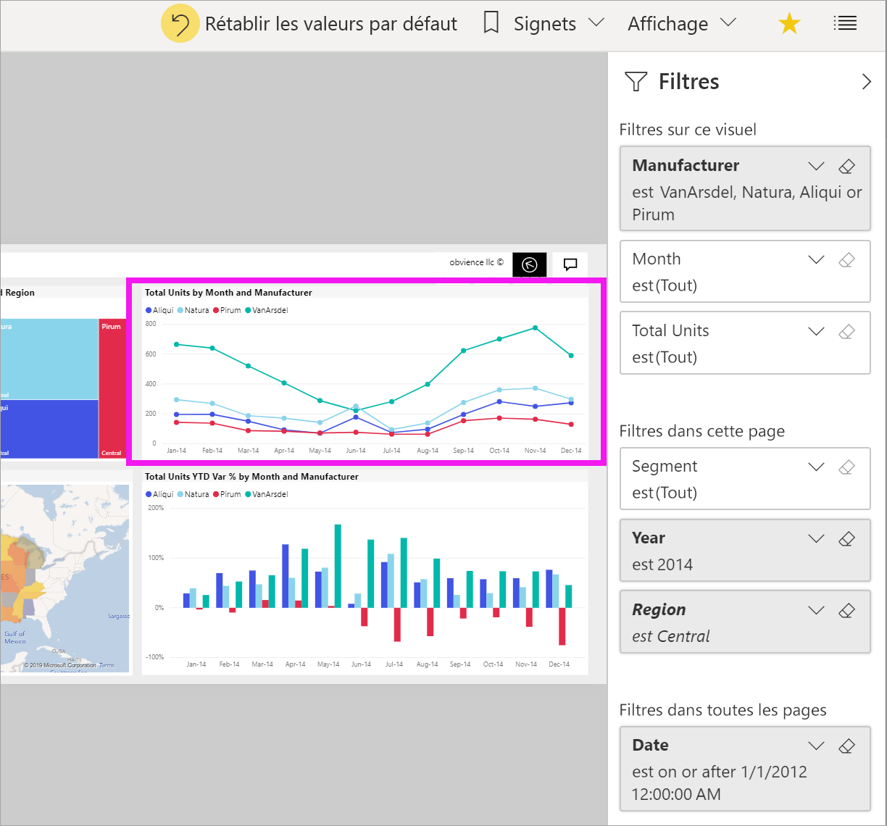
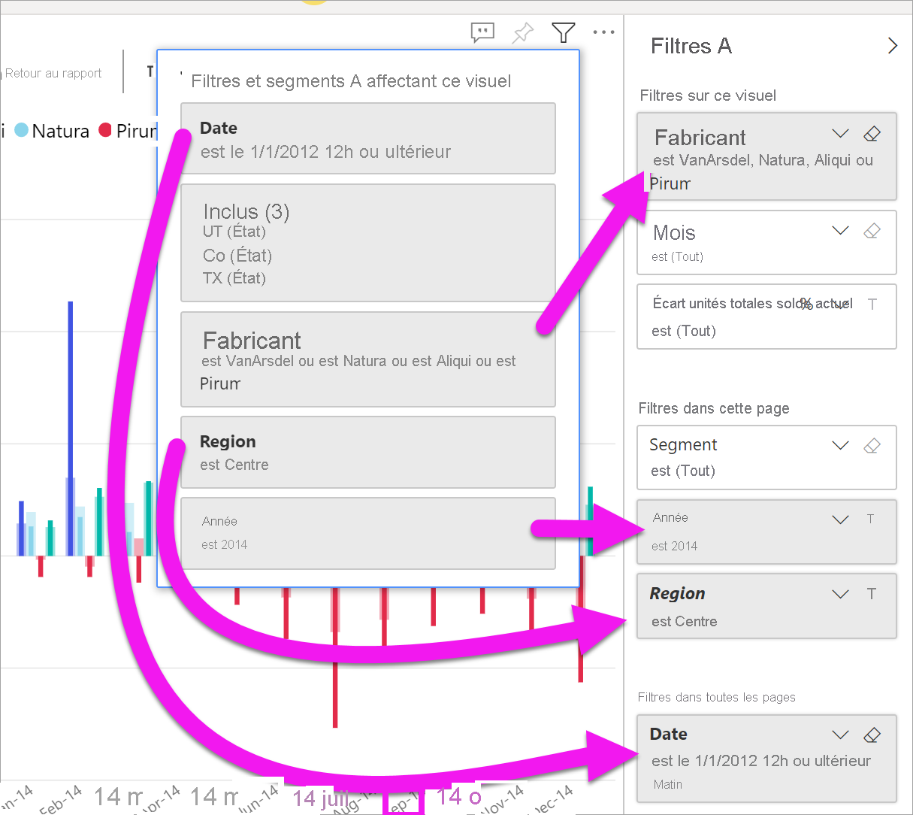
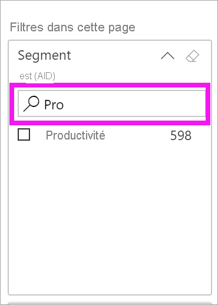
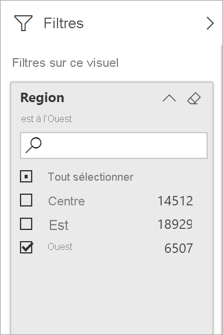
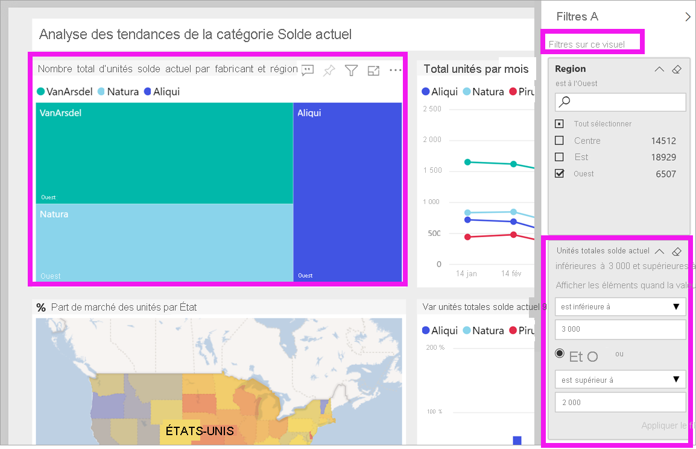
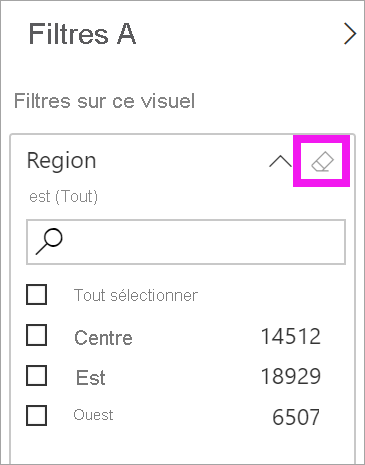
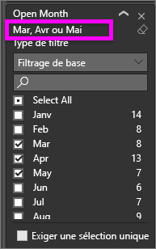
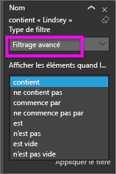
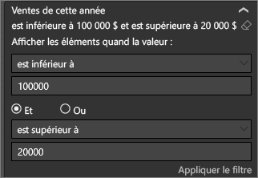

# Découvrir le volet Filtres de rapport

Cet article présente le volet **Filtres** de rapport du service Power BI. Utilisez les filtres pour découvrir de nouveaux insights dans vos données.

Il existe de nombreuses façons de filtrer les données dans Power BI. Pour plus d’informations sur les filtres, consultez [Filtres et mise en évidence dans les rapports Power BI](../power-bi-reports-filters-and-highlighting.md).

## Utiliser le volet Filtres des rapports

Quand un collègue partage un rapport avec vous, recherchez le volet **Filtres**. Il est parfois réduit le long du bord droit du rapport. Sélectionnez-le pour le développer.

Le volet **Filtres** contient les filtres qui ont été ajoutés au rapport par son *concepteur*. Les *consommateurs* comme vous peuvent interagir avec les filtres existants et enregistrer les changements, mais ils ne peuvent pas ajouter de nouveaux filtres au rapport. Par exemple, dans la capture d’écran ci-dessus, le concepteur a ajouté trois filtres au niveau de la page : **Le segment est Tout**, **l’année est 2014** et **la région est Central**. Vous pouvez interagir avec ces filtres et les changer, mais vous ne pouvez pas ajouter de quatrième filtre au niveau de la page.

Dans le service Power BI, les rapports conservent tous les changements que vous apportez dans le volet **Filtres**. Le service transmet ces changements à la version mobile du rapport.

Pour réinitialiser le volet **Filtres** aux valeurs par défaut du concepteur, sélectionnez **Rétablir les valeurs par défaut** dans la barre de menus du haut.

 

## Afficher tous les filtres d’une page de rapport

Le volet **Filtres** affiche tous les filtres ajoutés par le concepteur au rapport. Le volet **Filtres** vous permet également d’afficher des informations sur les filtres et d’interagir avec eux. Enregistrez vos changements ou utiliser **Rétablir les valeurs par défaut** pour revenir aux paramètres de filtre d’origine.

Si vous avez des changements à enregistrer, vous pouvez également créer un signet personnel. Pour plus d’informations, consultez [Que sont les signets ?](end-user-bookmarks.md)

Le volet **Filtres** s’affiche et gère plusieurs types de filtres de rapport : rapport, page de rapport et élément visuel.

Dans cet exemple, nous avons sélectionné un élément visuel comprenant trois filtres. La page de rapport comporte également des filtres listés sous le titre **Filtres dans cette page**. Par ailleurs, l’intégralité du rapport a un filtre **Date**.

**(Tout)** apparaît en regard de certains filtres. **(Tout)** signifie que toutes les valeurs sont incluses dans le filtre. Dans la capture d’écran ci-dessous, **Segment(Tout)** indique que cette page de rapport comporte des données sur tous les segments de produit. 

Toute personne qui consulte ce rapport peut interagir avec ces filtres comme suit :

### Afficher uniquement les filtres appliqués à un visuel

Pour examiner plus en détail les filtres appliqués à un visuel spécifique, pointez sur le visuel pour afficher l’icône de filtre . Sélectionnez cette icône de filtre pour afficher une fenêtre contextuelle avec tous les filtres, segments, etc. qui affectent ce visuel. Les filtres de la fenêtre contextuelle incluent les mêmes filtres que ceux affichés dans le volet **Filtres**, plus un filtrage supplémentaire affectant l’élément visuel sélectionné.

Voici les types de filtres que cet affichage peut contenir :

- Filtres de base
- Segments
- Mise en surbrillance croisée
- Filtrage croisé
- Filtres avancés
- N filtres principaux
- Filtres de date relative
- Segments synchronisés
- Filtres Inclure/Exclure
- Filtres transmis via une URL

Dans cet exemple :
1. **Inclus** nous indique que l’élément visuel a été filtré de façon croisée. Cela signifie que les États de l’Utah, du Colorado et du Texas ont été sélectionnés sur l’un des autres éléments visuels de cette page de rapport. Dans ce cas, il s’agit de la carte. La sélection de ces trois États a éliminé les données pour tous les autres États de l’affichage sur le graphique à barres sélectionné.  

1. **Date** est un filtre appliqué à toutes les pages de ce rapport, et

1. les filtres **La région est Centrale** et **l’année est 2014** sont des filtres appliqués à cette page de rapport, et

4. **Le fabricant est VanArsdel, Natura, Aliqui ou Pirum** est un filtre appliqué à cet élément visuel.

### Recherche dans un filtre

Parfois, un filtre peut avoir une longue liste de valeurs. Utilisez la zone de recherche pour rechercher et sélectionner la valeur souhaitée.

### Afficher les détails d’un filtre

Pour comprendre un filtre, examinez les valeurs disponibles et les décomptes.  Pour afficher les détails du filtre, pointez sur la flèche en regard du filtre et sélectionnez-la.
  

### Modifier les sélections d’un filtre

Une façon de rechercher des insights sur les données consiste à interagir avec les filtres. Vous pouvez modifier les sélections de filtre à l’aide de la flèche déroulante en regard du nom d’un champ.  En fonction du filtre et du type de données filtrées par Power BI, vos options vont de la sélection simple dans une liste à l’identification de plages de dates ou de chiffres. Dans le filtre avancé ci-dessous, nous avons modifié le filtre **Total Units YTD** dans le treemap pour qu’il soit compris entre 2 000 et 3 000. Notez que ce changement supprime Pirum du treemap.
  

> [!TIP]
> Pour sélectionner plusieurs valeurs de filtre à la fois, maintenez la touche Ctrl enfoncée. La plupart des filtres prennent en charge la sélection multiple.

### Rétablir les valeurs par défaut du filtre

Si vous souhaitez annuler toutes les modifications apportées aux filtres, sélectionnez **Rétablir les valeurs par défaut** dans la barre de menus supérieure.  Cette sélection rétablit l’état d’origine des filtres conformément à la définition du Concepteur de rapports.

### Supprimer un filtre

Pour réinitialiser un filtre sur (Tout), effacez-le en sélectionnant l’icône de gomme en regard du nom du filtre.

  
<!--  too much detail for consumers

## Types of filters: text field filters
### List mode
Ticking a checkbox either selects or deselects the value. The **All** checkbox can be used to toggle the state of all checkboxes on or off. The checkboxes represent all the available values for that field.  As you adjust the filter, the restatement updates to reflect your choices. 

Note how the restatement now says "is Mar, Apr or May".

### Advanced mode
Select **Advanced Filtering** to switch to advanced mode. Use the dropdown controls and text boxes to identify which fields to include. By choosing between **And** and **Or**, you can build complex filter expressions. Select the **Apply Filter** button when you've set the values you want.  

## Types of filters: numeric field filters
### List mode
If the values are finite, selecting the field name displays a list.  See **Text field filters** &gt; **List mode** above for help using checkboxes.   

### Advanced mode
If the values are infinite or represent a range, selecting the field name opens the advanced filter mode. Use the dropdown and text boxes to specify a range of values that you want to see. 

By choosing between **And** and **Or**, you can build complex filter expressions. Select the **Apply Filter** button when you've set the values you want.

## Types of filters: date and time
### List mode
If the values are finite, selecting the field name displays a list.  See **Text field filters** &gt; **List mode** above for help using checkboxes.   

### Advanced mode
If the field values represent date or time, you can specify a start/end time when using Date/Time filters.  

-->

## Étapes suivantes

Découvrez comment et pourquoi [le filtrage croisé et la sélection croisée affectent les visuels d’une page de rapport](end-user-interactions.md).