# Voir un rapport dans le service Power BI pour les *consommateurs*
Un rapport est constitué d’une ou de plusieurs pages d’éléments visuels. Les rapports sont créés par des *concepteurs* Power BI et [partagés avec des *consommateurs* directement](end-user-shared-with-me.md) ou dans le cadre d’une [application](end-user-apps.md). 

Il existe de nombreuses façons d’ouvrir un rapport et nous vous en montrerons deux : ouvrir à partir de la page d’accueil et ouvrir à partir d’un tableau de bord. 

<!-- add art-->

## Ouvrir un rapport depuis la page d’accueil de Power BI
Nous allons ouvrir un rapport qui a été partagé avec vous directement, puis un rapport qui a été partagé comme partie d’une application.

   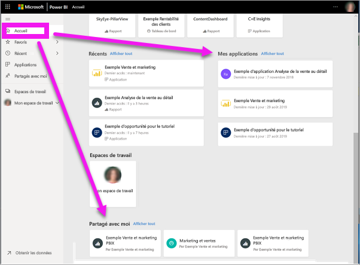

### Ouvrir un rapport qui a été partagé avec vous
Les *concepteurs* Power BI peuvent partager un rapport directement avec vous via un lien dans un e-mail ou en l’ajoutant automatiquement. Le contenu qui est partagé de cette façon s’affiche dans le conteneur **Partagé avec moi** sur votre barre de navigation et dans la section **Partagé avec moi** de votre canevas Accueil.

1. Ouvrir dans le service Power BI (app.powerbi.com).

2. Dans la barre de navigation, sélectionnez **Accueil** pour afficher votre canevas Accueil.  

   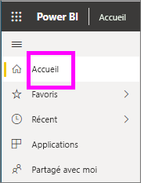
   
3. Faites défiler vers le bas jusqu'à ce que vous voyiez **Partagé avec moi**. Recherchez l’icône de rapport . Dans cette capture d’écran, nous avons un tableau de bord et un rapport nommé *Sales and marketing sample*. 
   
   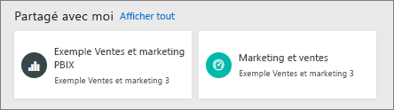

4. Sélectionnez simplement la *carte* du rapport pour ouvrir le rapport.

   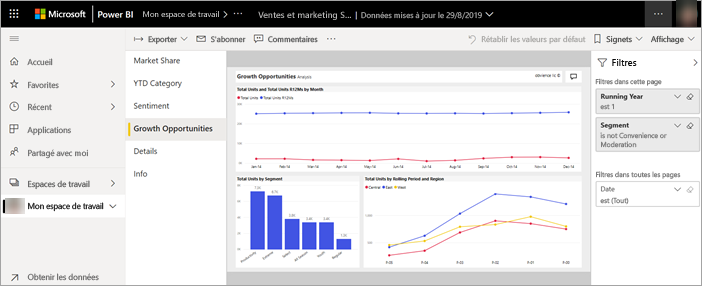

5. Notez la présence d’onglets sur le côté gauche.  Chaque onglet représente une *page* du rapport. La page *Growth Opportunity* est actuellement ouverte. Sélectionnez l’onglet *YTD Category* pour ouvrir à la place cette page du rapport. 

   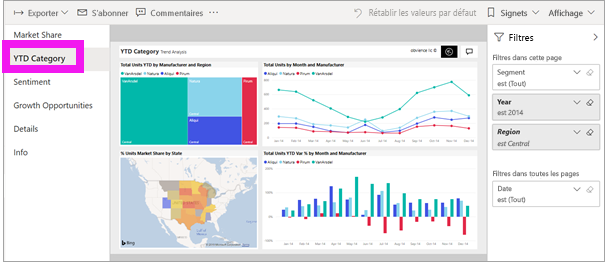

6. Notez le volet **Filtres** sur le côté droit. Les filtres qui ont été appliqués à cette page de rapport ou à l’ensemble du rapport s’affichent ici.

7. Le fait de pointer sur un visuel de rapport révèle plusieurs icônes et des points de suspension (...). Pour afficher les filtres appliqués à un visuel spécifique, sélectionnez l’icône de filtre. Ici, nous avons sélectionné l’icône de filtre pour le graphique en courbes *Total Units by Rolling Period and Region*.

   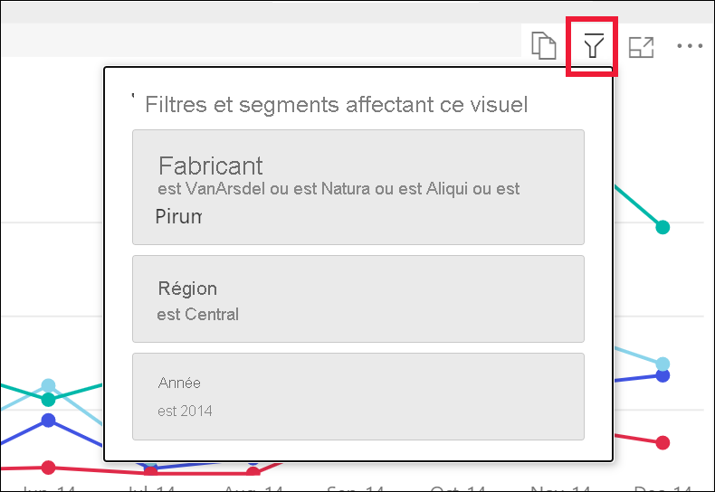

6. Pour l’instant, nous voyons toute la page du rapport. Pour changer l’affichage (zoom) de la page, sélectionnez la liste déroulante Afficher en haut à droite et choisissez **Taille réelle**.

   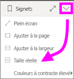

   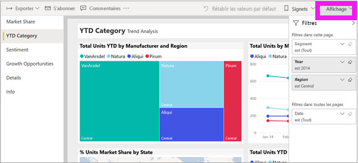

### Ouvrez un rapport qui fait partie d’une application
Si vous avez reçu des applications de collègues ou d’AppSource, ces applications sont disponibles à partir de votre page d’accueil et du conteneur **Applications** sur votre barre de navigation. Une [application](end-user-apps.md) est un ensemble de tableaux de bord et de rapports.

### Conditions préalables
Pour suivre la procédure, téléchargez l’application Marketing et ventes.
1. Dans votre navigateur, accédez à appsource.microsoft.com.
1. Recherchez « Marketing et ventes » et sélectionnez **Microsoft Sample - Sales & Marketing**.
1. Sélectionnez **Télécharger maintenant** > **Continuer** > **Installer** pour installer l’application dans votre conteneur d’applications. 

Vous pouvez ouvrir l’application à partir de votre conteneur d’applications ou de votre page d’accueil.
1. Revenez à l’accueil en sélectionnant **Accueil** à partir de la barre de navigation.

7. Faites défiler vers le bas jusqu'à ce que vous voyiez **Mes applications**.

   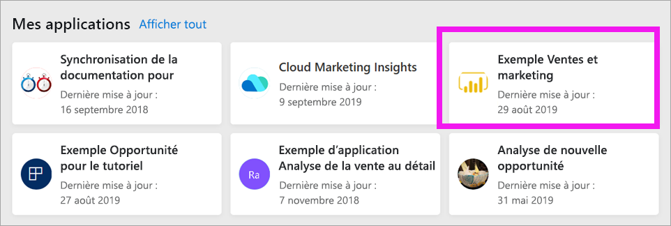

8. Sélectionnez votre nouvelle application de marketing et de ventes pour l’ouvrir. Selon les options définies par le *concepteur* de l’application, celle-ci ouvrira un tableau de bord ou un rapport. Cette application s’ouvre sur un tableau de bord.  

## Ouvrir un rapport à partir d’un tableau de bord
Les rapports peuvent être ouverts à partir d’un tableau de bord. La plupart des [vignettes](end-user-tiles.md) de tableau de bord sont *épinglées* à partir de rapports. Si une vignette est sélectionnée, le rapport utilisé pour la créer s’ouvre. 

1. À partir du tableau de bord, sélectionnez une vignette. Dans cet exemple, nous avons sélectionné la vignette d’histogramme « Total Units YTD... ».

    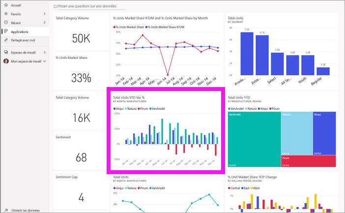

2.  Le rapport associé s’ouvre. Notez que nous sommes sur la page « YTD Category ». Il s’agit de la page de rapport qui contient l’histogramme que nous avons sélectionné à partir du tableau de bord.

    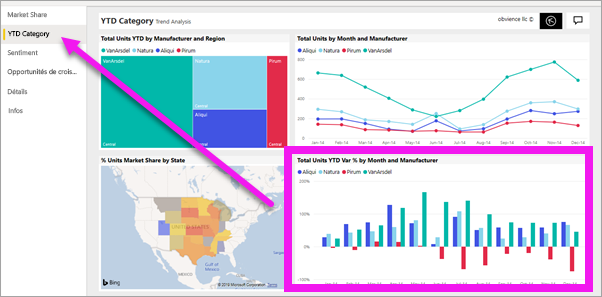

> [!NOTE]
> Toutes les vignettes ne conduisent pas à un rapport. Si vous sélectionnez une vignette [créée avec Questions et réponses](end-user-q-and-a.md), l’écran Questions et réponses s’ouvre. Si vous sélectionnez une vignette [créée à l’aide du widget **Ajouter une vignette** du tableau de bord](../service-dashboard-add-widget.md), plusieurs événements différents peuvent se produire : une vidéo peut être lue, un site web s’ouvrir, etc.  

##  Autres moyens pour ouvrir un rapport
Une fois que vous serez familiarisé avec la navigation dans le service Power BI, vous pourrez déterminer le workflow qui vous convient le mieux. Voici d’autres façons d’accéder aux rapports :
- À partir de la barre de navigation, en utilisant **Favoris** et **Récent**    
- À l’aide de [Afficher les éléments associés](end-user-related.md)    
- Dans un e-mail quand un utilisateur [partage avec vous](../service-share-reports.md) ou que vous [définissez une alerte](end-user-alerts.md)    
- À partir du [Centre de notifications](end-user-notification-center.md)    
- Et plus encore

## Étapes suivantes
[Ouvrir et voir un tableau de bord](end-user-dashboard-open.md)    
[Filtres de rapport](end-user-report-filter.md)

