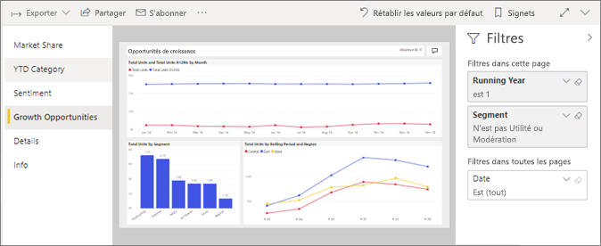
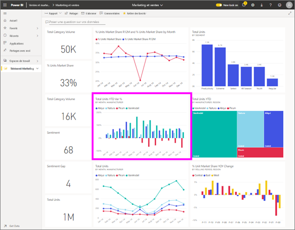

# Afficher un rapport dans le service Power BI pour les *consommateurs*
Un rapport est constitué d’une ou de plusieurs pages d’éléments visuels. Les rapports sont créés par Power BI *concepteurs* et [partagé avec *consommateurs* directement](end-user-shared-with-me.md) ou comme partie d’un [application](end-user-apps.md). 

Il existe différentes manières d’ouvrir un rapport et nous vous montrerons deux d'entre eux : ouvrez depuis leur domicile et ouvrir à partir d’un tableau de bord. 

<!-- add art-->

## Ouvrez un rapport à partir de Power BI accueil
Nous allons ouvrir un rapport qui a été partagé avec vous directement, puis un rapport qui a été partagé comme partie d’une application.

   

### Ouvrir un rapport qui a été partagé avec vous
Power BI *concepteurs* peuvent partager un rapport directement avec vous. Contenu qui est partagé de cette façon s’affiche dans le **partagé avec moi** conteneur sur votre volet de navigation de la barre et dans le **partagé avec moi** section de votre zone de dessin d’accueil.

1. Ouvrez le service Power BI (app.powerbi.com).

2. Dans la barre de navigation, sélectionnez **accueil** pour afficher votre canevas d’accueil.  

   
   
3. Faites défiler vers le bas jusqu'à ce que vous voyiez **Partagé avec moi**. Recherchez l’icône de rapport . Dans cette capture d’écran, nous avons un tableau de bord et un rapport nommé *exemple vente et marketing*. 
   
   

4. Il suffit de sélectionner le rapport *carte* pour ouvrir le rapport.

   

5. Notez que les onglets le long du côté gauche.  Chaque onglet représente une *page* du rapport. Nous disposons actuellement la *les opportunités de croissance* page ouverte. Sélectionnez le *YTD Category* onglet pour ouvrir cette page de rapport à la place. 

   

6. Maintenant, nous constatons la page de rapport entière. Pour modifier l’affichage (zoom) de la page, sélectionnez la liste déroulante d’affichage dans le coin supérieur droit ( **>** ) et choisissez **taille réelle**.

   

   

### Ouvrez un rapport qui fait partie d’une application
Si vous avez reçu des applications à partir de vos collègues ou d’AppSource, ces applications sont disponibles à partir d’accueil et à partir de la **applications** conteneur sur votre barre de navigation. Une [application](end-user-apps.md) est un ensemble de tableaux de bord et de rapports.

1. Revenez à l’accueil en sélectionnant **accueil** à partir de la barre de navigation.

7. Faites défiler vers le bas jusqu'à ce que vous voyiez **Mes applications**.

   

8. Sélectionnez une des applications pour l’ouvrir. Selon les options définies par le *concepteur* de l’application, celle-ci ouvrira un tableau de bord, un rapport ou une liste de contenu d’application. Si vous sélectionnez l’application :
    - le rapport s’ouvre, c’est parti.
    - un tableau de bord s’ouvre, consultez ***Ouvrir un rapport à partir d’un tableau de bord*** ci-dessous.
    - la liste de contenu d’application s’ouvre sous **Rapports**, sélectionnez le rapport pour l’ouvrir.

## Ouvrir un rapport à partir d’un tableau de bord
Les rapports peuvent être ouverts à partir d’un tableau de bord. La plupart des vignettes de tableau de bord sont *épinglées* à partir de rapports. Si une vignette est sélectionnée, le rapport utilisé pour la créer s’ouvre. 

1. À partir d’un tableau de bord, sélectionnez une vignette. Dans cet exemple, nous avons sélectionné la vignette d’histogramme « Total Units YTD... ».

    

2.  Le rapport associé s’ouvre. Notez que nous sommes sur la page « YTD Category ». Il s’agit de la page de rapport qui contient l’histogramme que nous avons sélectionné à partir du tableau de bord.

    

> [!NOTE]
> Toutes les vignettes ne conduisent pas à un rapport. Si vous sélectionnez une vignette [créée avec Questions et réponses](end-user-q-and-a.md), l’écran Questions et réponses s’ouvre. Si vous sélectionnez une vignette [créée à l’aide du widget **Ajouter une vignette** du tableau de bord](../service-dashboard-add-widget.md), plusieurs événements différents peuvent se produire.  

##  Autres moyens pour ouvrir un rapport
Que vous obtenez plus confortable de navigation dans le service Power BI, vous pourrez déterminer le flux de travail qui vous convient le mieux. Voici d’autres façons d’accéder aux rapports :
- À partir de la barre à l’aide de la navigation **favoris** et **récents**    
- À l’aide de [Afficher les éléments associés](end-user-related.md)    
- Dans un e-mail quand un utilisateur [partage avec vous](../service-share-reports.md) ou que vous [définissez une alerte](end-user-alerts.md)    
- À partir du [Centre de notifications](end-user-notification-center.md)    
- Et plus encore

## Étapes suivantes
Il y a de [très nombreuses façons d’interagir avec un rapport](end-user-reading-view.md).  Commencez à Explorer en sélectionnant chaque onglet sur le côté du canevas du rapport.

