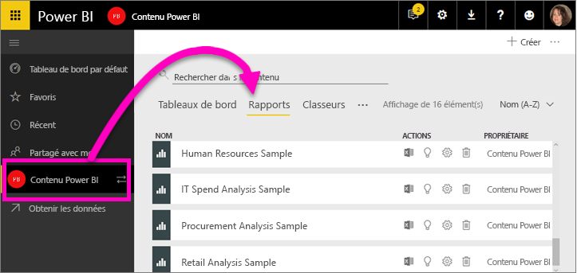
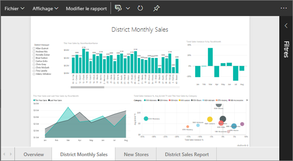
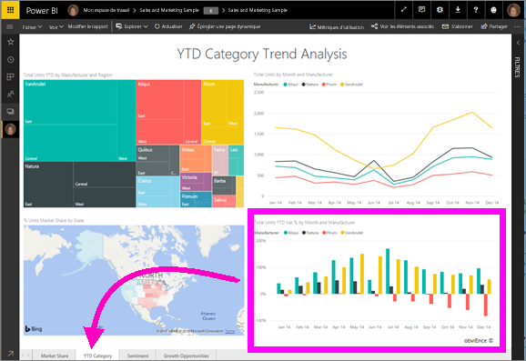
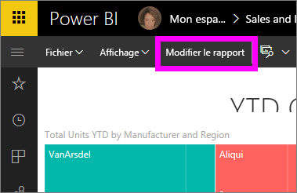
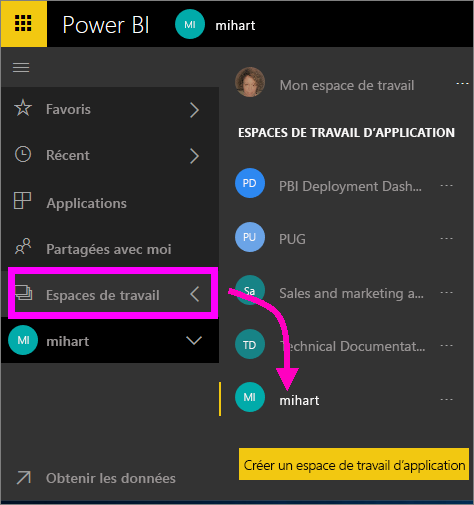
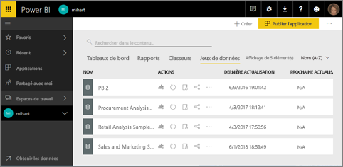
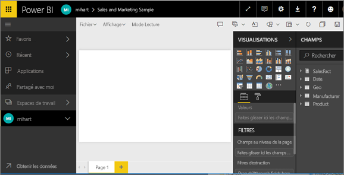

# Ouvrir un rapport dans le service Power BI (app.powerbi.com)
Les rapports sont disponibles dans le service Power BI, Power BI Desktop, Power BI Mobile et Power BI Embedded. Cet article s’applique à l’ouverture de rapports dans le ***service Power BI***.

Dans le service Power BI, il existe deux modes d’utilisation et d’affichage des rapports : le [mode Lecture et le mode Édition](end-user-reading-view.md). Le mode Lecture est disponible pour tous les utilisateurs et il est spécialement conçu pour les *consommateurs* de rapports tandis que le mode Édition est disponible uniquement pour les propriétaires et les *créateurs* de rapports. 

## Ouvrez un rapport à partir d’un espace de travail (via la liste d’affichage de contenu **Rapports**)

1. Démarrez dans un espace de travail, puis sélectionnez l’onglet **Rapports** pour afficher tous les rapports figurant dans cet espace de travail.  
   
   
2. Sélectionnez le nom du rapport pour ouvrir celui-ci en mode Lecture.  
   
    
3. Le [mode Lecture vous permet de faire de nombreuses choses](end-user-reading-view.md).  Comme cet exemple de rapport comprend plusieurs pages, commencez par les explorer en sélectionnant chaque onglet en bas du canevas de rapport. 

## Ouvrir un rapport à partir d’un tableau de bord
Il existe de nombreuses autres façons d’ouvrir un rapport. Par exemple, vous pouvez démarrer sur un tableau de bord, puis sélectionner une vignette créée à partir d’un rapport.  La sélection de la vignette a pour effet d’ouvrir le rapport en mode Lecture. Pour suivre la procédure, ouvrez le tableau de bord [Exemple Vente et marketing](../sample-datasets.md).

1. Ouvrez un tableau de bord et sélectionnez une vignette.

   Si vous sélectionnez une vignette [créée avec Questions et réponses](../service-dashboard-pin-tile-from-q-and-a.md), l’écran Questions et réponses s’ouvre. Si vous sélectionnez une vignette [créée à l’aide du **widget**  Ajouter une vignette](../service-dashboard-add-widget.md), vous ouvrez l’Assistant qui permet de modifier ce widget.  

2.  Dans cet exemple, nous avons sélectionné la vignette d’histogramme « Total Units YTD... ».

    

3.  Le rapport associé s’ouvre en mode Lecture. Notez que nous sommes sur la page « YTD Category ». Il s’agit de la page de rapport qui contient l’histogramme que nous avons sélectionné à partir du tableau de bord.

    

4. Restez en mode Lecture ou sélectionnez **Modifier le rapport** pour ouvrir le rapport en Mode Édition. N’oubliez pas que seuls les utilisateurs ayant des autorisations de modification de ce rapport peuvent l’ouvrir en mode Édition.

    

## Créer un tout nouveau rapport à partir d’un jeu de données
Un autre moyen d’ouvrir un rapport est de passer par un jeu de données. Lorsque vous démarrez à partir d’un jeu de données, le canevas de rapport est vide. Cette méthode est donc recommandée pour les *créateurs* de rapports intéressés par la création d’un rapport basé sur un jeu de données qu’ils possèdent. Comme dans l’exemple ci-dessus, pour suivre la procédure, téléchargez l’[exemple d’application Vente et marketing](../sample-datasets.md).

1. Démarrez dans l’espace de travail qui contient le jeu de données que vous souhaitez utiliser comme base pour un rapport.

   

2. Sélectionnez l’onglet **Jeux de données** pour afficher la liste de tous les jeux de données dans cet espace de travail. Il s’agit de la liste d’affichage de contenu **Jeux de données**.
   
   

1. Recherchez le jeu de données et sélectionnez l’icône **Créer un rapport** pour ouvrir le jeu de données en mode Édition. Si vous n’avez pas d’autorisations de modification d’un jeu de données, vous ne pouvez pas l’ouvrir. 
   
    

3. Le jeu de données s’ouvre dans l’éditeur de rapport. Vous voyez les champs de données affichés à droite, qui vont vous permettre de lancer l’exploration et la création de visualisations. 

   

##  Autres moyens pour ouvrir un rapport
Une fois que vous serez familiarisé avec la navigation dans le service Power BI, vous pourrez déterminer le flux de travail qui vous convient le mieux. Voici d’autres façons d’accéder aux rapports :
- À partir du volet de navigation gauche à l’aide de **Favoris**, **Récents**, **Applications** et **Partagés avec moi**. 
- À l’aide de [Afficher les éléments associés](end-user-related.md)
- Dans un e-mail quand un utilisateur [partage avec vous](../service-share-reports.md) ou que vous [définissez une alerte](../service-set-data-alerts.md).    
- À partir du [Centre de notifications](end-user-notification-center.md)    
- Et plus encore

## Étapes suivantes
En savoir plus sur les [rapports dans Power BI](end-user-reports.md)

D’autres questions ? [Posez vos questions à la communauté Power BI](http://community.powerbi.com/)  

