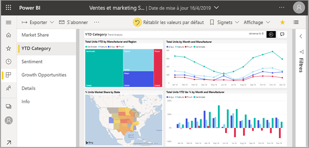
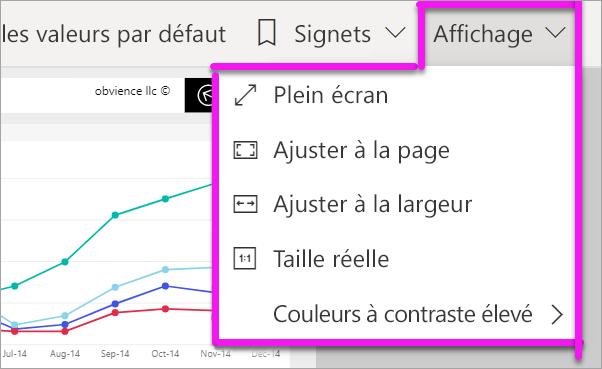
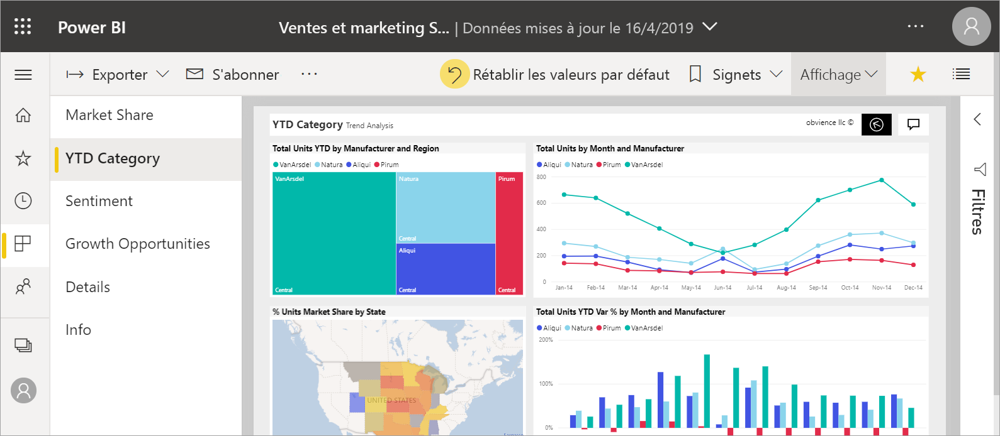
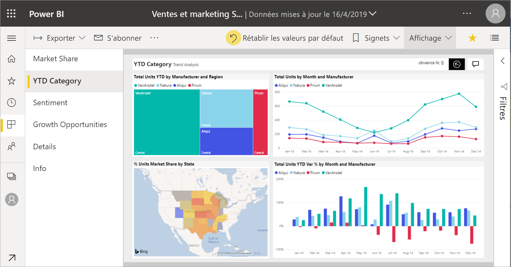
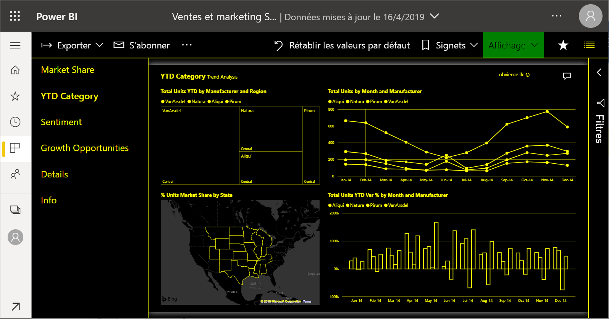
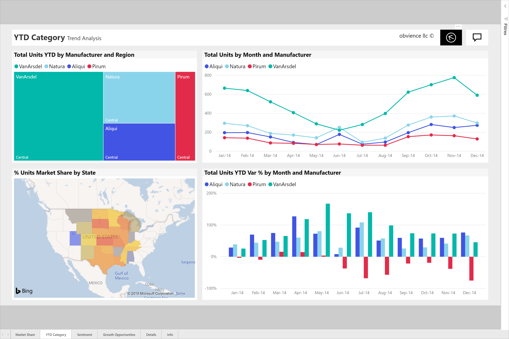
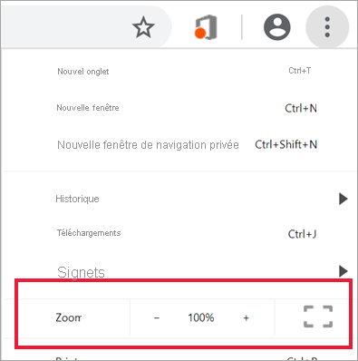
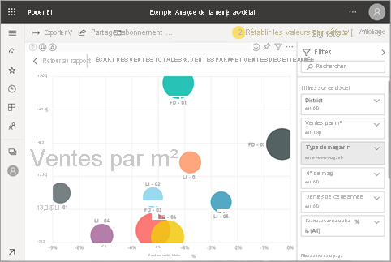

# Changer l’affichage d’une page de rapport

[!INCLUDE[consumer-appliesto-yyny](../includes/consumer-appliesto-yyny.md)]

[!INCLUDE [power-bi-service-new-look-include](../includes/power-bi-service-new-look-include.md)]

Vous pouvez afficher les rapports sur différents appareils dont les tailles d’écran et les proportions peuvent varier. Changez le mode d’affichage d’une page de rapport pour répondre à vos besoins.

## Explorer le menu Affichage

Les options du menu **Affichage** vous permettent d’afficher les pages d’un rapport selon la taille et la largeur de votre choix :

- Prenons un exemple : vous visualisez un rapport sur un petit appareil et vous avez du mal à voir les titres et les légendes.  Sélectionnez **Affichage** > **Taille réelle** pour augmenter la taille de la page du rapport. Utilisez les barres de défilement pour vous déplacer dans le rapport.

    

- Une autre option consiste à adapter le rapport à la largeur de votre écran en sélectionnant **Ajuster à la largeur**. Dans la mesure où il s’agit uniquement de la largeur et non de la hauteur, vous devrez peut-être utiliser la barre de défilement verticale.

  

- Si vous ne souhaitez pas de barres de défilement, mais que vous voulez utiliser au mieux la taille de votre écran, sélectionnez **Ajuster à la page**.

   

- Vous pouvez également choisir parmi quatre **Couleurs à contraste élevé** : Contraste élevé n°1, Contraste élevé n°2, Noir à contraste élevé et Blanc à contraste élevé. Vous pouvez utiliser cette fonctionnalité d’accessibilité pour que les personnes malvoyantes puissent mieux voir les rapports. L’exemple ci-dessous est un contraste élevé de 1. 

    

- La dernière option, **Plein écran**, affiche la page de votre rapport sans barres de menus ni en-têtes. Le mode Plein écran peut être un bon choix pour les appareils dotés de petits écrans où les détails sont difficiles à voir.  Il peut également s’avérer utile pour projeter les pages d’un rapport sur de grands écrans (à des fins de visualisation et non d’interaction).  

    

Quand vous quittez le rapport, les **paramètres d’affichage** ne sont pas enregistrés. Les valeurs par défaut sont rétablies. Si vous tenez à enregistrer ces paramètres, utilisez des [signets](end-user-bookmarks.md).

## Utiliser votre navigateur pour modifier l’affichage des pages

Les contrôles de zoom de votre navigateur permettent d’augmenter et de diminuer la zone de dessin disponible. La diminution du zoom augmente la taille de la zone de dessin, et vice versa. 

Le redimensionnement de l’ensemble du navigateur est une autre façon de changer la taille d’affichage de votre rapport. 

## Zoom avant sur un visuel
Parfois, il est difficile de voir les détails d’un visuel. Vous pouvez faire en sorte que ce visuel s’affiche en plus grand et seul. Pour plus d’informations, consultez [Mode Focus et mode Plein écran](end-user-focus.md).

### Visuel en mode *Focus*

### Visuel en mode *Plein écran*

## Étapes suivantes

* [Découvrir le volet Filtres du rapport](end-user-report-filter.md)