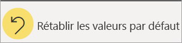

# Rapports dans Power BI

[!INCLUDE[consumer-appliesto-yyny](../includes/consumer-appliesto-yyny.md)]

[!INCLUDE [power-bi-service-new-look-include](../includes/power-bi-service-new-look-include.md)]

Un rapport Power BI est un affichage sous plusieurs angles d’un jeu de données, avec des visuels représentant différents résultats et insights de ce jeu de données.  Un rapport peut avoir un seul visuel ou des pages entières de visuels. Selon votre fonction principale, vous pouvez soit *concevoir* des rapports, soit *consommer* (utiliser) des rapports. Cet article s’adresse aux *consommateurs*.

A. Dans ce rapport de six pages (ou onglets), vous visualisez actuellement la page **Sentiment**.    
B. Cette page comprend cinq visuels et un titre de page.    
C. Le volet *Filtres* nous montre un filtre appliqué à toutes les pages du rapport. Pour réduire le volet Filtres, sélectionnez la flèche ( **>** ).    
D. La bannière Power BI affiche le nom du rapport et la date de la dernière mise à jour. Sélectionnez la flèche pour ouvrir un menu qui affiche également le nom du propriétaire du rapport.    
E. La barre d’action contient les actions que vous pouvez effectuer sur ce rapport.  Par exemple, vous pouvez ajouter un commentaire, afficher un signet ou exporter des données à partir du rapport.  Sélectionnez **Plus d’options** (...) pour afficher une liste de fonctionnalités de rapport supplémentaires.    

Si vous débutez dans Power BI, vous pouvez acquérir de bonnes bases en lisant [Concepts de base pour les consommateurs du service Power BI](end-user-basic-concepts.md). Les rapports peuvent être visualisés, partagés et annotés sur des appareils mobiles. Pour plus d’informations, consultez [Explorer des rapports dans les applications mobiles Power BI](mobile/mobile-reports-in-the-mobile-apps.md).

## Avantages des rapports

Power BI base un rapport sur un seul jeu de données. Les *concepteurs* de rapports créent les visuels dans un rapport représentant un nugget d’informations. Les visuels ne sont pas statiques.  Ils se mettent à jour à mesure que les données sous-jacentes changent. Vous pouvez interagir avec les visuels et les filtres à mesure que vous explorez davantage les données pour découvrir des insights et trouver des réponses. Au même titre qu’un tableau de bord, un rapport est hautement interactif et personnalisable.

### Interagir avec le contenu de manière sécurisée

Quand vous explorez votre contenu et interagissez avec celui-ci (filtrage, découpage, abonnement et exportation), vous n’endommagez pas les rapports. Votre travail n’affecte pas le jeu de données sous-jacent ni le contenu partagé d’origine. Cela s’applique aux tableaux de bord, aux rapports et aux applications.

> [!NOTE]
> Rappelez-vous que vous ne pouvez pas endommager vos données. Power BI est l’endroit idéal pour explorer et expérimenter sans craindre de détériorer quoi que ce soit.

### Enregistrer vos changements ou rétablir les paramètres par défaut

Cela ne veut pas dire que vous ne pouvez pas enregistrer vos changements. Vous pouvez le faire, mais ces changements affectent uniquement votre vue du contenu. Pour revenir à la vue par défaut du rapport, sélectionnez **Rétablir les valeurs par défaut**.

## Tableaux de bord et rapports

Les [tableaux de bord](end-user-dashboards.md) sont souvent confondus avec les rapports, car il s’agit également de canevas remplis de visuels. Mais il existe quelques différences majeures.  

| **Fonctionnalité** | **Tableaux de bord** | **Rapports** |
| --- | --- | --- |
| Pages |Une seule page |Une ou plusieurs pages |
| Sources de données |Un ou plusieurs rapports et un ou plusieurs jeux de données par tableau de bord |Un seul jeu de données par rapport |
| Filtrage |Impossible de filtrer ou découper |Différentes manières de filtrer, mettre en surbrillance et découper |
| Définir des alertes |Possibilité de créer des alertes pour envoyer un e-mail quand le tableau de bord répond à certaines conditions |Non |
| Caractéristique |Possibilité de définir un tableau de bord comme tableau de bord « par défaut » |Impossible de créer un rapport proposé |
| Possibilité d’afficher les tables et les champs sous-jacents d’un jeu de données |Non. Possibilité d’exporter les données, mais pas de voir les tables et les champs du jeu de données dans le tableau de bord |Oui. Possibilité de voir les tables et les champs du jeu de données ainsi que les valeurs que vous êtes autorisé à voir |
| Personnalisation |Non  |Possibilité de filtrer, d’exporter et de voir le contenu associé, d’ajouter des signets, de générer des codes QR, d’analyser dans Excel, etc. |

<!--| Available in Power BI Desktop |No |Yes, can create and view reports in Desktop |
| Pinning |Can pin existing visuals (tiles) only from current dashboard to your other dashboards |Can pin visuals (as tiles) to any of your dashboards. Can pin entire report pages to any of your dashboards. | -->

## Concepteurs de rapports et consommateurs de rapports

Selon votre rôle, vous pouvez être *concepteur*. Dans ce cas, vous créez des rapports pour votre usage personnel ou pour les partager avec vos collègues. Vous devez donc apprendre à créer et à partager des rapports.

Ou bien, vous pouvez être *consommateur*, c’est-à-dire quelqu’un qui reçoit des rapports d’autres personnes. Vous devez donc apprendre à comprendre les rapports et à interagir avec ceux-ci. Si vous êtes *consommateur* de rapports, ces liens vous concernent :

* Commencez par une [présentation du service Power BI](end-user-basic-concepts.md) pour savoir où trouver les rapports et les outils de rapport.
* Découvrez comment [ouvrir un rapport](end-user-report-open.md) et toutes les [interactions disponibles pour les consommateurs](end-user-reading-view.md).
* Familiarisez-vous avec les rapports en suivant la présentation de l’un de nos [exemples](../sample-tutorial-connect-to-the-samples.md).  
* Pour voir le jeu de données que le rapport utilise et les tableaux de bord affichant des visuels (*épingles*) à partir du rapport, consultez [Afficher le contenu associé dans le service Power BI](end-user-related.md).

> [!TIP]
> Si vous n’avez pas trouvé ici ce que vous cherchiez, utilisez la Table des matières à gauche pour parcourir tous les articles relatifs aux *rapports*.

## Étapes suivantes

[Ouvrir et voir un rapport](end-user-report-open.md)    
[Tableaux de bord dans le service Power BI](end-user-dashboards.md)
