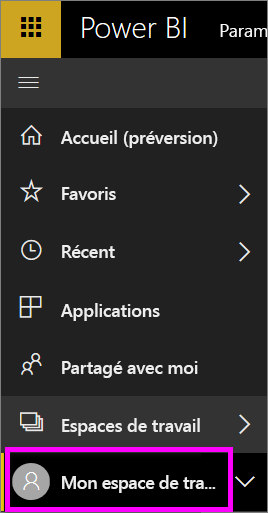
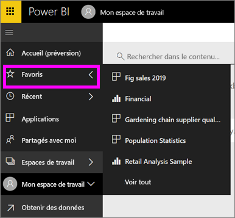

# Navigation : recherche et tri de votre contenu dans le service Power BI
Il existe plusieurs façons de parcourir votre contenu dans le service Power BI. Dans les espaces de travail, le contenu est organisé par type : tableaux de bord, rapports, classeurs et jeux de données.  De plus, le contenu est également organisé par utilisation : favori, récent, application, partagé avec moi et par défaut. Pour assurer une navigation fluide, la page d’accueil organise tout le contenu sur une page. Cette organisation du contenu vous permet de trouver rapidement ce dont vous avez besoin dans le service Power BI.  

## Navigation dans les espaces de travail

Les *consommateurs* Power BI n’ont généralement qu’un seul espace de travail : **Mon espace de travail**. **Mon espace de travail** n’aura de contenu que si vous avez téléchargé les exemples Microsoft´, ou bien créé ou téléchargé votre propre contenu.  

Au sein de **Mon espace de travail**, le service Power BI sépare votre contenu par type : tableaux de bord, rapports, classeurs et jeux de données. Cette organisation est visible lorsque vous sélectionnez un espace de travail. Dans cet exemple, **Mon espace de travail** contient un tableau de bord, deux rapports, aucun classeur et deux jeux de données.

________________________________________

## Navigation avec la barre de navigation gauche
La barre de navigation gauche classifie votre contenu de manière à accélérer et à faciliter encore davantage la recherche de ce dont vous avez besoin.  

- Le contenu partagé avec vous est disponible dans **Partagé avec moi**.
- Le dernier contenu que vous avez consulté est disponible dans **Récent**. 
- Vos applications peuvent être trouvées en sélectionnant **Applications**.
- **Accueil** est un affichage de page unique de votre contenu le plus important et de suggestions de contenu ainsi que de sources de formation.

De plus, vous pouvez marquer le contenu comme [favori](end-user-favorite.md) et [par défaut](end-user-featured.md). Choisissez le tableau de bord que vous prévoyez d’afficher le plus souvent et définissez-le comme votre tableau de bord *par défaut*. Chaque fois que vous ouvrez le service Power BI, votre tableau de bord principal s’affiche en premier. Vous disposez de plusieurs tableaux de bord et applications que vous consultez souvent ? Si vous les définissez en tant que favoris, ils sont toujours disponibles dans votre barre de navigation de gauche.

.

## Considérations et résolution des problèmes
* Pour les jeux de données, l’option **Trier par** n’est pas à la disposition du propriétaire.

## Étapes suivantes
[Power BI – Concepts de base](end-user-basic-concepts.md)

D’autres questions ? [Posez vos questions à la communauté Power BI](http://community.powerbi.com/)