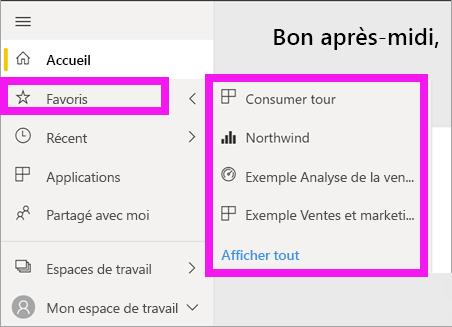

# Navigation : recherche et tri de votre contenu dans le service Power BI

[!INCLUDE [power-bi-service-new-look-include](../includes/power-bi-service-new-look-include.md)]

Il existe plusieurs façons de parcourir votre contenu dans le service Power BI. Dans votre espace de travail, le contenu est organisé par type : tableaux de bord et rapports.  De plus, le contenu est également organisé par utilisation : favori, récent, application, partagé avec moi et par défaut. Pour assurer une navigation fluide, l’*Accueil* Power BI organise tout le contenu sur une page. Cette organisation du contenu vous permet de trouver rapidement ce dont vous avez besoin dans le service Power BI.  

## Navigation dans les espaces de travail

Les *consommateurs* Power BI n’ont généralement qu’un seul espace de travail : **Mon espace de travail**. **Mon espace de travail** ne contient du contenu que si vous avez téléchargé les exemples Microsoft, ou créé ou téléchargé vos propres tableaux de bord, rapports ou applications.  

Au sein de **Mon espace de travail**, le service Power BI sépare votre contenu par type : tableaux de bord, rapports, classeurs et jeux de données. Cette organisation est visible lorsque vous sélectionnez un espace de travail. Dans cet exemple, **Mon espace de travail** contient un tableau de bord, un rapport, aucun classeur et un jeu de données.

________________________________________
## Navigation avec le champ Rechercher
Utilisez la vue du contenu de **Mon espace de travail** pour explorer, filtrer et trier votre contenu. Dans le champ Rechercher, tapez tout ou partie du nom d’un tableau de bord, d’un rapport, d’un classeur ou d’un propriétaire.  

Si vous obtenez peu d’éléments, vous n’avez pas besoin de rechercher et de filtrer.  Toutefois, vous trouverez la recherche et le tri très utiles si vous avez de longues listes de tableaux de bord et de rapports. Par exemple, la liste de rapports ci-dessous, contient 83 éléments. 

Vous pouvez également trier le contenu par nom ou propriétaire. Notez la flèche vers le haut à droite de **Nom**. Nous trions actuellement 83 éléments par ordre alphabétique par nom, dans l’ordre croissant. Pour utiliser l’ordre de tri décroissant, sélectionnez **Nom**. La flèche vers le haut est remplacée par une flèche vers le bas.

Toutes les colonnes ne peuvent pas être triées. Placez le curseur sur les en-têtes de colonne pour savoir lesquelles peuvent être triées.

___________________________________________________________________
## Navigation avec le volet de navigation
Le volet de navigation classifie votre contenu de manière à vous aider à trouver rapidement ce dont vous avez besoin.  

- Le contenu partagé avec vous est disponible dans **Partagé avec moi**.
- Le dernier contenu que vous avez consulté est disponible dans **Récent**. 
- Vos applications peuvent être trouvées en sélectionnant **Applications**.
- **Accueil** est un affichage de page unique de votre contenu le plus important et de suggestions de contenu ainsi que de sources de formation.

De plus, vous pouvez marquer le contenu comme [favori](end-user-favorite.md) et [par défaut](end-user-featured.md). Choisissez le tableau de bord ou le rapport que vous prévoyez de consulter le plus souvent et définissez-le comme votre contenu *par défaut*. Chaque fois que vous ouvrez le service Power BI, votre tableau de bord par défaut s’affiche en premier. Vous disposez de plusieurs tableaux de bord et applications que vous consultez souvent ? Si vous les définissez en tant que favoris, ils sont toujours disponibles dans votre volet de navigation.

.

## Considérations et résolution des problèmes
* Pour les jeux de données, l’option **Trier par** n’est pas à la disposition du propriétaire.

## Étapes suivantes
[Trier les visuels dans les rapports](end-user-change-sort.md)

D’autres questions ? [Posez vos questions à la communauté Power BI](https://community.powerbi.com/)
