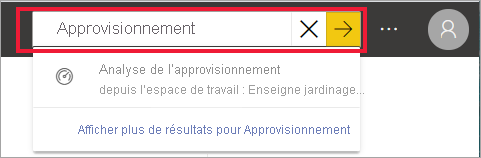
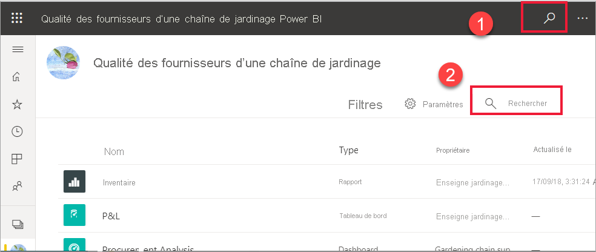
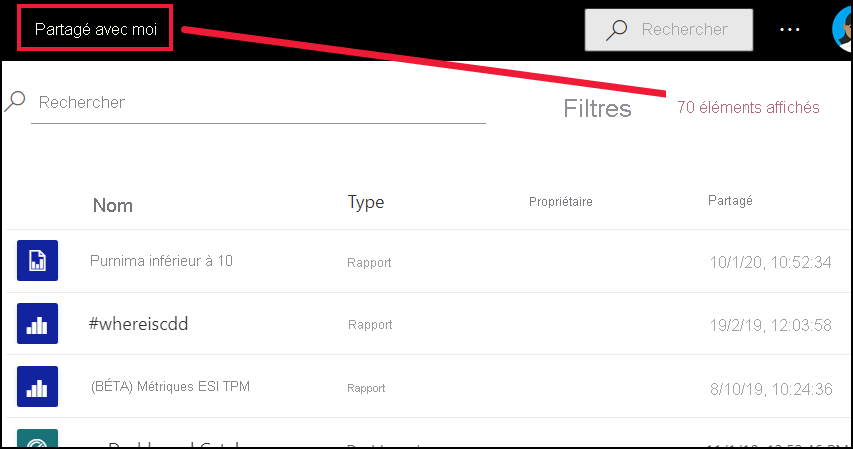
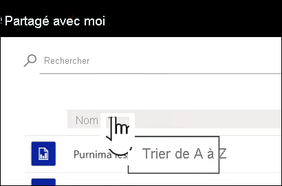
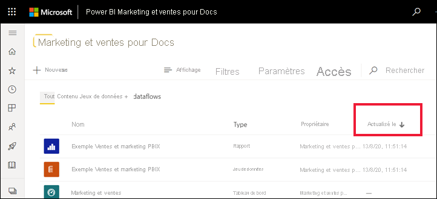
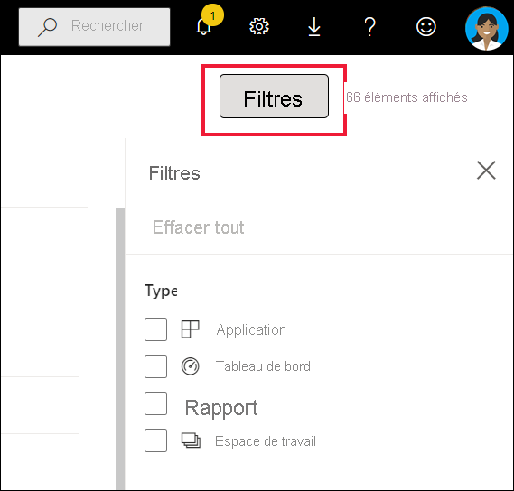

# Navigation pour les utilisateurs professionnels Power BI : recherche globale

[!INCLUDE[consumer-appliesto-yyny](../includes/consumer-appliesto-yyny.md)]

[!INCLUDE [power-bi-service-new-look-include](../includes/power-bi-service-new-look-include.md)]

Si vous utilisez le service Power BI depuis peu, vous n’avez pas beaucoup de contenus (tableaux de bord, rapports et applications). Mais, si vos collègues en partagent avec vous et que vous téléchargez des applications, vous pouvez vous retrouver avec de longues listes de contenus. C’est à ce moment-là que vous trouverez la recherche et le tri extrêmement utiles.

## Recherche de contenu
 La recherche est disponible presque partout dans le service Power BI. Repérez simplement la zone ou l’icône de recherche .

 Dans le champ Rechercher, tapez tout ou partie du nom d’un tableau de bord, d’un rapport, d’un classeur, d’un espace de travail, d’une application ou d’un propriétaire. Power BI effectue une recherche sur l’ensemble de votre contenu. 

  

 Dans certaines zones de Power BI, comme les espaces de travail, vous trouverez deux champs de recherche différents. Celui de la barre de menus effectue la recherche sur l’ensemble de votre contenu, tandis que celui du canevas de l’espace de travail porte uniquement sur cet espace de travail.

  

## Tri de listes de contenu

Si vous n’avez pas beaucoup de contenus, le tri ne vous sera pas forcément nécessaire.  Si, en revanche, vous disposez de longues listes de tableaux de bord et de rapports, il vous aidera à trouver ce dont vous avez besoin. Par exemple, cette liste de contenus **Partagés avec moi** contient 70 éléments. 

Pour le moment, cette liste de contenus est triée par ordre alphabétique du nom, de Z à A. Pour modifier les critères de tri, sélectionnez la flèche à droite de **Nom (A-Z)** .

Le tri est également disponible dans les espaces de travail. Dans cet exemple, le contenu est trié par date **d’Actualisation**. Pour définir des critères de tri pour les espaces de travail, sélectionnez les en-têtes de colonne une fois puis à nouveau afin de changer de sens de tri. 

Toutes les colonnes ne peuvent pas être triées. Placez le curseur sur les en-têtes de colonne pour savoir lesquelles peuvent être triées.

## Filtrage des listes de contenu
Une autre façon de localiser rapidement le contenu consiste à utiliser les **Filtres** de liste de contenu. Affichez les filtres en sélectionnant **Filtres** dans le coin supérieur droit. Les filtres disponibles dépendent de votre emplacement dans le service Power BI.  L’exemple ci-dessous provient d’une liste de contenu **Récent**.  Elle vous permet de filtrer la liste par type de contenu.  Sur la liste de contenu **Partagé avec moi**, les **Filtres** disponibles incluent Propriétaire et Type de contenu.

## Étapes suivantes
[Trier les visuels dans les rapports](end-user-change-sort.md)

[Trier des données dans les visuels](end-user-change-sort.md)

D’autres questions ? [Posez vos questions à la communauté Power BI](https://community.powerbi.com/)
