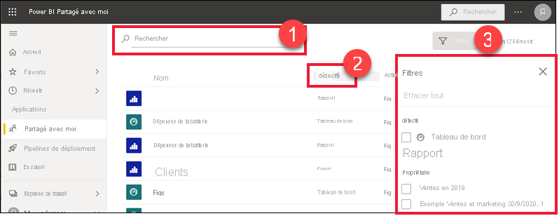

# Afficher les tableaux de bord et les rapports qui ont été partagés avec moi

[!INCLUDE[consumer-appliesto-yyny](../includes/consumer-appliesto-yyny.md)]

[!INCLUDE [power-bi-service-new-look-include](../includes/power-bi-service-new-look-include.md)]

Lorsqu’un collègue partage un tableau de bord ou un rapport avec vous, il apparaît dans votre conteneur **Partagé avec moi**. Quand un collègue partage une application avec vous, l’application s’affiche dans votre conteneur **Applications**.   

Regardez Amanda expliquer la liste de contenu **Partagé avec moi** et montrer comment naviguer dans celle-ci ainsi que la filtrer. Suivez ensuite les instructions détaillées sous la vidéo pour essayer vous-même. Pour afficher les tableaux de bord partagés avec vous, vous devez posséder une licence Power BI Pro. Pour plus de détails, consultez [Qu’est-ce que Power BI Premium ?](../admin/service-premium-what-is.md).
    

> [!NOTE]
> Cette vidéo utilise une version plus ancienne du service Power BI.
    

<iframe width="560" height="315" src="https://www.youtube.com/embed/G26dr2PsEpk" frameborder="0" allowfullscreen></iframe>

## Interagir avec du contenu partagé

Des options vous permettent d’interagir avec les tableaux de bord et les rapports partagés, en fonction des autorisations que le *concepteur* vous octroie. Celles-ci incluent la capacité de faire des copies du tableau de bord, de s’abonner, d’ouvrir le rapport [en mode Lecture](end-user-reading-view.md) et de re-partager avec d’autres collègues. Sélectionnez un tableau de bord ou un rapport pour l’ouvrir.

## Rechercher et trier des tableaux de bord et des rapports partagés
Si votre liste de contenus **Partagés avec moi** est très longue, vous avez plusieurs options pour rechercher ce dont vous avez besoin. Vous pouvez utiliser le champ de recherche (1), vous pouvez effectuer un tri sur l’une des colonnes (2) ou vous pouvez utiliser le volet Filtres. Pour ouvrir le volet Filtres, sélectionnez **Filtres** dans le coin supérieur droit.    

