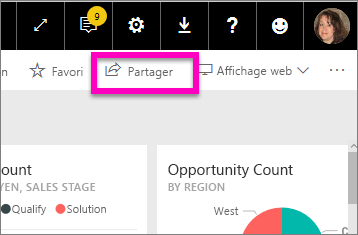
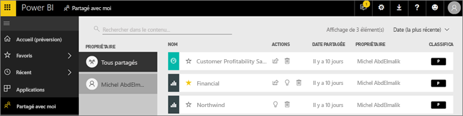
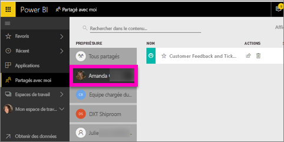

# Afficher les tableaux de bord et les rapports qui ont été partagés avec moi
## Partagé avec moi

Quand un collègue partage du contenu avec vous, à l’aide du bouton **Partager**, il s’affiche dans votre conteneur **Partagés avec moi**. Le tableau de bord ou le rapport est disponible uniquement à partir de **Partagés avec moi** et non depuis **Applications**.

Regardez Amanda expliquer la liste de contenu **Partagé avec moi** et montrer comment naviguer dans celle-ci ainsi que la filtrer. Suivez ensuite les instructions détaillées sous la vidéo pour essayer vous-même. Pour afficher les tableaux de bord partagés avec vous, vous devez posséder une licence Power BI Pro. Pour plus de détails, consultez [Qu’est-ce que Power BI Premium ?](../service-premium.md).

<iframe width="560" height="315" src="https://www.youtube.com/embed/G26dr2PsEpk" frameborder="0" allowfullscreen></iframe>

Des options vous permettent d’interagir avec les tableaux de bord et les rapports, en fonction des autorisations que le concepteur vous octroie. Celles-ci incluent la capacité de faire des copies du tableau de bord, d’ouvrir le rapport [en mode Lecture](end-user-reading-view.md) et de re-partager avec d’autres collègues.

## Actions disponibles à partir du conteneur **Partagés avec moi**
* Sélectionnez l’icône représentant une étoile pour [Ajouter un rapport ou tableau de bord dans les Favoris](end-user-favorite.md).
* Supprimer un tableau de bord ou un rapport  
* Certains tableaux de bord et rapports peuvent être repartagés  
* De plus, si vos listes s’allongent, [utilisez le champ de recherche et le tri pour trouver ce que vous cherchez](end-user-search-sort.md).
  
  > [!NOTE]
  > Pour plus d’informations sur les classifications EGRC, sélectionnez le bouton de classification ou visitez [Classement des données du tableau de bord](../service-data-classification.md).
  > 
  > 
* Sélectionnez le nom d’un tableau de bord pour ouvrir celui-ci et l’explorer. Après avoir ouvert le tableau de bord partagé, vous pouvez utiliser Q&R pour poser des questions concernant les données sous-jacentes, ou sélectionner une vignette afin d’ouvrir le rapport en mode Lecture et interagir avec celui-ci.

## Filtrer des tableaux de bord partagés par propriétaire
Le contenu de l’écran **Partagé avec moi** peut être filtré davantage par propriétaire du contenu. Par exemple, si je sélectionne **Amanda**, je vois uniquement le tableau de bord qu’Amanda a partagé avec moi.

