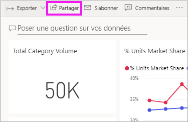
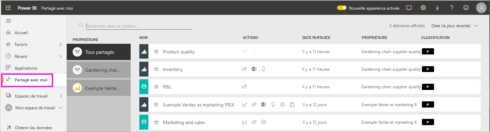
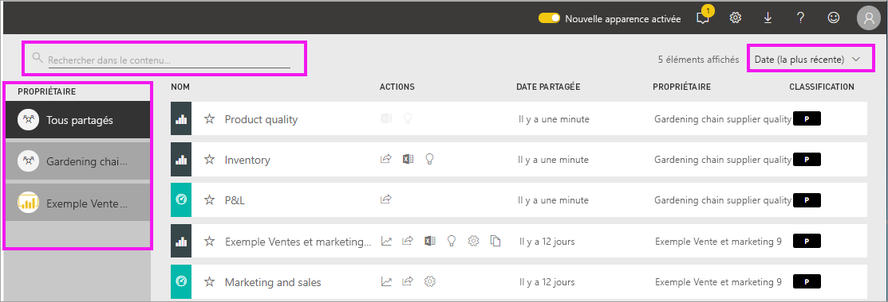

# Afficher les tableaux de bord et les rapports qui ont été partagés avec moi

[!INCLUDE[consumer-appliesto-yyny](../includes/consumer-appliesto-yyny.md)]

[!INCLUDE [power-bi-service-new-look-include](../includes/power-bi-service-new-look-include.md)]

Quand un collègue partage du contenu avec vous, à l’aide du bouton **Partager**, il s’affiche dans votre conteneur **Partagés avec moi**. Le tableau de bord ou le rapport est disponible uniquement à partir de **Partagés avec moi** et non depuis **Applications**.

Regardez Amanda expliquer la liste de contenu **Partagé avec moi** et montrer comment naviguer dans celle-ci ainsi que la filtrer. Suivez ensuite les instructions détaillées sous la vidéo pour essayer vous-même. Pour afficher les tableaux de bord partagés avec vous, vous devez posséder une licence Power BI Pro. Pour plus de détails, consultez [Qu’est-ce que Power BI Premium ?](../admin/service-premium-what-is.md).
    

> [!NOTE]
> Cette vidéo utilise une version plus ancienne du service Power BI.
    

<iframe width="560" height="315" src="https://www.youtube.com/embed/G26dr2PsEpk" frameborder="0" allowfullscreen></iframe>

## Interagir avec du contenu partagé

Des options vous permettent d’interagir avec les tableaux de bord et les rapports partagés, en fonction des autorisations que le *concepteur* vous octroie. Celles-ci incluent la capacité de faire des copies du tableau de bord, d’ouvrir le rapport [en mode Lecture](end-user-reading-view.md) et de re-partager avec d’autres collègues.

### Actions disponibles à partir du conteneur **Partagés avec moi**
Les actions disponibles dépendent des paramètres affectés par le *concepteur* du contenu. Certaines de vos options peuvent inclure :
* Sélectionnez l’icône représentant une étoile pour [ajouter un rapport ou un tableau de bord aux favoris](end-user-favorite.md) .
* Supprimer un tableau de bord ou un rapport  .
* Certains tableaux de bord et rapports peuvent être repartagés  .
* [Ouvrir le rapport dans Excel](end-user-export.md)  
* [Voir les insights](end-user-insights.md) que Power BI trouve dans les données .
  
  > [!NOTE]
  > Pour plus d’informations sur les classifications EGRC, sélectionnez le bouton **Classification** ou [consultez Classification des données des tableaux de bord](../create-reports/service-data-classification.md).
  > 

## Rechercher et trier des tableaux de bord partagés
Si votre liste de contenus est très longue, vous avez plusieurs options pour rechercher ce dont vous avez besoin. Vous pouvez utiliser le champ de recherche, trier par date ou sélectionner dans la colonne **Propriétaire**.    

