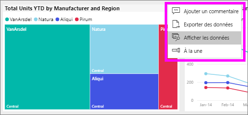
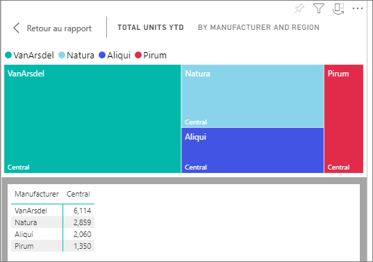
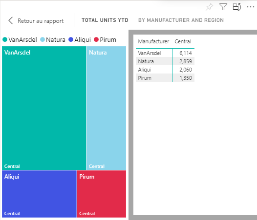

# Afficher les données qui a été utilisées pour créer le visuel

Visuels Power BI est construite à l’aide de données à partir de jeux de données sous-jacents. Si vous voulez voir les calculs sous-jacents, Power BI vous permet d’*afficher* les données utilisées pour créer le visuel. Lorsque vous sélectionnez **afficher les données**, Power BI affiche les données sous (ou à côté) le visuel.

1. Dans le service Power BI, [ouvrir un rapport](end-user-report-open.md) et sélectionnez un élément visuel.  
2. Pour afficher les données sous-jacentes du visuel, sélectionnez les points de suspension (…), puis choisissez **Afficher les données**.
   
   
3. Par défaut, les données s’affichent sous l’élément visuel.
   
   

4. Pour modifier l’orientation, sélectionnez la disposition verticale  dans l’angle supérieur droit de la visualisation.
   
   

## Étapes suivantes
[Éléments visuels dans les rapports Power BI](../visuals/power-bi-report-visualizations.md)    
[Rapports Power BI](end-user-reports.md)    
