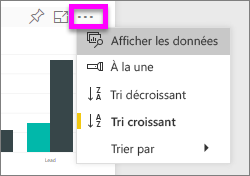
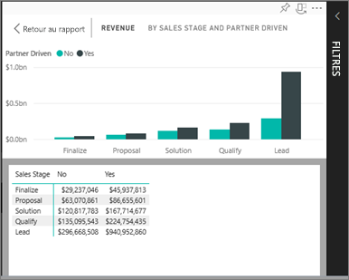
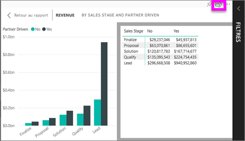

# Afficher les données utilisées pour créer la visualisation
## Afficher des données en mode Lecture
Une visualisation Power BI se construit à l’aide des données des jeux de données sous-jacents. Si vous voulez voir les calculs sous-jacents, Power BI vous permet d’*afficher* les données utilisées pour créer le visuel. Lorsque vous sélectionnez **Afficher les données**, Power BI affiche les données sous (ou à côté de) la visualisation.

## Utiliser *Afficher les données* en mode Lecture dans le service Power BI
1. Dans le service Power BI, ouvrez un rapport (en mode Lecture) et sélectionnez un visuel.  
2. Pour afficher les données sous-jacentes du visuel, sélectionnez les points de suspension (…), puis choisissez **Afficher les données**.
   
   
3. Par défaut, les données s’affichent sous l’élément visuel.
   
   

4. Pour modifier l’orientation, sélectionnez la disposition verticale  dans l’angle supérieur droit de la visualisation.
   
   

## Étapes suivantes
[Visualisations dans des rapports Power BI](../visuals/power-bi-report-visualizations.md)    
[Rapports Power BI](end-user-reports.md)    
