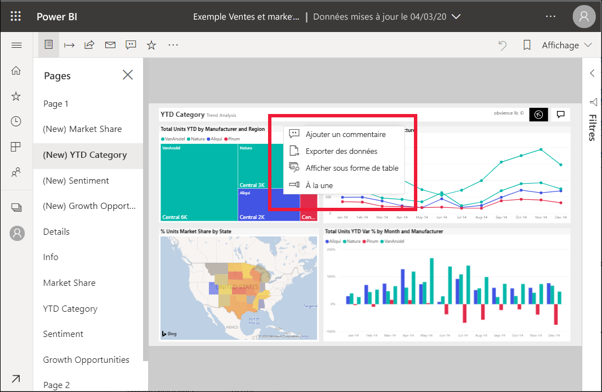

# Ajouter le mode À la une à des rapports Power BI

[!INCLUDE[consumer-appliesto-yyny](../includes/consumer-appliesto-yyny.md)]

Avec le mode À la une, vous pouvez attirer l’attention sur un visuel spécifique sur une page de rapport.  Si le mode À la une est sélectionné lors de l’ajout d’un signet, ce mode est conservé dans le signet.

## Ajouter le mode À la une

1. [Ouvrez un rapport](end-user-report-open.md) dans le service Power BI.

2. Choisissez le visuel que vous souhaitez mettre en surbrillance sur la page de rapport. Sélectionnez la liste déroulante **Plus d’actions (...)** .  

    

3. Choisissez l’option **À la une**. Le visuel sélectionné est mis en surbrillance. Tous les autres visuels de la page deviennent presque transparents. 

    

## Étapes suivantes

* [Afficher une vignette de tableau de bord ou un visuel de rapport en mode Focus](end-user-focus.md)

