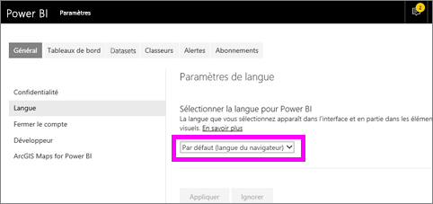
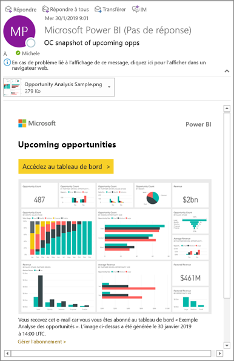
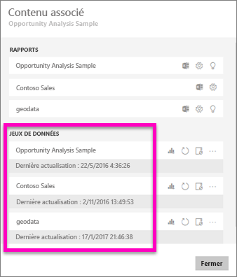
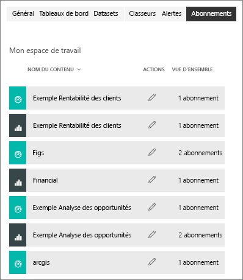

# S’abonner à un rapport ou à un tableau de bord dans le service Power BI 
Vous pouvez à présent connaître encore plus facilement l’état de vos rapports et tableaux de bord les plus importants. Abonnez-vous aux pages de rapport et aux tableaux de bord qui vous intéressent le plus pour que Power BI envoie une capture instantanée dans votre boîte de réception. Vous indiquez à Power BI la fréquence à laquelle vous souhaitez recevoir les e-mails : une fois par jour, une fois par semaine ou quand les données sont actualisées. Vous pouvez même définir une heure spécifique à laquelle Power BI envoie les e-mails ou exécuter cette tâche tout de suite.  

L’e-mail et l’instantané utiliseront la langue définie dans les paramètres de Power BI (cf. [Langues et pays/régions pris en charge par Power BI](../supported-languages-countries-regions.md)). Si aucune langue n’est définie, Power BI sélectionnera celle des paramètres régionaux du navigateur. Pour voir ou définir vos préférences de langue, sélectionnez l’icône de roue dentée  > **Paramètres > Général > Langue**. 

L’e-mail que vous recevez contient un lien « accéder au rapport ou tableau de bord ». Sur les appareils mobiles sur lesquels les applications Power BI sont installées, la sélection de ce lien lance l’application (par opposition à l’action par défaut qui ouvre le rapport ou le tableau de bord sur le site web Power BI).

## Configuration requise
La **création** d’un abonnement est une fonctionnalité Power BI Pro.   

## S’abonner à un tableau de bord ou une page de rapport
Que vous vous abonniez à un tableau de bord ou un rapport, le processus est le même. Le même bouton vous permet de vous abonner aux rapports et aux tableaux de bord du service Power BI.
 
.

1. Ouvrez le tableau de bord ou le rapport.
2. Dans la barre de menus supérieure, sélectionnez **S’abonner** ou l’icône en forme d’enveloppe .
   
   

   
    
    L’écran à gauche s’affiche quand vous êtes dans un tableau de bord et que vous sélectionnez **S’abonner**. L’écran à droite s’affiche quand vous êtes dans une page de rapport et que vous sélectionnez **S’abonner**. Pour vous abonner à plusieurs pages d’un rapport, sélectionnez **Ajouter un autre abonnement** et sélectionnez une autre page. 

4. Utilisez le curseur jaune pour activer ou désactiver l’abonnement.  La définition du curseur sur Désactivé ne supprime pas l’abonnement. Pour supprimer l’abonnement, sélectionnez l’icône Corbeille.

4. Votre adresse e-mail est automatiquement ajoutée au champ **S’abonner**. Pour abonner d’autres personnes de votre organisation, ajoutez également ici leur adresse e-mail. 

5. Facultativement, vous pouvez ajouter les détails du message. 

5. Sélectionnez une **Fréquence** pour votre abonnement.  Vous pouvez choisir Quotidien, Hebdomadaire ou Après l’actualisation des données (quotidien).  Pour recevoir l’e-mail d’abonnement certains jours uniquement, sélectionnez **Hebdomadaire** et choisissez les jours auxquels vous voulez le recevoir.  Par exemple, si vous voulez recevoir l’e-mail d’abonnement seulement les jours ouvrés, sélectionnez la fréquence **Hebdomadaire** et décochez les cases Sam et Dim.   

6. Planifiez l’heure d’envoi de l’e-mail en sélectionnant Quotidien ou Hebdomadaire comme fréquence et en entrant une **Heure** **planifiée** pour l’abonnement.  Cette heure correspond au moment où la tâche d’abonnement commence. Dans certains scénarios, la remise de l’e-mail dans votre boîte de réception peut prendre plusieurs minutes.    

7. Planifiez les dates de début et de fin en entrant des dates dans les champs correspondants. Par défaut, la date de début de votre abonnement est sa date de création et la date de fin est un an plus tard. Quand un abonnement atteint une date de fin, il s’arrête jusqu’à ce que vous le réactiviez.  Vous recevez des notifications avant la date de fin planifiée pour savoir si vous voulez la prolonger.     

8. Pour vérifier votre abonnement et le tester, sélectionnez **Exécuter maintenant**.  Un e-mail vous est envoyé immédiatement. 

8. Si tout semble correct, sélectionnez **Enregistrer et fermer** pour enregistrer l’abonnement. Vous et vos collègues abonnés recevez un e-mail et un instantané du tableau de bord ou du rapport selon la planification que vous avez définie. Tous les abonnements ayant pour fréquence **Après l’actualisation des données** envoient un e-mail seulement après la première actualisation planifiée ce jour-là.
   
   
   
    L’actualisation de la page de rapport n’actualise pas le jeu de données. Seul le propriétaire du jeu de données peut actualiser manuellement un jeu de données. Pour rechercher le nom de propriétaire du ou des jeux de données sous-jacents, sélectionnez **Afficher les éléments associés** dans la barre de menus supérieure ou recherchez l’e-mail d’abonnement d’origine.
   
    

## Gérer vos abonnements
Vous seul pouvez gérer les abonnements que vous créez. Sélectionnez à nouveau **S’abonner** et choisissez **Gérer tous les abonnements** en bas à gauche (voir les captures d’écran ci-dessus). 

Un abonnement se termine si la licence Pro expire, si le tableau de bord ou le rapport est supprimé par le propriétaire ou si le compte d’utilisateur qui a servi à créer l’abonnement est supprimé.

## Considérations et résolution des problèmes
* Les tableaux de bord comportant plus de 25 vignettes épinglées, ou quatre pages de rapport dynamique épinglées, risquent de ne pas s’afficher entièrement dans les e-mails d’abonnement envoyés aux utilisateurs. Nous vous conseillons de contacter le concepteur du tableau de bord pour lui demander de limiter le nombre de vignettes épinglées à moins de 25 et le nombre de pages de rapport dynamique épinglées à moins de quatre pour garantir un affichage correct dans les e-mails.  
* Pour les abonnements à l’e-mail du tableau de bord, si la sécurité au niveau des lignes (SNL) est appliquée à des vignettes, celles-ci ne s’affichent pas.  Pour les abonnements à l’e-mail des rapports, si le jeu de données utilise SNL, vous ne pouvez pas créer d’abonnement.
* Les abonnements aux pages de rapports sont liés au nom de la page de rapport. Si vous vous abonnez à une page de rapport et que vous la renommez, vous devez recréer votre abonnement.
* Si vous ne pouvez pas utiliser la fonctionnalité d’abonnement, contactez votre administrateur système. Votre organisation peut avoir désactivé cette fonctionnalité pour l’authentification ou d’autres raisons.  
* Les abonnements aux courriers ne prennent pas en charge la plupart des [visuels personnalisés](../power-bi-custom-visuals.md).  Sauf s’il s’agit de visuels personnalisés [certifiés](../power-bi-custom-visuals-certified.md).  
* Actuellement, les abonnements aux e-mails ne prennent pas en charge les visuels personnalisés alimentés par R.  
* Pour les abonnements aux tableaux de bord en particulier, certains types de vignettes ne sont pas encore pris en charge.  notamment les vignettes de streaming, vidéo, de contenu web personnalisé.     
* S’il s’agit d’abonnements à des tableaux de bord ou rapports incluant de très grandes images, l’abonnement peut échouer en raison de la limite de taille de la messagerie.    
* Power BI suspend automatiquement l’actualisation des jeux de données associés à des tableaux de bord et rapports qui n’ont pas été consultés depuis plus de 2 mois.  Toutefois, si vous ajoutez un abonnement à un tableau de bord ou à un rapport, il n’est pas suspendu même si le rapport ou le tableau de bord n’est pas consulté.
* Dans de rares occasions, la remise par e-mail des abonnements à leurs destinataires peut prendre plus de quinze minutes.  Si cela se produit, nous vous recommandons d’exécuter l’actualisation de vos données et votre abonnement par e-mail à des moments différents pour garantir une remise en temps voulu.  Si le problème persiste, contactez le support Power BI.

## Étapes suivantes

[Rechercher et trier du contenu](end-user-search-sort.md)
