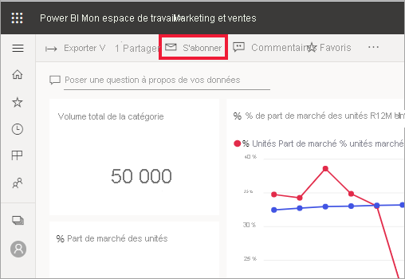
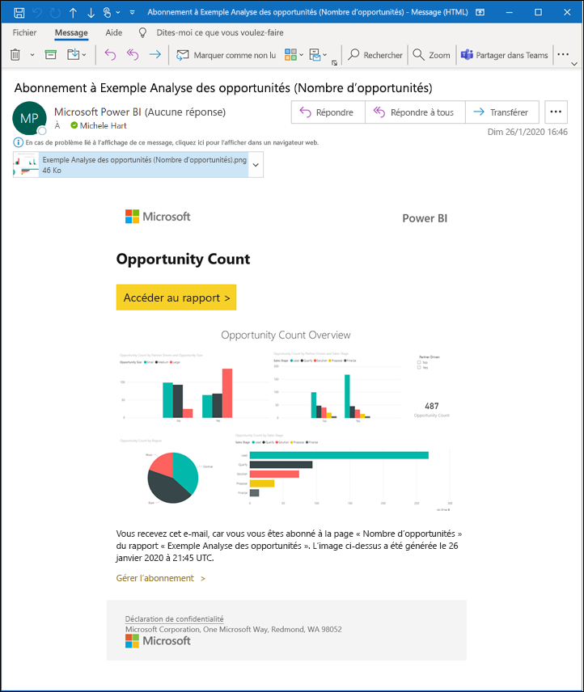
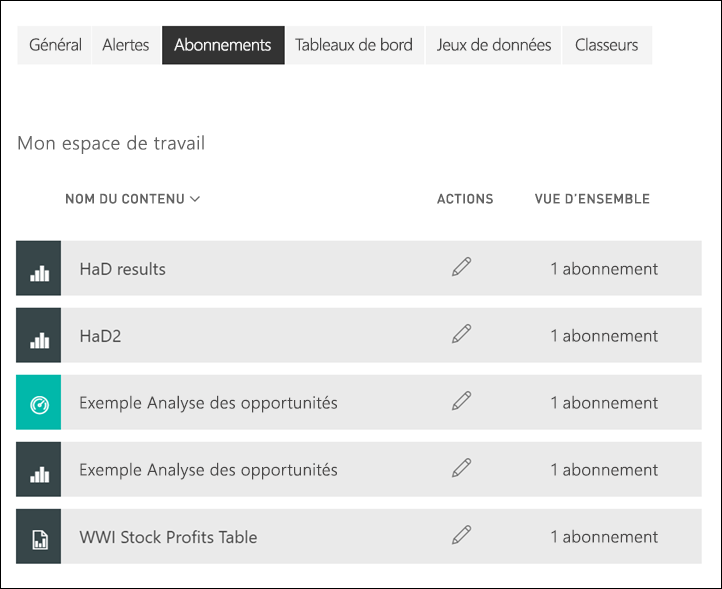

# S’abonner à un rapport ou un tableau de bord dans le service Power BI 

[!INCLUDE[consumer-appliesto-ynny](../includes/consumer-appliesto-ynny.md)]

[!INCLUDE [power-bi-service-new-look-include](../includes/power-bi-service-new-look-include.md)]

Vous pouvez à présent connaître encore plus facilement l’état de vos rapports et tableaux de bord les plus importants. Abonnez-vous aux pages de rapport et tableaux de bord qui vous intéressent le plus pour que Power BI envoie une capture instantanée dans votre boîte de réception. Vous indiquez à Power BI la fréquence à laquelle vous souhaitez recevoir les e-mails : une fois par jour, une fois par semaine ou quand les données sont actualisées. Vous pouvez même définir une heure spécifique à laquelle Power BI envoie les e-mails ou exécuter cette tâche tout de suite.  Vous pouvez définir jusqu’à 24 abonnements différents par rapport ou par tableau de bord.

L’e-mail et l’instantané utiliseront la langue définie dans les paramètres de Power BI (cf. [Langues et pays/régions pris en charge par Power BI](../fundamentals/supported-languages-countries-regions.md)). Si aucune langue n’est définie, Power BI sélectionnera celle des paramètres régionaux du navigateur. Pour voir ou définir vos préférences de langue, sélectionnez l’icône de roue dentée  > **Paramètres > Général > Langue**. 

L’e-mail que vous recevez contient un lien « accéder au rapport ou tableau de bord ». Sur les appareils mobiles sur lesquels les applications Power BI sont installées, la sélection de ce lien lance l’application (par opposition à l’action par défaut qui ouvre le rapport ou le tableau de bord sur le site web Power BI).

## Configuration requise
La **création** d’un abonnement pour vous-même exige un certain type de [licence](end-user-license.md). Si vous ne parvenez pas à créer un abonnement, contactez votre administrateur Power BI. Seul le propriétaire du tableau de bord ou du rapport peut **abonner d’autres utilisateurs**. L’abonnement aux rapports paginés est un peu différent. Consultez [Vous abonner vous et d’autres utilisateurs à un rapport paginé dans le service Power BI](paginated-reports-subscriptions.md) pour plus d’informations. 

## S’abonner à un tableau de bord ou une page de rapport
Que vous vous abonniez à un tableau de bord ou un rapport, le processus est le même. Le même bouton vous permet de vous abonner aux rapports et aux tableaux de bord du service Power BI.
 
.

1. Ouvrez le tableau de bord ou le rapport.
2. Dans la barre de menus supérieure, sélectionnez **S’abonner** ou l’icône en forme d’enveloppe .
   

   
    
    L’écran à gauche s’affiche quand vous êtes dans un tableau de bord et que vous sélectionnez **S’abonner**. L’écran à droite s’affiche quand vous êtes dans une page de rapport et que vous sélectionnez **S’abonner**. 
    
    a. Pour vous abonner à plusieurs pages d’un rapport, sélectionnez **Ajouter un autre abonnement** et sélectionnez une autre page dans la liste déroulante en haut.

    b. Utilisez le curseur jaune pour activer ou désactiver l’abonnement.  La définition du curseur sur Désactivé ne supprime pas l’abonnement. Pour supprimer l’abonnement, sélectionnez l’icône Corbeille.

    c. Vous pouvez également ajouter l’objet et les détails du message. 

    d. Sélectionnez une **Fréquence** pour votre abonnement.  Vous pouvez choisir Quotidien, Hebdomadaire ou Après l’actualisation des données (quotidien).  Pour recevoir l’e-mail d’abonnement certains jours uniquement, sélectionnez **Hebdomadaire** et choisissez les jours auxquels vous voulez le recevoir.  Par exemple, si vous voulez recevoir l’e-mail d’abonnement seulement les jours ouvrés, sélectionnez la fréquence **Hebdomadaire** et décochez les cases Sam et Dim. Si vous sélectionnez **Mensuel**, entrez le ou les jours du mois auxquels vous souhaitez recevoir le courrier de l’abonnement.   

    e. Si vous choisissez Quotidien, Toutes les heures, Mensuel ou Hebdomadaire, vous pouvez également choisir une Heure planifiée pour l’abonnement. Vous pouvez choisir une exécution à une heure pile ou 15, 30 ou 45 minutes après. Sélectionnez le matin (AM) ou l’après-midi/le soir (PM). Vous pouvez également spécifier le fuseau horaire. Si vous choisissez Toutes les heures, sélectionnez l’Heure planifiée à laquelle vous voulez que l’abonnement démarre : il sera alors exécuté toutes les heures après cela.  

    f. Planifiez les dates de début et de fin en entrant des dates dans les champs correspondants. Par défaut, la date de début de votre abonnement est sa date de création et la date de fin est un an plus tard. Vous pouvez la remplacer par n’importe quelle date dans le futur (jusqu’à l’année 9999) à tout moment avant la fin de l’abonnement. Quand un abonnement atteint une date de fin, il s’arrête jusqu’à ce que vous le réactiviez.  Vous recevez des notifications avant la date de fin planifiée pour savoir si vous voulez la prolonger.     

    exemple, Pour vérifier votre abonnement et le tester, sélectionnez **Exécuter maintenant**.  Un e-mail vous est envoyé immédiatement. 

3. Si tout semble correct, sélectionnez **Enregistrer et fermer** pour enregistrer l’abonnement. Vous recevrez un e-mail et un instantané du tableau de bord ou du rapport selon la planification que vous avez définie. Tous les abonnements ayant pour fréquence **Après l’actualisation des données** envoient un e-mail seulement après la première actualisation planifiée ce jour-là.
   
   
   
    L’actualisation de la page de rapport n’actualise pas le jeu de données. Seul le propriétaire du jeu de données peut actualiser manuellement un jeu de données. Pour rechercher le nom de propriétaire du ou des jeux de données sous-jacents, sélectionnez la liste déroulante dans la barre de menus ou recherchez l’e-mail d’abonnement d’origine.
   
    

## Gérer vos abonnements
Vous seul pouvez gérer les abonnements que vous créez. Sélectionnez à nouveau **S’abonner** et choisissez **Gérer tous les abonnements** en bas à gauche (voir les captures d’écran ci-dessus). Les abonnements particuliers affichés dépendent de l’espace de travail actuellement actif. Pour afficher tous les abonnements à la fois pour tous les espaces de travail, vérifiez que **Mon espace de travail** est actif. Pour comprendre le fonctionnement des espaces de travail, consultez [Espaces de travail dans Power BI](end-user-workspaces.md). 

Un abonnement se termine si la licence Pro expire, si le tableau de bord ou le rapport est supprimé par le propriétaire ou si le compte d’utilisateur qui a servi à créer l’abonnement est supprimé.

## Considérations et résolution des problèmes
* Pour éviter que les e-mails relatifs à l’abonnement ne soient dirigés vers votre dossier de courrier indésirable, ajoutez l’alias d’e-mail Power BI (no-reply-powerbi@microsoft.com) à vos contacts. Si vous utilisez Microsoft Outlook, cliquez avec le bouton droit sur l’alias et sélectionnez **Ajouter aux contacts Outlook**. 
* Les tableaux de bord comportant plus de 25 mosaïques épinglées ou 4 pages de rapport dynamique épinglées, risquent de ne pas s’afficher entièrement dans les e-mails d’abonnement envoyés aux utilisateurs. Nous vous conseillons de contacter le concepteur du tableau de bord pour lui demander de limiter le nombre de vignettes épinglées à moins de 25 et le nombre de pages de rapport dynamique épinglées à moins de quatre pour garantir un affichage correct dans les e-mails.  
* Pour les abonnements à l’e-mail du tableau de bord, si la sécurité au niveau des lignes (SNL) est appliquée à des vignettes, celles-ci ne s’affichent pas.  
* Si les liens qui sont fournis dans l’e-mail (et qui mènent au contenu) cessent de fonctionner, il est possible que le contenu ait été supprimé. Dans l’e-mail, sous la capture d’écran, vous pouvez voir si vous vous êtes abonné vous-même ou si quelqu’un d’autre s’est chargé de vous abonner. Si c’est quelqu’un d’autre, demandez-lui d’annuler les e-mails ou de vous réabonner.
* Pour les abonnements aux tableaux de bord, certains types de mosaïques ne sont pas encore pris en charge, notamment les vignettes de streaming, vidéo, de contenu web personnalisé. 
* Les abonnements aux pages de rapports sont liés au nom de la page de rapport. Si vous vous abonnez à une page de rapport et que vous la renommez, vous devez recréer votre abonnement.
* Si vous ne pouvez pas utiliser la fonctionnalité d’abonnement, contactez votre administrateur système. Votre organisation a peut-être désactivé cette fonctionnalité.  
* Les abonnements aux courriers ne prennent pas en charge la plupart des [visuels personnalisés](../developer/visuals/power-bi-custom-visuals.md).  L’exception est celle des visuels Power BI personnalisés qui ont été [certifiés](../developer/visuals/power-bi-custom-visuals-certified.md).    
* Les abonnements aux e-mails sont envoyés avec l’état par défaut des filtres et des segments du rapport. Si vous changez les valeurs par défaut après l’abonnement, les changements ne s’affichent pas dans l’e-mail. Les rapports paginés prennent en charge cette fonctionnalité et vous permettent de définir les valeurs de paramètre spécifiques par abonnement.  
* À ce stade, les abonnements aux e-mails ne prennent pas en charge les visuels Power BI alimentés par R.  
* Pour les abonnements aux tableaux de bord en particulier, certains types de vignettes ne sont pas encore pris en charge.  notamment les vignettes de streaming, vidéo, de contenu web personnalisé.     
* S’il s’agit d’abonnements à des tableaux de bord ou rapports incluant de très grandes images, l’abonnement peut échouer en raison de la limite de taille de la messagerie.    
* Power BI suspend automatiquement l’actualisation des jeux de données associés à des tableaux de bord et rapports qui n’ont pas été consultés depuis plus de 2 mois.  Toutefois, si vous ajoutez un abonnement à un tableau de bord ou à un rapport, il n’est pas suspendu même si le rapport ou le tableau de bord n’est pas consulté.
* Gardez à l’esprit que comme avec les autres produits de décisionnel, le moment pour lequel vous définissez votre abonnement correspond au début du traitement de l’abonnement.  Une fois le traitement du rapport terminé, l’abonnement est mis en file d’attente et envoyé aux destinataires de l’e-mail.  Bien que nous cherchions à traiter et à fournir tous les abonnements aussi rapidement que possible, vous pourriez constater un délai plus long en période de pointe, en raison du nombre d’abonnements qui peuvent être envoyés simultanément.  Pour la majorité des clients, le délai ne devrait pas dépasser 15 minutes pour traiter et envoyer les rapports, mais cela peut prendre jusqu’à 30 minutes à certains moments et pour certains locataires dont l’utilisation est significative.  Nous estimons que le délai de livraison ne sera jamais supérieur à 60 minutes au-delà du moment où l’abonnement est planifié.  Si un client observe un délai aussi long, il doit d’abord vérifier que l’adresse no-reply-powerbi@microsoft.com figure dans votre liste des expéditeurs approuvés et n’est pas bloquée par votre fournisseur de messagerie.  Si elle n’est pas bloquée, il doit contacter le support Power BI pour obtenir de l’aide.

## Étapes suivantes

[Rechercher et trier du contenu](end-user-search-sort.md)
