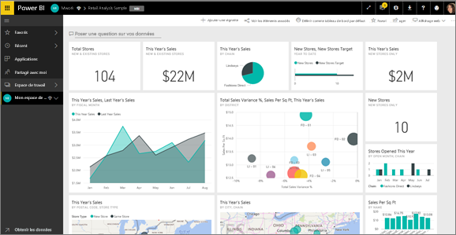
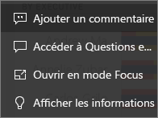
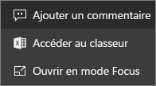
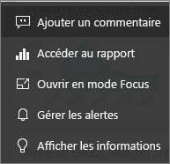

# Vignettes d’un tableau de bord dans Power BI
Les tableaux de bord et vignettes de tableau de bord caractérisent le service Power BI et non Power BI Desktop. Si vous ne pouvez pas créer ou épingler des vignettes de tableau de bord dans Power BI Mobile, vous [pouvez les afficher et les partager](mobile/mobile-tiles-in-the-mobile-apps.md). 

## Mise à jour des vignettes de tableau de bord

Une vignette est une capture instantanée de vos données, épinglée au tableau de bord par un *concepteur*. Une vignette peut être créée à partir d’un rapport, d’un jeu de données, d’un tableau de bord, de la zone Questions et réponses, d’Excel et de SSRS (SQL Server Reporting Services), et plus encore.  Cette capture d’écran montre différentes vignettes épinglées à un tableau de bord.

En plus des vignettes épinglées à partir de rapports, les *concepteurs* peuvent ajouter des vignettes autonomes directement sur le tableau de bord à l’aide de l’option **Ajouter une vignette**. Les vignettes autonomes incluent des zones de texte, des images, des vidéos, des données de streaming et du contenu web.

Vous avez du mal à comprendre les éléments qui composent Power BI ?  Consultez [Power BI – Concepts de base](end-user-basic-concepts.md).

## Interaction avec des vignettes dans un tableau de bord

### Placer le curseur sur une vignette pour modifier son apparence et son comportement
1. Placez le curseur sur la vignette pour afficher les points de suspension.
   
    
2. Sélectionnez les points de suspension pour ouvrir le menu des actions de la vignette. Les options disponibles varient en fonction du type de visuel et de la méthode utilisée pour créer la vignette. Voici quelques exemples de ce que vous pouvez voir.

    - vignette créée à l’aide de Questions et réponses
   
        

    - vignette créée à partir d’un classeur
   
        

    - vignette créée à partir d’un rapport
   
        
   
    Vous pouvez ici :
   
   * [Ouvrir le rapport utilisé pour créer cette vignette ](end-user-reports.md)   
   
   * [Ouvrir la question de Questions et réponses qui a été utilisée pour créer la vignette ](end-user-reports.md)   
   

   * [Ouvrir le classeur utilisé pour créer cette vignette ](end-user-reports.md)   
    * [Afficher la vignette en mode focus](end-user-focus.md)   
     * [Exécuter Insights ](end-user-insights.md) 
    * [Ajouter un commentaire et démarrer une discussion](end-user-comment.md) 

3. Pour fermer le menu d’actions, sélectionnez une zone vide dans la zone de dessin.

### Sélectionner (cliquer sur) une vignette
Lorsque vous sélectionnez une vignette, ce qui se passe ensuite dépend de la façon dont la vignette a été créée et de la présence ou non d’un [lien personnalisé dessus](../service-dashboard-edit-tile.md). Si elle comporte un lien personnalisé, la sélection de la vignette vous fait accéder à ce lien. Dans le cas contraire, sélectionner la vignette ouvre le rapport, le classeur Excel en ligne, le rapport SSRS en local, ou la question Q&R qui a été utilisée pour créer la vignette.

> [!NOTE]
> La seule exception concerne les vignettes de vidéo créées directement sur le tableau de bord avec l’option **Ajouter une vignette**. En sélectionnant une vignette de vidéo (créée de cette façon), la vidéo est lue directement dans le tableau de bord.   
> 
> 

## Considérations et résolution des problèmes
* Si le rapport utilisé pour créer la visualisation n'a pas été enregistré, sélectionner la vignette ne produit alors aucune action.
* Si la vignette a été créée à partir d'un classeur Excel en ligne et que vous ne disposez pas au moins des autorisations de lecture nécessaires pour ce classeur, vous ne pourrez pas ouvrir le classeur Excel en ligne en sélectionnant la vignette.
* Pour les vignettes créées directement sur le tableau de bord avec l’option **Ajouter une vignette**, si un lien hypertexte personnalisé a été défini, vous pouvez ouvrir cette URL en sélectionnant le titre, le sous-titre et/ou la vignette.  Sinon, par défaut, la sélection d’une de ces vignettes créées directement sur le tableau de bord pour une image, du code web ou une zone de texte ne produit aucune action.
* Si vous n’avez pas l’autorisation d’accéder au rapport dans SSRS, la sélection d’une vignette créée à partir de SSRS générera une page indiquant que vous n’avez pas accès (rsAccessDenied).
* Si vous n’avez pas accès au réseau où se trouve le serveur SSRS, la sélection d’une vignette créée à partir de SSRS générera une page indiquant que la localisation du serveur est impossible (HTTP 404). Votre appareil doit bénéficier de l’accès réseau au serveur de rapports pour afficher le rapport.
* Si la visualisation d’origine utilisée pour créer la vignette change, la vignette ne change pas.  Par exemple, si le *concepteur* a épinglé un graphique en courbes à partir d’un rapport, puis transformé ce graphique en graphique à barres, la vignette du tableau de bord continue à afficher un graphique en courbes. Les données s’actualisent, mais pas le type de visualisation.

## Étapes suivantes
[Actualisation des données](../refresh-data.md)

[Power BI – Concepts de base](end-user-basic-concepts.md)
