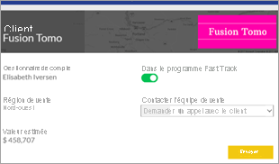
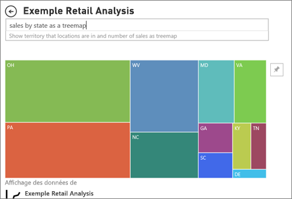

# Types de visuel dans Power BI

[!INCLUDE[consumer-appliesto-yynn](../includes/consumer-appliesto-yynn.md)]

Vous pouvez trouver des visuels dans les rapports, les tableaux de bord et Questions et réponses. Certains types de visuel sont inclus dans Power BI et d’autres sont des *visuels personnalisés*. Les visuels personnalisés sont créés en dehors de Power BI de façon à permettre aux *concepteurs de rapports* de les ajouter aux rapports et aux tableaux de bord Power BI. 

Cet article est une vue d’ensemble des visuels inclus dans le service Power BI.  Voici les visuels que vous allez rencontrer plus souvent. Pour des informations détaillées sur l’un de ces visuels, consultez la documentation du [concepteur *de rapports Power BI* sur les types de visuel](../visuals/power-bi-visualization-types-for-reports-and-q-and-a.md)

> [!NOTE]
> Pour en savoir plus sur les visuels personnalisés, recherchez-les dans la section **Visuels Power BI** de [Microsoft AppSource](https://appsource.microsoft.com/marketplace/apps?product=power-bi-visuals). Pour chaque visuel, vous avez une description, des informations sur le créateur et des captures d’écran ou une vidéo. 

## Liste de visuels disponibles dans Power BI
Tous ces visuels sont disponibles dans les tableaux de bord et les rapports Power BI, et sont [spécifiés dans Questions et réponses](end-user-q-and-a.md). Pour savoir comment interagir avec les visuels, consultez [Interagir avec les visuels dans les rapports, les tableaux de bord et les applications](end-user-visualizations.md).

### Graphiques en aires : De base (superposées) et empilées

Le graphique en aires de base est un graphique en courbes dont la zone comprise entre l’axe et la ligne est remplie. Les graphiques en aires mettent en évidence l’ampleur du changement dans le temps et peuvent être utilisés pour attirer l’attention sur la tendance évolutive d’une valeur totale. Par exemple, les données qui représentent des profits dans le temps peuvent être tracées dans un graphique en aires pour mettre l’accent sur le profit total.

### Graphiques à barres et histogrammes

 

Les graphiques à barres sont la norme pour la recherche d’une valeur spécifique dans différentes catégories.

### Cartes : Numéro unique

Les cartes à un seul numéro montrent un seul fait, un seul point de données. Vous pouvez parfois vouloir suivre un nombre unique dans votre tableau de bord ou rapport Power BI pour l’importance qu’il représente, qu’il s’agisse du total des ventes, de la part de marché d’une année sur l’autre ou du nombre total d’opportunités.  

### Cartes : Plusieurs lignes

Les carte à plusieurs lignes montrent un ou plusieurs points de données, un par ligne.

### Graphiques combinés

Un graphique combiné associe un histogramme et un graphique en courbes. Cette combinaison des deux graphiques vous permet de comparer plus rapidement les données. Les graphiques combinés peuvent avoir un ou deux axes Y, prêtez-y attention. 

Les graphiques combinés sont conseillés :
- quand vous avez un graphique en courbes et un histogramme avec le même axe X ;
- pour comparer plusieurs mesures avec des plages de valeurs différentes
- pour illustrer la corrélation entre deux mesures dans le même visuel
- pour vérifier si une mesure correspond à la cible définie par une autre mesure ;
- pour utiliser moins d’espace sur le canevas

### Graphiques en anneau

Les graphiques en anneau sont similaires aux graphiques en secteurs.  Ils affichent la relation de parties par rapport à un tout. La seule différence est que le centre est vide et qu’il y a de la place pour une étiquette ou une icône.

### Graphiques en entonnoir

Les entonnoirs permettent de visualiser un processus comprenant des étapes et des éléments qui passent de manière séquentielle d’une étape à la suivante.  Par exemple, un processus de vente qui commence avec des clients potentiels et se termine par le traitement des commandes fournisseur.

Par exemple, un entonnoir de ventes qui effectue le suivi des clients à travers des étapes : Client potentiel > Client potentiel qualifié > Prospect > Contrat > Signature. En regardant la forme de l’entonnoir, vous savez instantanément comment se déroule le processus dont vous effectuez le suivi.
Chaque étape de l’entonnoir représente un pourcentage du total. C’est pourquoi un graphique en entonnoir a généralement la forme d’un entonnoir, où la première étape est la plus large et chaque étape suivante est plus étroite que l’étape précédente. Un entonnoir en forme de poire est également utile, car il peut indiquer un problème dans le processus. Mais le plus souvent, la première étape (l’étape de départ) est la plus large.

### Graphiques en jauge

Un graphique en jauge radiale est en forme d’arc de cercle. Il affiche une seule valeur qui mesure la progression vers un objectif/indicateur de performance clé. L’objectif (valeur cible) est représenté par la ligne (aiguille). La progression vers l’objectif est représentée par l’ombrage. La valeur représentant cette progression est indiquée en caractères gras à l’intérieur de l’arc. Toutes les valeurs possibles sont réparties uniformément le long de l’arc, de la valeur minimale (la plus à gauche) à la valeur maximale (la plus à droite).

Dans l’exemple ci-dessus, un concessionnaire automobile effectue le suivi de la moyenne des ventes mensuelles réalisées par son équipe de vente. L’objectif, représenté par l’aiguille noire, est d’atteindre 140 ventes. La moyenne minimale de ventes mensuelles possible est 0 et la moyenne maximale a été définie à 200. L’ombrage bleu indique une moyenne actuelle de 120 ventes ce mois-ci. Heureusement, il reste encore une semaine pour atteindre l’objectif fixé.

Les graphiques en jauge radiale sont conseillés pour :
- montrer la progression vers un objectif
- représenter une mesure en centiles, comme un indicateur de performance clé
- montrer l’intégrité d’une seule mesure
- montrer des informations faciles à comprendre et à analyser

 ### Graphique des influenceurs clés

Un graphique d’influenceurs clés affiche les principaux contributeurs à une valeur ou un résultat sélectionné.

Les influenceurs clés sont conseillés pour vous aider à comprendre les facteurs qui influencent une métrique clé, par exemple *ce qui influence les clients pour qu’ils passent une deuxième commande *ou* pourquoi les ventes ont été si élevées en juin dernier*. 

### Indicateurs de performance clés

Un indicateur de performance clé (KPI) est un indice visuel qui représente la marge de progression réalisée en vue d’atteindre un objectif mesurable. 

Les indicateurs de performances clés sont recommandés :
- pour mesurer la progression (dans quel domaine suis-je en avance ou en retard ?)
- pour mesurer ce qu’il vous reste à faire pour atteindre un objectif (suis-je en avance ou en retard ?)

### Graphiques en courbes

Les graphique en courbes mettent en évidence la forme générale de l’ensemble d’une série de valeurs, normalement au fil du temps.

### Cartes : Cartes simples

Utilisez une carte simple pour associer des informations quantitatives et de catégorie à des emplacements spatiaux.

### Cartes : ArcGIS Maps

L’association des cartes ArcGIS et de Power BI porte la cartographie au-delà de la simple présentation de points sur une carte, pour accéder à un nouveau niveau. Les options disponibles pour les cartes de base, les types de lieu, les thèmes, les styles de symbole et les couches de référence créent de superbes visuels de carte d’information. L’association de couches de données officielles (comme les données de recensement) d’une carte avec une analyse spatiale permet une compréhension approfondie des données dans votre visuel.

### Cartes : Cartes choroplèthes (thématiques)

Une carte choroplèthe utilise des ombrages, des teintes ou des motifs pour représenter proportionnellement les variations d’une valeur entre des zones géographiques ou des régions. Visualisez rapidement les écarts relatifs grâce aux ombrages allant du clair (moins fréquent/plus bas) au foncé (plus fréquent/plus élevé).

### Cartes : Cartes de formes

Les carte de formes comparent des régions sur une carte à l’aide de la couleur. Une carte de formes ne peut pas montrer des lieux géographiques précis de points de données sur une carte. Leur principal objectif est de montrer des comparaisons relatives de régions sur une carte en leur appliquant une couleur différente.

### Matrice

Le visuel de matrice est un type de visuel de tableau (voir « Tableau » ci-dessous) qui prend en charge une disposition échelonnée. Souvent, les concepteurs de rapports ajoutent des matrices dans les rapports et tableaux de bord pour permettre aux utilisateurs de sélectionner un ou plusieurs éléments (lignes, colonnes, cellules) dans la matrice et de faire des sélections croisées avec d’autres visuels sur une page de rapport.  

### Graphiques en secteurs

Ils montrent la relation des parties par rapport à un tout. 

### Visuel Power Apps

Les Concepteurs de rapports peuvent créer une application Power Apps et l’incorporer dans un rapport Power BI. Les consommateurs peuvent interagir avec ce visuel dans le rapport Power BI. 

### Visuel de Questions et réponses

>[!TIP]
>À l’instar de [Questions et réponses dans les tableaux de bord](../power-bi-tutorial-q-and-a.md), le visuel Questions et réponses vous permet de poser des questions sur vos données en langage naturel. 

Pour plus d’informations, consultez [Visuels Questions et réponses dans Power BI](../visuals/power-bi-visualization-types-for-reports-and-q-and-a.md).

### Graphique de ruban

Ils montrent la catégorie de données qui a le rang le plus élevé (la plus grande valeur). Les graphiques de ruban sont efficaces pour l’affichage de changements de rangs, la plage (valeur) la plus élevée étant toujours affichée en première position pour chaque période de temps.

### Nuages de points, graphiques en bulles et graphiques à points

Un nuage de points a toujours deux axes de valeur pour afficher un jeu de données numériques sur l’axe horizontal et un autre jeu de valeurs numériques sur l’axe vertical. Le graphique affiche les points à l’intersection d’une valeur numérique x et y, en associant ces valeurs en points de données uniques. Ces derniers peuvent être distribués uniformément ou non sur l’axe horizontal, en fonction des données.

Un graphique en bulles remplace les points de données par des bulles, la taille de la bulle représentant une dimension supplémentaire des données.

Un graphique à points est comme un graphique en bulles et un nuage de points sauf que vous pouvez tracer des données numériques ou de catégorie sur l’axe X. Cet exemple utilise des carrés à la place de cercles et trace les ventes sur l’axe X.

### Nuage de points à haute densité

Par définition, les données à haute densité sont échantillonnées pour créer des visuels d’une façon raisonnablement rapide, qui réagissent à l’interactivité. L’échantillonnage à haute densité utilise un algorithme qui élimine les points qui se chevauchent et garantit que tous les points du jeu de données sont représentés dans le visuel. Il ne se contente pas de tracer un échantillon représentatif des données.  

Il assure une combinaison optimale de réactivité, de représentation et de préservation claire des points importants dans la totalité du jeu de données.

### Segments

Un segment est un graphique autonome qui peut être utilisé pour filtrer les autres visuels sur la page. Les segments sont fournis dans différents formats (catégorie, plage, date, etc.) et peuvent être mis en forme pour permettre la sélection d’une, de plusieurs ou de toutes les valeurs disponibles. 

Les segments sont recommandés pour :
- Afficher les filtres couramment utilisés ou importants sur le canevas de rapport pour en faciliter l’accès
- Déterminer plus rapidement l’état de filtrage actuel sans avoir à ouvrir une liste déroulante
- Filtrer les colonnes qui sont inutiles et masquées dans les tables de données
- Créer des rapports plus ciblés en ajoutant des segments à côté des visuels importants

### Images autonomes

Une image autonome est un graphique qui a été ajouté à un rapport ou un tableau de bord. 

### Tables

Un tableau est une grille qui contient les données connexes dans une série logique de lignes et colonnes. Il peut également contenir des en-têtes et une ligne de totaux. Les tableaux fonctionnent correctement avec des comparaisons quantitatives où vous examinez de nombreuses valeurs pour une même catégorie. Par exemple, ce tableau montre 5 mesures différentes pour la Catégorie.

Les tableaux sont recommandés :
- pour afficher et comparer des données détaillées et des valeurs exactes (au lieu de représentations visuelles) ;
- pour afficher des données dans un format tabulaire ;
- pour afficher des données numériques par catégories.

### Treemaps

Les treemaps sont des graphiques de rectangles de couleur, dont la taille représente une valeur.  Ils peuvent être hiérarchiques, avec les rectangles imbriqués dans les rectangles principaux. L’espace à l’intérieur de chaque rectangle est alloué en fonction de la valeur mesurée. Les rectangles sont disposés par taille du haut à gauche (le plus grand) au bas à droite (le plus petit).

Les treemaps sont conseillés :
- pour afficher de grandes quantités de données hiérarchiques
- quand un graphique à barres ne peut pas afficher correctement toutes les valeurs
- pour montrer la proportion de chaque partie par rapport à l’ensemble
- pour montrer le modèle de distribution de la mesure entre chaque niveau de catégories dans la hiérarchie
- pour représenter les attributs selon un codage par taille et couleur
- pour repérer les modèles, les valeurs inhabituelles, les principaux contributeurs et les exceptions

### Graphiques en cascade

Un graphique en cascade affiche un résultat cumulé à mesure que les valeurs sont additionnées ou soustraites. Ce type de graphique est utile pour comprendre de quelle façon une valeur initiale (par exemple, un revenu net) est affectée par une série de variations positives et négatives.

Grâce au codage par couleur des colonnes, vous repérez rapidement les hausses et les baisses. Les colonnes des valeurs initiales et finales démarrent généralement sur l’axe horizontal, alors que les valeurs intermédiaires sont représentées par des colonnes flottantes. Les graphiques en cascade sont également appelés graphiques « bridge » (pont) en raison de leur forme.

Les graphiques en cascade sont conseillés pour :
- représenter les variations de la mesure sur une chronologie ou sur des catégories différentes ;
- analyser les variations majeures qui ont un impact sur la valeur totale ;
- tracer le bénéfice annuel de votre société en affichant les différentes sources de revenus et indiquer le résultat net (gains ou pertes).
- illustrer l’évolution annuelle de l’effectif global de votre société ;
- visualiser vos revenus et vos dépenses par mois, et le solde courant de votre compte.

## Indiquer dans Questions et réponses le visuel à utiliser
Lorsque vous tapez des requêtes en langage naturel avec le service Questions et réponses de Power BI, vous pouvez spécifier le type de visuel dans votre requête.  Par exemple :

***sales by state as a treemap*** (ventes par région sous forme de compartimentage

## Étapes suivantes
[Interagir avec les visuels dans les rapports, les tableaux de bord et les applications](end-user-visualizations.md)    
[La bonne référence visuelle dans sqlbi.com](https://www.sqlbi.com/wp-content/uploads/videotrainings/dashboarddesign/visuals-reference-may2017-A3.pdf)
