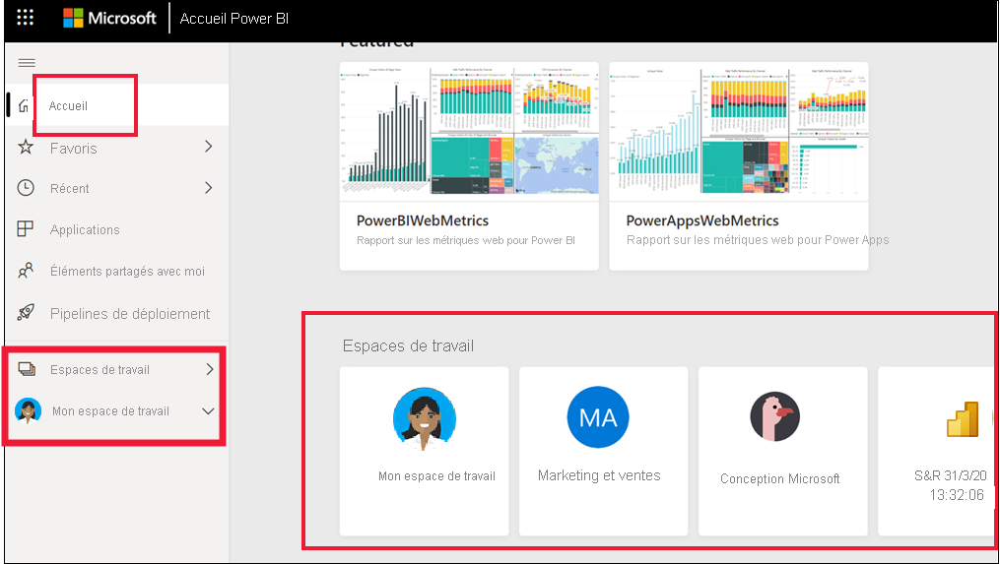

# Collaborer dans des espaces de travail

 Les *espaces de travail* sont des emplacements où collaborer avec des collègues sur du contenu spécifique. Les espaces de travail sont créés par des *concepteurs* Power BI pour contenir des collections de tableaux de bord et de rapports. Le concepteur peut ensuite partager l’espace de travail avec des collègues. Les concepteurs peuvent également regrouper un ensemble de tableaux de bord et de rapports dans une *application* et les distribuer à l’ensemble de la communauté, à leur organisation ou à des personnes ou groupes spécifiques. Certaines applications, appelées *applications de modèle*, créent un espace de travail lors de l’installation de l’application. [En savoir plus sur les applications](end-user-apps.md). 

 Toute personne utilisant le service Power BI a également un espace **Mon espace de travail**.  Mon espace de travail est votre bac à sable personnel, où vous pouvez créer du contenu pour vous-même.

 Vous pouvez voir vos espaces de travail dans l’**Accueil** de Power BI ou en sélectionnant **Espaces de travail** dans le volet de navigation.

 

## Types des espaces de travail
**Mon espace de travail** stocke tout le contenu qui vous appartient et que vous créez. Considérez-le comme votre zone de travail ou bac à sable personnel pour votre propre contenu. Pour de nombreux *utilisateurs professionnels* Power BI, **Mon espace de travail** reste vide car votre travail n’implique pas la création de nouveau contenu. Les *utilisateurs professionnels*, par définition, consomment des données créées par d’autres et utilisent ces données pour prendre des décisions commerciales. Si vous recherchez créer un contenu, lisez [les articles Power BI pour les concepteurs](../create-reports/index.yml) à la place.

Les **espaces de travail d’application** regroupent tout le contenu d’une application spécifique. Quand un *concepteur* crée une application, il rassemble tout le contenu nécessaire à l’utilisation de cette application. Le contenu peut inclure des tableaux de bord, des rapports et des jeux de données. Chaque application n’est pas forcément configurée de la sorte. Une application peut contenir un seul tableau de bord, trois éléments de chaque type ou même vingt rapports. Tout dépend de ce que le *concepteur* décide d’inclure dans l’application. En règle générale, les espaces de travail d’application partagés avec des *utilisateurs professionnels* n’incluent pas les jeux de données.

L’espace de travail de Fig Sales ci-dessous contient trois rapports et un tableau de bord. 

## Autorisations dans les espaces de travail

Les autorisations d’accès déterminent ce que vous pouvez faire dans un espace de travail, ce qui permet aux équipes de collaborer.  Lorsqu’ils accordent l’accès à un nouvel espace de travail, les *concepteurs* ajoutent des individus ou des groupes à l’un des rôles de l’espace de travail : **Lecteur**, **Membre**, **Contributeur** ou **Admin**. 

En tant qu’*utilisateur professionnel* Power BI, vous allez généralement interagir dans les espaces de travail avec le rôle **Lecteur**. Un *concepteur* peut cependant aussi vous attribuer le rôle **Membre** ou le rôle **Contributeur**. Le rôle Lecteur vous permet de visualiser et d’interagir avec du contenu (tableaux de bord, rapports, applications) créé par d’autres et partagé avec vous. Et comme le rôle Lecteur ne peut pas accéder au jeu de données sous-jacent, il s’agit d’un moyen sûr d’interagir avec le contenu et de ne pas avoir à vous inquiéter de « nuire » aux données sous-jacentes.

Pour obtenir une liste détaillée de ce que vous pouvez faire en tant qu’*utilisateur professionnel* avec le rôle Lecteur, consultez [Fonctionnalités de Power BI pour les utilisateurs professionnels](end-user-features.md).

### Autorisations et rôles de l’espace de travail

Voici les fonctionnalités des quatre rôles : Administrateurs, membres, contributeurs et lecteurs. Toutes ces fonctionnalités, à l’exception de l’affichage et de l’interaction, nécessitent une licence Power BI Pro.

[!INCLUDE[power-bi-workspace-roles-table](../includes/power-bi-workspace-roles-table.md)]

## Licences, espaces de travail et capacité
La gestion des licences joue également un rôle concernant ce que vous pouvez et ne pouvez pas faire dans un espace de travail. De nombreuses fonctionnalités requièrent que l’utilisateur dispose d’une licence Power BI *Pro* ou que l’espace de travail soit stocké dans une capacité Premium. 

Souvent, les *utilisateurs professionnels* utilisent une licence gratuite. [En savoir plus sur les licences](end-user-license.md). Si le contenu n’est pas stocké dans une capacité Premium, l’utilisateur professionnel n’y a pas accès.

Si l’espace de travail est stocké dans une *capacité Premium*, les utilisateurs professionnels peuvent visualiser et interagir avec le contenu de cet espace de travail. Une icône de diamant identifie les espaces de travail qui sont stockés dans une capacité Premium.

 Pour plus d’informations, consultez [De quelle licence est-ce que je dispose ?](end-user-license.md)

## Étapes suivantes
* [Applications dans Power BI](end-user-apps.md)    

* Vous avez des questions ? [Essayez d’interroger la communauté Power BI](https://community.powerbi.com/)

