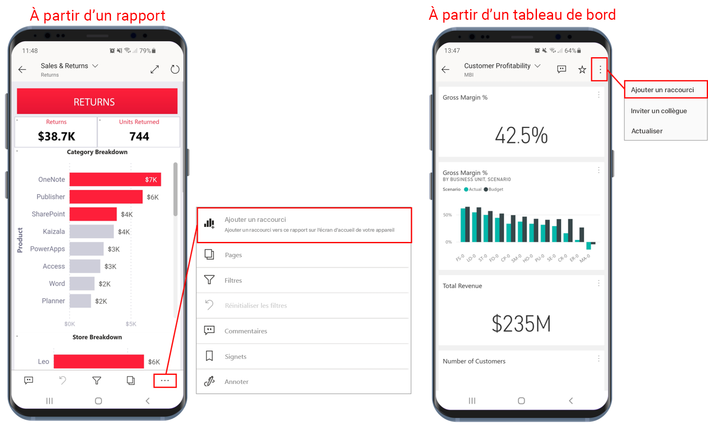
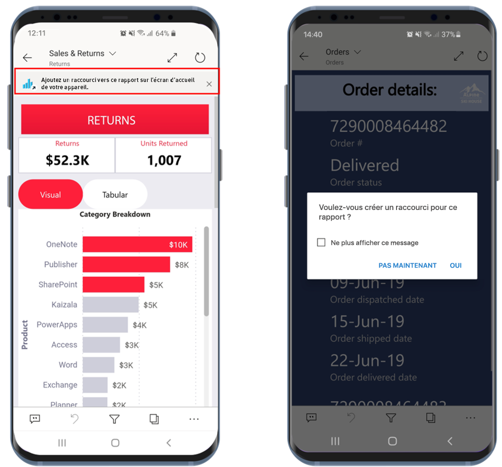
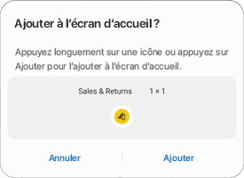
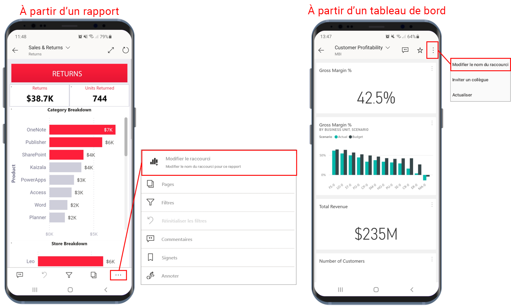
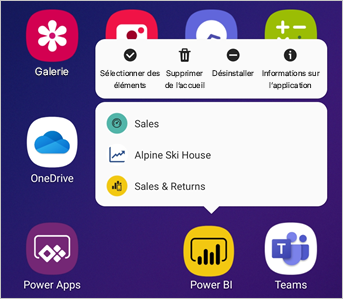

# Utiliser des raccourcis d’application Android dans l’application Power BI pour Android

S’applique à :

|  |  |
|:--- |:--- |
| Téléphones Android |Tablettes Android |

L’application mobile Power BI pour Android vous offre deux méthodes simples pour accéder directement aux rapports ou aux tableaux de bord dont vous avez besoin, sans avoir à naviguer dans l’application : des **raccourcis sur l’écran d’accueil de l’appareil** et des **raccourcis dans le lanceur d’application**.
 * **Raccourcis sur l’écran d’accueil de l’appareil** : Vous pouvez créer un raccourci vers un rapport ou un tableau de bord et l’épingler à l’écran d’accueil de votre appareil. Le rapport ou le tableau de bord ne doit pas forcément se trouver dans l’un de vos espaces de travail. Vous pouvez également créer des raccourcis vers des rapports et des tableaux de bord se trouvant dans des applications ou même sur un locataire externe (B2B).
 * **Raccourcis dans le lanceur d’application** : Vous pouvez accéder directement aux rapports et aux tableaux de bord fréquemment consultés en appuyant longuement sur l’icône du lanceur d’application située sur l’écran d’accueil de votre appareil pour ouvrir le lanceur d’application. Un menu accès rapide fournit des raccourcis vers trois éléments fréquemment consultés. L’application mobile Power BI fait le suivi des éléments que vous visualisez souvent et modifie les raccourcis en conséquence.

 >[!NOTE]
 >Les raccourcis d’application Android sont disponibles dans Android 8 et ultérieur.

## Créer un raccourci vers un rapport ou un tableau de bord

Vous pouvez créer des raccourcis vers un rapport ou un tableau de bord.

1. À partir d’un rapport, dans le menu Actions, appuyez sur **Plus d’options...** et sélectionnez **Ajouter un raccourci**. Dans un tableau de bord, appuyez sur **Ajouter un raccourci** dans le menu Actions.

   

   Par ailleurs, si l’application Power BI détecte que vous accédez souvent à un élément, elle vous suggère de créer un raccourci vers cet élément. Cela se produit de deux manières :
   * Sur les tableaux de bord et les rapports fréquemment consultés, l’option **Ajouter un raccourci** apparaît dans une bannière quand vous ouvrez l’élément.
   * Si vous utilisez fréquemment un lien pour accéder à un rapport (par exemple, à partir d’un e-mail partagé, d’une annotation, etc.), une fenêtre s’ouvre après quelques utilisations du lien pour vous demander si vous souhaitez créer un raccourci. Sélectionnez **Oui** pour ouvrir la boîte de dialogue **Ajouter un raccourci** (voir ci-dessous) ou **Pas maintenant** pour passer à l’élément auquel vous tentiez d’accéder.
   
   Ces deux expériences sont illustrées ci-dessous.

   

 1. Une boîte de dialogue **Ajouter un raccourci** s’ouvre avec le nom de votre élément. Vous pouvez modifier le nom si vous le souhaitez. Quand vous avez terminé, appuyez sur **AJOUTER**.

    

1. Vous êtes invité à confirmer l’ajout du raccourci. Appuyez sur **AJOUTER** pour ajouter le raccourci à l’écran d’accueil de votre appareil.

   

   Une icône de raccourci vers le tableau de bord ou le rapport est ajoutée à l’écran d’accueil de votre appareil avec le nom que vous avez entré.

   

## Modifier le nom du raccourci

Pour modifier le nom d’un raccourci, dans un rapport, dans le menu d’actions, appuyez sur **Plus d’options...** , puis sur **Modifier le nom du raccourci**. Dans un tableau de bord, appuyez sur **Ajouter un raccourci**. La boîte de dialogue **Modifier le nom du raccourci** s’affiche.

 

## Utiliser le lanceur d’application mobile Power BI pour accéder au contenu fréquemment consulté

Vous pouvez utiliser le lanceur d’application mobile Power BI pour accéder directement aux éléments fréquemment utilisés.

Appuyez longuement sur le lanceur d’application pour ouvrir un menu d’accès rapide contenant les éléments fréquemment consultés. Appuyez ensuite sur un raccourci pour ouvrir l’élément souhaité.

Vous pouvez créer un raccourci permanent vers n’importe quel élément listé en faisant simplement glisser l’icône de raccourci souhaitée vers l’écran d’accueil de votre appareil.

## Étapes suivantes
* [Rechercher du contenu et y accéder avec la recherche Google](mobile-app-find-access-google-search.md)
* Si vous êtes sur iOS et que vous recherchez des raccourcis Siri, consultez [Utilisation des raccourcis Siri dans l’application mobile Power BI pour iOS](mobile-apps-ios-siri-shortcuts.md).
* [Favoris dans les applications mobiles Power BI](mobile-apps-favorites.md)
