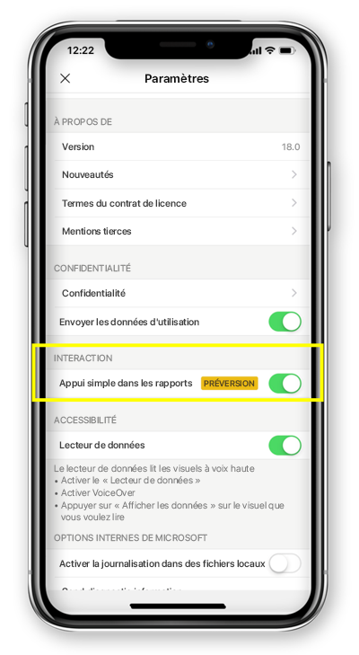

# Configurer une interaction par appui simple ou double avec les rapports
S’applique à :

|  |  | 
|:--- |:--- |
| iPhone |Téléphones Android |

Un rapport Power BI est une vue interactive de vos données, dont la découverte et l’analyse sont traduites par des insights.

Vous pouvez configurer la façon dont vous souhaitez interagir avec vos données. Vous avez le choix entre une interaction par appui simple et une interaction par appui double.

* Dans le cadre d’une interaction par appui double, vous appuyez une première fois sur un visuel pour le sélectionner, puis une deuxième fois pour exécuter l’action souhaitée (sélection des éléments d’un segment, mise en surbrillance croisée, clic sur un lien, bouton, etc.).

* Dans le cadre d’une interaction par appui simple, vous appuyez une seule fois sur un visuel pour le sélectionner et exécuter l’action.

À compter de l’application Power BI version 18.0 pour iOS et version 112540 pour Android, toutes les nouvelles installations sont configurées par défaut en mode appui simple.
Les utilisateurs qui ont déjà installé Power BI sur leur téléphone et qui effectuent la mise à niveau vers ces nouvelles versions se voient proposer de passer en mode appui simple.

## Changer le comportement d’interaction

Pour changer le comportement d’interaction, vous pouvez accéder aux paramètres de l’application et activer/désactiver l’interaction par appui simple.

Cet article s’applique aux rapports en mode paysage et en mode téléphone.

## Étapes suivantes
* [Visualiser les rapports Power BI optimisés pour les téléphones et interagir avec eux](mobile-apps-view-phone-report.md)
* Vous avez des questions ? [Essayez d’interroger la communauté Power BI](http://community.powerbi.com/)

