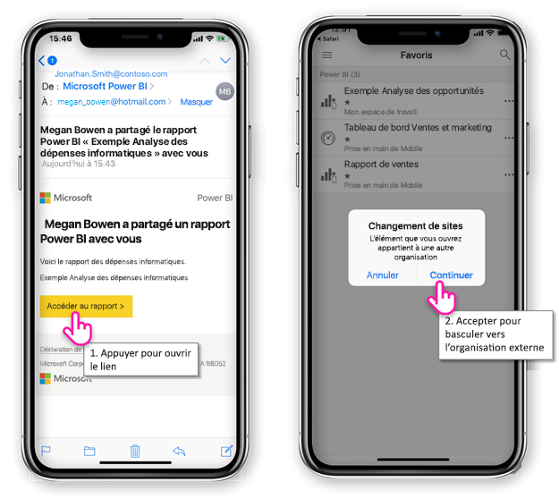
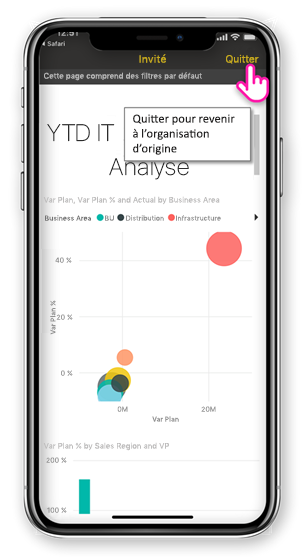
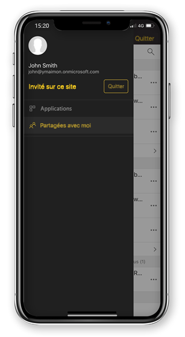

# Afficher le contenu Power BI partagé avec vous à partir d’une organisation externe

Power BI s’intègre avec Azure Active Directory business-to-business (Azure AD B2B) pour permettre une distribution sécurisée de contenu Power BI à des utilisateurs invités extérieurs à votre organisation. Et les utilisateurs invités externes peuvent utiliser l’application mobile Power BI à accéder à ce contenu Power BI partagé avec eux. 

S’applique à :

|  |  |  |  |
|:--- |:--- |:--- |:--- |
| iPhone |iPad |Téléphones Android |Tablettes Android |

## L’accès au contenu partagé

**Vous devez tout d’abord, une personne d’une organisation externe pour partager un élément avec vous.** Lorsqu’un utilisateur [partage un élément avec vous](../../service-share-dashboards.md), à partir de la même organisation ou d’une organisation externe, vous recevez un e-mail contenant un lien à celle d’élément partagé. Suivez ce lien dans votre appareil mobile, l’application mobile Power BI s’ouvre. Si l’application reconnaît que l’élément a été partagé à partir d’une organisation externe, l’application se reconnecte à cette organisation avec votre identité. L’application charge ensuite tous les éléments qui ont été partagés avec vous à partir de cette organisation.

> [!NOTE]
> S’il s’agit du premier élément partagé avec vous en tant qu’un utilisateur externe invité, vous devez demander l’invitation dans un navigateur. Vous pouvez ne peut pas réclamer l’invitation dans l’application Power BI.

Tant que vous êtes connecté à une organisation externe, un en-tête noir s’affiche dans l’application. Cet en-tête indique que vous n’êtes pas connecté à votre organisation d’origine. Pour vous connecter à votre organisation d’origine, quittez le mode invité.

Même si vous avez besoin d’avoir un lien d’artefact de Power BI pour se connecter à une organisation externe, une fois que votre application bascule, vous pouvez accéder à tous les éléments partagés avec vous (et pas uniquement l’élément vous avez ouvert à partir de l’e-mail). Pour afficher tous les éléments que vous pouvez accéder dans l’organisation externe, accédez au menu application, puis sélectionnez **partagé avec moi**. Sous **applications** vous recherchez des applications que vous pouvez utiliser également.

## Limites

- Accès conditionnel et autres stratégies Intune ne sont pas pris en charge dans Azure AD B2B et dans Power BI mobile. Cela signifie que l’application applique uniquement les stratégies de l’organisation d’origine, s’ils existent.
- Notifications Push sont reçues à partir du site d’organisation d’origine uniquement (même si l’utilisateur est connecté en tant qu’invité à une organisation externe). Ouverture de la notification connecte à nouveau l’application sur site d’organisation d’origine de l’utilisateur.
- Si l’utilisateur ferme l’application, lors de la réouverture de l’application se connecte automatiquement à l’organisation d’origine de l’utilisateur.
- Lorsque vous êtes connecté à une organisation externe, certaines actions sont désactivées : favori des éléments, des alertes de données, commentaires et le partage.
- Données hors connexion ne sont pas disponibles lorsque vous êtes connecté à une organisation externe.
- Si vous avez installé sur votre appareil de l’application portail d’entreprise, votre appareil doit être inscrit.
