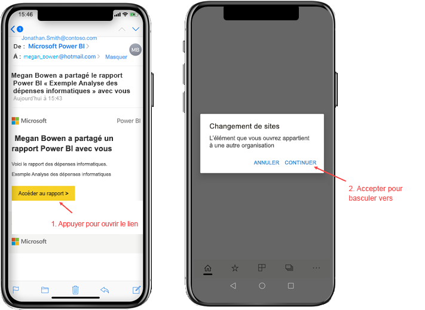
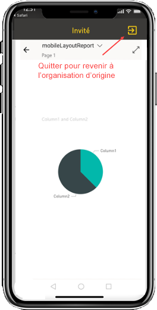
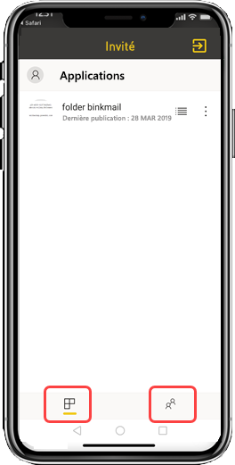

# Afficher le contenu Power BI qu’une organisation externe a partagé avec vous

Power BI s’intègre à Azure Active Directory B2B (Azure AD B2B) pour permettre une distribution sécurisée du contenu Power BI à des utilisateurs invités extérieurs à votre organisation. Les utilisateurs invités externes peuvent utiliser l’application mobile Power BI pour accéder au contenu Power BI qui a été partagé avec eux. 

S’applique à :

|  |  |  |  |
|:--- |:--- |:--- |:--- |
| iPhone |iPad |Téléphones Android |Tablettes Android |

## Accès au contenu partagé

**Tout d’abord, il est nécessaire qu’une personne d’une organisation externe partage une ressource avec vous.** Lorsque quelqu’un [partage une ressource avec vous](../../collaborate-share/service-share-dashboards.md), que ce soit au sein de votre organisation ou d’une organisation externe, vous recevez un e-mail contenant un lien vers cette ressource partagée. Lorsque vous sélectionnez ce lien dans votre appareil mobile, l’application mobile Power BI s’ouvre. Si l’application reconnaît que la ressource a été partagée par une organisation externe, l’application se reconnecte à cette organisation avec votre identité. L’application charge ensuite toutes les ressources que cette organisation a partagées avec vous.

> [!NOTE]
> S’il s’agit de la première ressource qui est partagée avec vous en tant qu’utilisateur invité externe, vous devez revendiquer l’invitation dans un navigateur. Vous ne pouvez pas la revendiquer dans l’application Power BI.

Tant que vous êtes connecté à une organisation externe, un en-tête noir s’affiche dans l’application. Cet en-tête indique que vous n’êtes pas connecté à votre organisation d’origine. Pour vous reconnecter à votre organisation d’origine, vous devez quitter le mode invité.

Même si vous avez besoin d’un lien vers un artefact Power BI pour vous connecter à une organisation externe, après le basculement de votre application, vous pouvez accéder à toutes les ressources qui ont été partagées avec vous (et pas seulement la ressource que vous avez ouverte à partir de l’e-mail). Pour afficher toutes les ressources de l’organisation externe auxquelles vous pouvez accéder, ouvrez le menu de l’application, puis sélectionnez **Partagé avec moi**. Sous **Applications**, vous trouverez d’autres applications que vous pouvez également utiliser.

## Limites

- Les utilisateurs doivent avoir un compte Power BI actif et un locataire de base.
- Les utilisateurs doivent être connectés à leur locataire de base Power BI pour accéder au contenu qui a été partagé avec eux à partir d’un locataire externe.
- L’accès conditionnel et les autres stratégies Intune ne sont pas pris en charge dans Azure AD B2B ni dans Power BI Mobile. Cela signifie que seules les stratégies de l’organisation d’origine (s’il en existe) sont appliquées à l’application.
- Seules les notifications Push provenant du site de l’organisation d’origine sont reçues (même si l’utilisateur est connecté en tant qu’invité à une organisation externe). L’ouverture de la notification reconnecte l’application au site de l’organisation d’origine de l’utilisateur.
- Si l’utilisateur ferme l’application, une fois rouverte, celle-ci se connecte automatiquement à l’organisation d’origine de l’utilisateur.
- Lors d’une connexion à une organisation externe, certaines actions sont désactivées : les favoris, les alertes de données, les commentaires et le partage.
- Les données hors connexion ne sont pas disponibles lorsque vous êtes connecté à une organisation externe.
- Si l’application Portail d’entreprise est installée sur votre appareil, votre appareil doit être inscrit.
