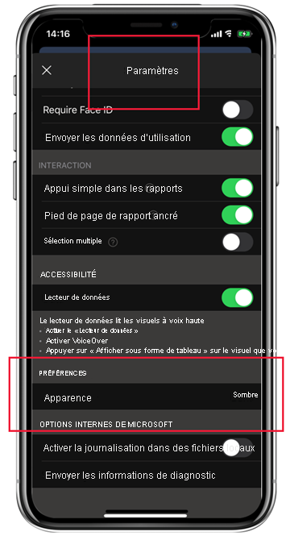

# Mode sombre

Pour prendre en compte vos préférences d’affichage individuelles, l’application mobile Power BI pour iOS prend en charge les modes d’écran clair et sombre. Le mode sombre réduit la luminosité de l’écran, ce qui vous permet de voir plus facilement votre contenu.

 En mode sombre, toutes les expériences d’application s’affichent avec un arrière-plan sombre. Toutefois, le contenu de Power BI n’est pas affecté. Vos rapports, tableaux de bord et applications sont toujours affichés comme les concepteurs l’ont prévu.
 
 Par défaut, votre application mobile Power BI utilise les paramètres de votre appareil pour déterminer l’apparence d’écran à afficher. Si votre appareil est configuré pour le mode sombre, l’application s’affiche en mode sombre.
 
 Pour basculer entre les modes clair et sombre, ou pour laisser les paramètres de l’appareil déterminer le mode, accédez à **Paramètres > Préférences** et appuyez sur **Apparence** pour choisir le mode souhaité.

