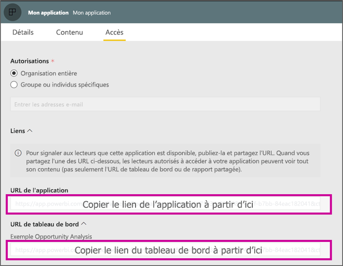

# <a name="create-a-link-to-a-specific-location-in-the-power-bi-mobile-apps"></a>Créer un lien vers un emplacement spécifique dans les applications mobiles Power BI
Vous pouvez utiliser des liens pour accéder directement à certains éléments dans Power BI : Rapport, Tableau de bord et Vignette.

Il existe deux scénarios principaux pour l’utilisation de liens dans Power BI Mobile : 

* Pour ouvrir Power BI **en dehors de l’application** afin d’accéder à du contenu spécifique (rapport/tableau de bord/application). Il s’agit généralement d’un scénario d’intégration, lorsque vous souhaitez ouvrir Power BI Mobile à partir d’une autre application. 
* Pour **naviguer** dans Power BI. C’est le cas lorsque vous souhaitez créer une navigation personnalisée dans Power BI.


## <a name="use-links-from-outside-of-power-bi"></a>Utiliser des liens en dehors de Power BI
Lorsque vous utilisez un lien en dehors de l’application Power BI, vous devez vérifier qu’il sera ouvert par l’application. Si l’application n’est pas installée sur l’appareil, vous devez proposer à l’utilisateur de l’installer. Nous avons créé un format de lien spécial afin de permettre cela. Ce format permet de garantir que l’appareil utilisera l’application pour ouvrir le lien. Si l’application n’est pas installée sur l’appareil, l’utilisateur est invité à se rendre dans le Store pour la télécharger.

Le lien doit commencer par ceci :  
```html
https://app.powerbi.com/Redirect?[**QUERYPARAMS**]
```

> [!IMPORTANT]
> Si votre contenu est hébergé dans un centre de données spécial (Goverment, Chine, etc.), le lien doit commencer par l’adresse Power BI correspondante, par exemple `app.powerbigov.us` ou `app.powerbi.cn`.   
>


Les paramètres de requête (**QUERY PARAMS**) sont les suivants :
* **action** (obligatoire) = OpenApp / OpenDashboard / OpenTile / OpenReport
* **appId** = si vous souhaitez ouvrir un rapport ou un tableau de bord faisant partie d’une application 
* **groupObjectId** = si vous souhaitez ouvrir un rapport ou un tableau de bord faisant partie d’un espace de travail (autre que Mon espace de travail)
* **dashboardObjectId** = ID d’objet du tableau de bord (si l’action est OpenDashboard ou OpenTile)
* **reportObjectId** = ID d’objet du rapport (si l’action est OpenReport)
* **tileObjectId** = ID d’objet de la vignette (si l’action est OpenTile)
* **reportPage** = si vous souhaitez ouvrir une section de rapport spécifique (si l’action est OpenReport)
* **ctid** = ID d’organisation de l’élément (valable pour les scénarios B2B. Peut être omis si l’élément appartient à l’organisation de l’utilisateur).

**Exemples :**

* Ouvrir un lien vers une application 
  ```html
  https://app.powerbi.com/Redirect?action=OpenApp&appId=appidguid&ctid=organizationid
  ```

* Ouvrir un tableau de bord faisant partie d’une application 
  ```html
  https://app.powerbi.com/Redirect?action=OpenDashboard&appId=**appidguid**&dashboardObjectId=**dashboardidguid**&ctid=**organizationid**
  ```

* Ouvrir un rapport faisant partie d’un espace de travail
  ```html
  https://app.powerbi.com/Redirect?Action=OpenReport&reportObjectId=**reportidguid**&groupObjectId=**groupidguid**&reportPage=**ReportSectionName**
  ```

### <a name="how-to-get-the-right-link-format"></a>Comment obtenir le bon format de lien

#### <a name="links-of-apps-and-items-in-app"></a>Liens d’applications et d’éléments dans l’application

Pour les **applications, rapports et tableaux de bord faisant partie d’une application**, le moyen le plus simple d’obtenir le lien est d’accéder à l’espace de travail et de choisir « Mettre à jour l’application ». Cela va entraîner l’ouverture de l’expérience « Publier l’application » et vous permettra de trouver la section **Liens** sous l’onglet Accès. En développant cette section, vous verrez l’application et tous les liens de contenu qui peuvent être utilisés pour y accéder directement.



#### <a name="links-of-items-not-in-app"></a>Liens vers des éléments ne se trouvant pas dans l’application 

Pour les rapports et les tableaux de bord qui ne font pas partie d’une application, vous devez extraire les ID à partir de l’URL de l’élément.

Par exemple, pour rechercher l’ID d’objet de **tableau de bord** contenant 36 caractères, accédez au tableau de bord correspondant dans le service Power BI. 

```html
https://app.powerbi.com/groups/me/dashboards/**dashboard guid comes here**?ctid=**organization id comes here**`
```

Pour rechercher l’ID d’objet de **rapport** contenant 36 caractères, accédez au rapport correspondant dans le service Power BI.
Voici un exemple de rapport tiré de « Mon espace de travail »

```html
https://app.powerbi.com/groups/me/reports/**report guid comes here**/ReportSection3?ctid=**organization id comes here**`
```
L’URL ci-dessus contient également la page de rapport « **ReportSection3** ».

Voici un exemple de rapport tiré d’un espace de travail (autre que Mon espace de travail)

```html
https://app.powerbi.com/groups/**groupid comes here**/reports/**reportid comes here**/ReportSection1?ctid=**organizationid comes here**
```

## <a name="use-links-inside-power-bi"></a>Utiliser des liens à l’intérieur de Power BI

À l’intérieur de Power BI, les liens des applications mobiles fonctionnent exactement comme dans le service Power BI.

Si vous souhaitez ajouter à votre rapport un lien qui pointe vers un autre élément Power BI, vous pouvez copier l’URL de cet élément à partir de la barre d’adresse du navigateur. Découvrez comment [ajouter un lien hypertexte à une zone de texte](https://docs.microsoft.com/power-bi/service-add-hyperlink-to-text-box).

## <a name="use-report-url-with-filter"></a>Utiliser une URL de rapport comprenant un filtre
Tout comme le service Power BI, les applications Power BI Mobile prennent en charge les URL de rapport qui contiennent un paramètre de requête de type Filtre. Vous pouvez ouvrir un rapport dans l’application Power BI Mobile et le filtrer pour obtenir un état spécifique. Par exemple, cette URL ouvre le rapport des ventes et le filtre par secteur.

```html
https://app.powerbi.com/groups/me/reports/**report guid comes here**/ReportSection3?ctid=**organization id comes here**&filter=Store/Territory eq 'NC'
```

Découvrez comment [créer des paramètres de requête pour filtrer les rapports](https://docs.microsoft.com/power-bi/service-url-filters).

## <a name="next-steps"></a>Étapes suivantes
Vos commentaires nous aident à développer les futurs processus d’implémentation. N’oubliez pas de voter pour les fonctionnalités que vous aimeriez voir dans les applications mobiles Power BI. 

* [Applications Power BI pour appareils mobiles](mobile-apps-for-mobile-devices.md)
* Suivez @MSPowerBI sur Twitter
* Rejoindre la conversation de la [Communauté Power BI](https://community.powerbi.com/)
* [Qu’est-ce que Power BI ?](../../fundamentals/power-bi-overview.md)

