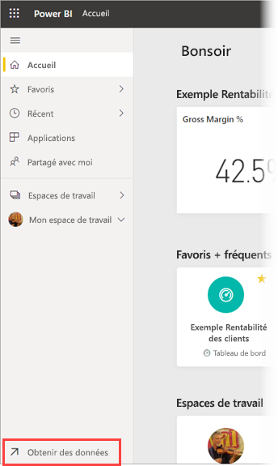
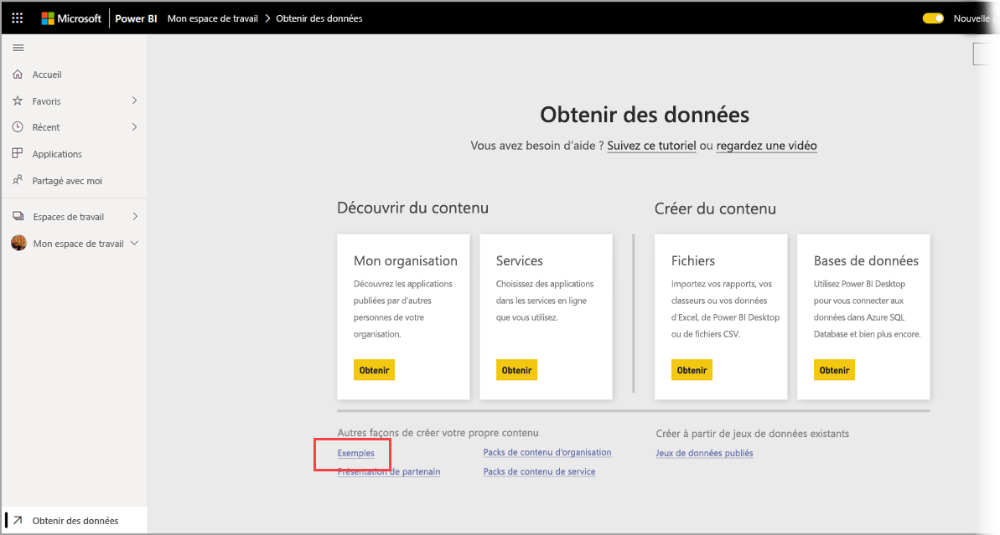
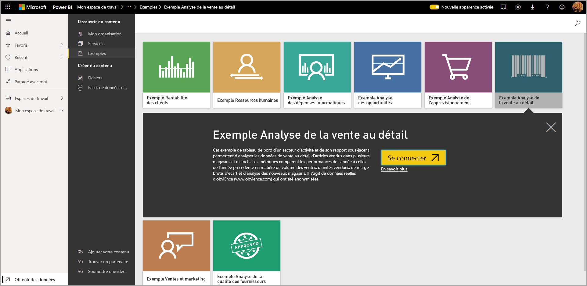
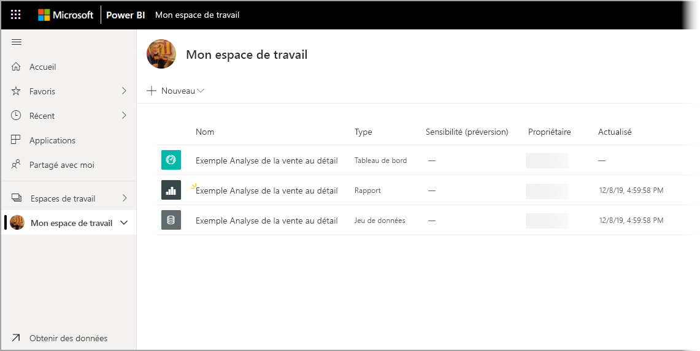

# Téléchargement d’exemples dans Mon espace de travail dans le service Power BI

Une partie de la documentation sur les applications mobiles disponible ici utilise des exemples de données à des fins d’illustration. Pour suivre les instructions sur votre appareil, vous pouvez télécharger les exemples de données dans votre compte de service Power BI, où vous pouvez ensuite les afficher à partir de l’application Power BI Mobile sur votre appareil. Cet article explique comment télécharger les exemples de données sur votre compte de service Power BI. 

## Conditions préalables

Vous devez disposer d’un compte de service Power BI pour pouvoir télécharger des données. Si vous n’êtes pas encore inscrit à Power BI, [inscrivez-vous à un essai gratuit](https://app.powerbi.com/signupredirect?pbi_source=web) avant de commencer.

## Télécharger un exemple

1. Ouvrez le [service Power BI](https://app.powerbi.com) dans votre navigateur, puis connectez-vous.

2. Sélectionnez **Obtenir des données** en haut à gauche dans le volet de navigation. Si le volet de navigation est masqué et que vous ne voyez pas le lien Obtenir des données, affichez le volet en cliquant sur l’icône Afficher/masquer le volet de navigation .  
   
    

3. Dans la page Obtenir les données, sélectionnez le lien **Exemples**.
   
   

4. Sélectionnez un exemple à télécharger. Veillez à choisir l’exemple auquel fait appel le tutoriel, le guide de démarrage rapide ou l’article que vous utilisez. Après l’avoir sélectionné, cliquez sur **Se connecter**.
  
   
   
5. Power BI importe l’exemple, puis ajoute un tableau de bord, un rapport et un jeu de données à votre espace de travail.
   
   
  
Vous êtes maintenant prêt à consulter les exemples sur votre appareil mobile.

## Étapes suivantes
* [Démarrage rapide](mobile-apps-quickstart-view-dashboard-report.md)
* Des questions ? Consultez la [section Mobile Apps dans la communauté Power BI](https://go.microsoft.com/fwlink/?linkid=839277)
