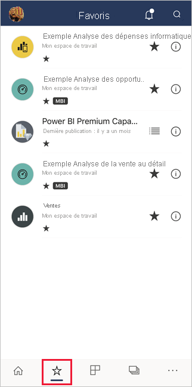
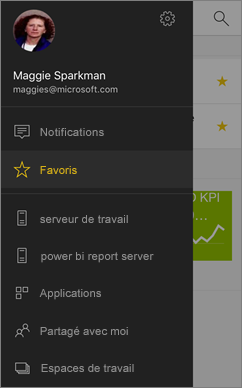
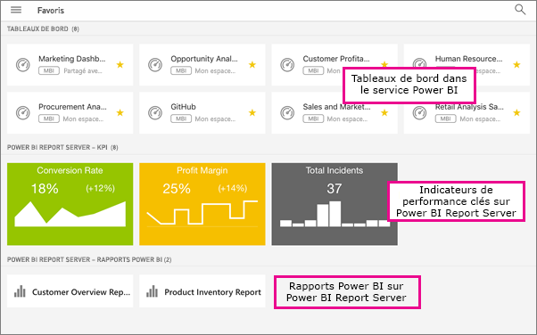
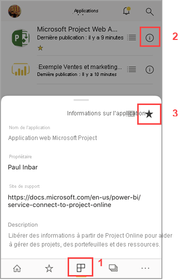
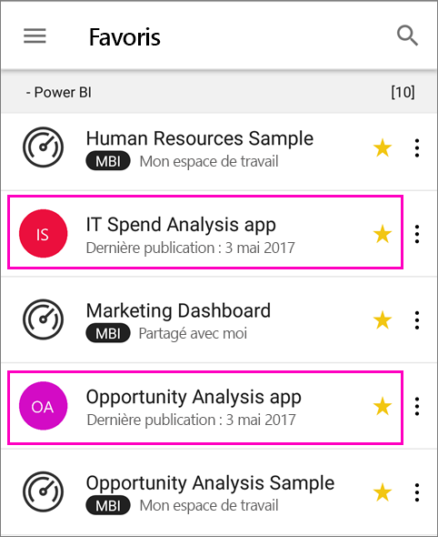
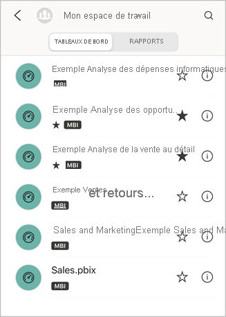
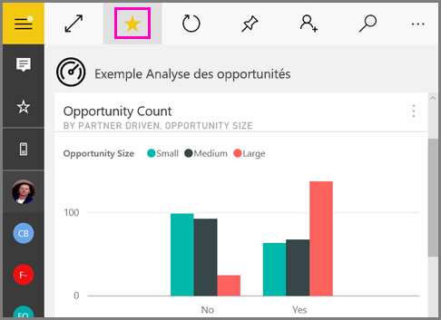
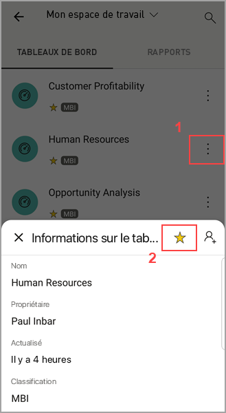
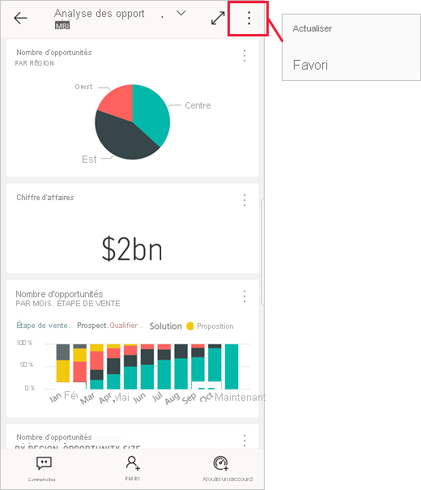

# Définir et afficher des favoris dans les applications mobiles Power BI
S’applique à :

|  |  |  |  |  |
|:--- |:--- |:--- |:--- |:--- |
| iPhone |iPad |Téléphones Android |Tablettes Android |Appareils Windows 10 |

Découvrez comment définir et afficher vos tableaux de bord, rapports et applications Power BI favoris, vos rapports Power BI Report Server et Reporting Services locaux favoris, ainsi que vos indicateurs de performance clés favoris dans les applications mobiles.

Quand vous marquez un élément comme favori dans les applications mobiles Power BI, il apparaît sur votre page Favoris du service Power BI ([https://powerbi.com](https://powerbi.com)) et de tous vos appareils mobiles. 

Vous pouvez également [marquer comme favoris des tableaux de bord et applications Power BI dans le service Power BI](../end-user-favorite.md). Vous pouvez ensuite les consulter sur la page Favoris dans l’application mobile.

Vous pouvez marquer des indicateurs de performance clés et rapports en tant que favoris sur un portail web Power BI Report Server ou Reporting Services, puis les afficher dans un seul dossier sur votre appareil mobile, ainsi que vos tableaux de bord Power BI favoris.

## Afficher vos favoris Power BI
* Appuyez sur le menu de navigation en haut , puis sur **Favoris**.
  
  
  
  Vous pouvez voir tous vos favoris regroupés sur cette page :
  
  

## Marquer une application en tant que favorite
1. Dans la liste des applications dans l’application mobile, cliquez sur **Plus d’options** (...) en regard de l’application > **Favoris**.
   
    
   
    Désormais, l’application est répertoriée avec vos autres applications et tableaux de bord favoris.
   
    

## Définir un tableau de bord ou un rapport en tant que favori dans des applications mobiles iOS et Windows 10
Vous pouvez définir un tableau de bord ou un rapport application Power BI comme favori à partir de la liste des tableaux de bord ou des rapports, ou du tableau de bord ou rapport proprement dit.

* Dans la liste des tableaux de bord ou des rapports dans l’application mobile, appuyez sur l’étoile vide en regard du nom . L’étoile devient jaune .
  
    
* Sur le tableau de bord ou le rapport, appuyez sur l’étoile vide dans le ruban . L’étoile devient jaune .
  
    

## Marquer un tableau de bord ou un rapport comme favori dans les applications mobiles Android
Vous pouvez définir un tableau de bord ou un rapport application comme favori à partir de la liste des tableaux de bord ou des rapports, ou du tableau de bord ou rapport proprement dit.

* Dans la liste des tableaux de bord ou des rapports dans l’application mobile, appuyez sur le bouton **Plus d’options** (...) vertical en regard du nom, puis appuyez sur **Favoris**. Vous voyez une étoile jaune en regard du nom .
  
    
* Sur le tableau de bord ou le rapport, appuyez sur l’étoile vide dans le ruban . L’étoile devient gris foncé .
  
    

## Marquer comme favoris des rapports et indicateurs de performance clés Power BI Report Server et Reporting Services
Vous pouvez afficher vos rapports et indicateurs de performance clés Power BI Report Server et Reporting Services favoris dans les applications mobiles Power BI, mais vous ne pouvez pas les marquer en tant que favoris dans ces applications. Vous [les marquez en tant que favoris dans le portail web](../../report-server/tutorial-explore-report-server-web-portal.md#tag-your-favorites). 

## Étapes suivantes
* [Tableaux de bord favoris dans le service Power BI](../end-user-favorite.md) 
* Vous avez des questions ? [Essayez d’interroger la communauté Power BI](https://community.powerbi.com/)

