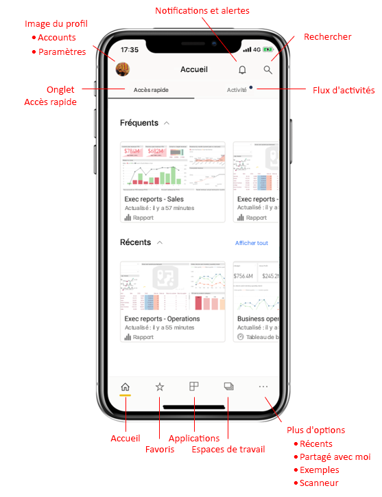
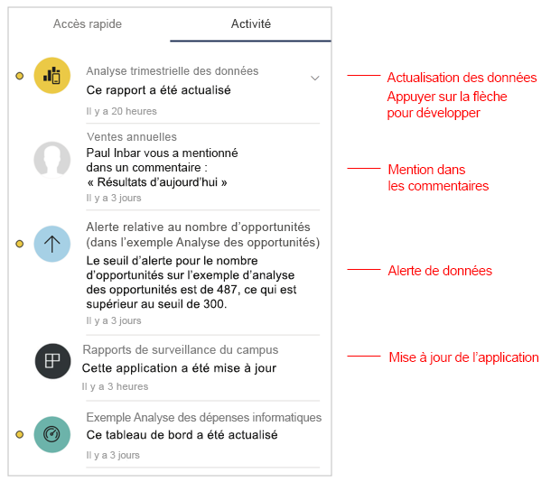
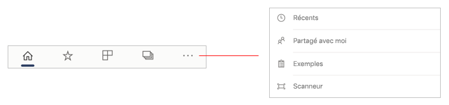
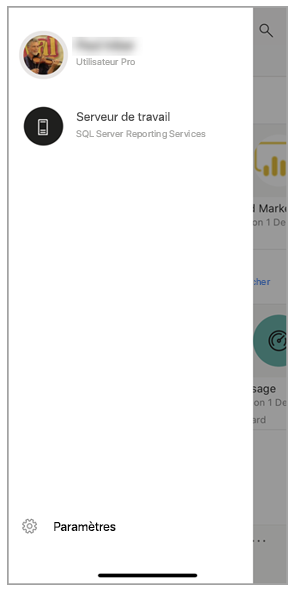
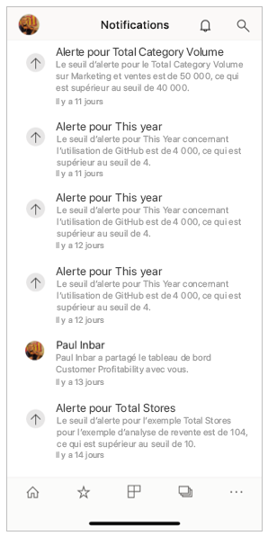
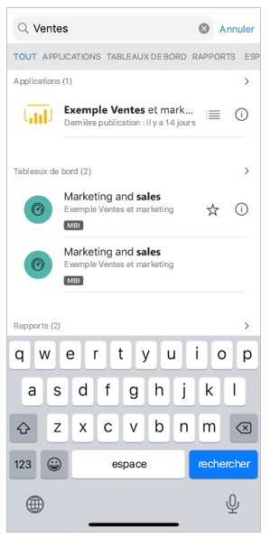

# Présentation rapide de la page d’accueil de l’application Mobile
Cette présentation va vous permettre de vous familiariser avec la page d’accueil de l’application Power BI Mobile, ainsi qu’avec les aides à la navigation qu’elle fournit pour accéder rapidement à tout ce dont vous avez besoin.

S’applique à :

|  |  |  |
|:--- |:--- |:--- |
| iPhone | iPad | Téléphone | 

Lorsque vous ouvrez l’application Power BI Mobile, vous accédez à la page d’accueil, à partir de laquelle vous pouvez accéder rapidement aux rapports, aux tableaux de bord et aux applications les plus fréquemment ou les plus récemment utilisés. De plus, elle fournit un flux d’activités qui vous permet de savoir comment votre contenu Power BI est utilisé, ainsi que des outils de navigation pratiques qui vous permettent d’accéder rapidement au contenu dont vous avez besoin.

 
## Onglet Accès rapide

L’onglet Accès rapide montre les rapports, les tableaux de bord et les applications fréquemment et récemment consultés, dans deux sections réductibles. Pour voir la liste complète des éléments récemment consultés, appuyez sur **Tout afficher** à droite de Récents. 

## Flux d'activités

Le flux d’activités vous permet de suivre l’utilisation de votre contenu Power BI. Il vous montre l’ensemble des notifications, alertes, commentaires et @mentions les plus récents.

Les mises à jour du flux sont les suivantes :
* **Données actualisées** : lors de l’actualisation des données sous-jacentes de l’un des rapports ou tableaux de bord compris dans la section Favoris ou Récents.
* **Nouveaux commentaires** : lorsque des utilisateurs créent un commentaire dans un rapport ou un tableau de bord qui se trouve dans vos favoris ou dans la section Récents, ou quand quelqu’un vous mentionne dans un commentaire.
* **Alertes de données** : lorsque les données atteignent un seuil que vous avez défini précédemment dans une [alerte de données](mobile-set-data-alerts-in-the-mobile-apps.md).
* **Mises à jour de l’application** : lorsqu’un créateur d’application publie une mise à jour pour une application que vous utilisez.

 Appuyez sur un élément d’activité pour accéder à l’emplacement souhaité en vue de l’explorer.

Les éléments d’activité étant agrégés, toutes les mises à jour de données provenant d’une même application ou d’un même espace de travail seront regroupées. Utilisez le  flèche pour développer et afficher les éléments agrégés. L’élément le plus récent se situe toujours en haut de la liste.

## Barre de navigation

Au bas de la page se trouve la barre de navigation.

La barre de navigation fournit un accès rapide aux éléments suivants :

*  **Page d’accueil** : permet de retourner à la page d’accueil.
*  **Favoris** : rapports, tableaux de bord et applications que vous avez marqués comme [Favoris](mobile-apps-favorites.md).
*  **Applications** : applications que vous avez installées dans votre compte.
*  **Espaces de travail** : dossiers de travail qui regroupent les rapports et les tableaux de bord générés par les créateurs de contenu.
*  **Récents** : éléments que vous avez récemment consultés.
*  **Partagé avec moi** : éléments que d’autres personnes ont partagés avec vous.
*  **Exemples** : exemples Power BI que vous pouvez utiliser pour en savoir plus sur les fonctionnalités de Power BI.
*  **Scanneur** : appareil photo que vous pouvez utiliser pour scanner les [codes-barres](mobile-apps-scan-barcode-iphone.md) et les [codes QR](mobile-apps-qr-code.md).

## En-tête

En haut de la page, l’en-tête indique le nom de la page Power BI, du rapport ou du tableau de bord où vous vous trouvez.

L’en-tête fournit les éléments de navigation suivants :
* **Image de profil ou avatar** : ouvre le panneau latéral dans lequel vous pouvez [passer de votre compte Power BI à votre compte Report Server](mobile-app-ssrs-kpis-mobile-on-premises-reports.md), ainsi qu’accéder aux paramètres de l’application Power BI Mobile.

    

* **Notifications** : ouvre la [page Notifications](mobile-apps-notification-center.md) dans laquelle vous pouvez voir les notifications et y accéder. Lorsqu’un point apparaît sur la cloche des notifications, cela signifie que vous avez de nouvelles notifications.

    

* **Rechercher** : permet de rechercher du contenu Power BI dans votre abonnement.

    

## Étapes suivantes
Cette présentation vous a permis d’explorer la page d’accueil de l’application Power BI Mobile. Accédez à des informations supplémentaires sur l’utilisation de l’application Power BI Mobile. 
* [Explorer des tableaux de bord et des rapports](mobile-apps-quickstart-view-dashboard-report.md)
* [Explorer des rapports dans les applications mobiles Power BI](mobile-reports-in-the-mobile-apps.md)
