# Analyste virtuel des questions et réponses dans les applications iOS – Power BI

Le moyen le plus simple de tirer des enseignements de vos données consiste à poser des questions à leur sujet en utilisant vos propres mots. Dans cet article, vous allez poser des questions et afficher les insights proposés sur l’exemple de données à l’aide de l’analyste virtuel des questions et réponses dans l’application mobile Microsoft Power BI sur votre iPad, votre iPhone ou votre iPod touch. 

S’applique à :

|  |  |
|:--- |:--- |
| iPhone |iPad |

L’analyste virtuel des questions et réponses est une expérience décisionnelle de type conversationnel qui accède aux données de questions et réponses sous-jacentes du service Power BI [(https://powerbi.com)](https://powerbi.com). Il suggère des insights sur les données ; vous pouvez poser vos questions par écrit ou oralement.

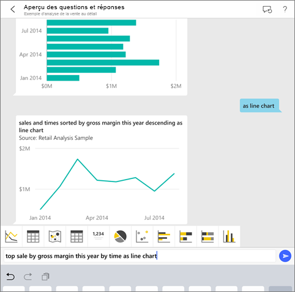

Si vous n’êtes pas inscrit à Power BI, [inscrivez-vous à un essai gratuit](https://app.powerbi.com/signupredirect?pbi_source=web) avant de commencer.

## Conditions préalables

### Installer l’application Power BI pour iOS
[Téléchargez l’application iOS](http://go.microsoft.com/fwlink/?LinkId=522062 "Téléchargez l’application iPhone") à partir de l’Apple App Store sur votre iPad, iPhone ou iPod touch.

Les versions suivantes prennent en charge l’application Power BI pour iOS :
- iPad sous iOS 10 (et versions ultérieures) ;
- iPhone 5 (et versions ultérieures) sous iOS 10 (et versions ultérieures) ; 
- iPod touch sous iOS 10 (et versions ultérieures).

### Télécharger les exemples
La première étape consiste à télécharger les exemples Retail Analysis (Analyse de la vente au détail) et Opportunity Analysis (Analyse des opportunités) dans le service Power BI.

**Obtenir l’exemple Retail Analysis** (Analyse de la vente au détail)

1. Ouvrez le service Power BI (app.powerbi.com) et connectez-vous.

2. Dans le volet de navigation de gauche, sélectionnez **Espaces de travail**, **Mon espace de travail**.

3. Dans le coin inférieur gauche, sélectionnez **Obtenir des données**.
   
    

3. Sur la page Obtenir des données, sélectionnez l’icône **Exemples**.
   
   

4. Sélectionnez **l’exemple Retail Analysis** (Analyse de la vente au détail).
 
    
 
8. Sélectionnez **Se connecter**.  
  
   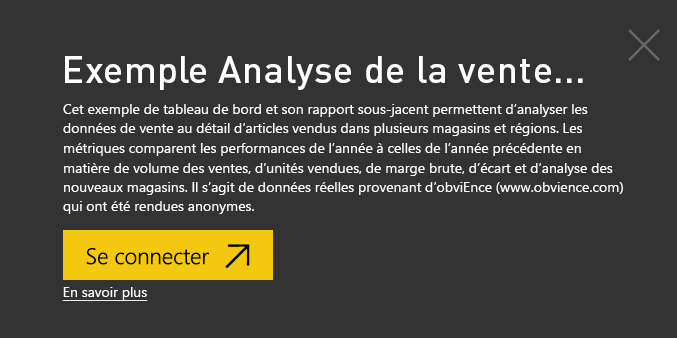
   
5. Power BI importe le pack de contenu, puis ajoute un tableau de bord, un rapport et un jeu de données à votre espace de travail.
   
   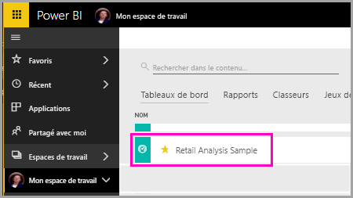

**Obtenir l’exemple Opportunity Analysis** (Analyse des opportunités)

- Suivez les mêmes étapes que pour l’exemple Retail Analysis (Analyse de la vente au détail), mais en sélectionnant **l’exemple Opportunity Analysis** (Analyse des opportunités) à l’étape 4.

    
  
Vous pouvez à présent consulter les exemples sur votre appareil iOS.

## Poser des questions sur votre iPhone ou iPad
1. Sur votre iPhone ou votre iPad, appuyez sur le bouton de navigation globale  > **Espaces de travail** > **Mon espace de travail** et ouvrez le tableau de bord Exemple Retail Analysis (Analyse de la vente au détail).

2. Appuyez sur l’icône de l’analyste virtuel des questions et réponses  dans le menu Action au bas de la page (en haut de la page sur un iPad).
     L’analyste virtuel des questions et réponses commence par proposer des suggestions.
3. Tapez **Afficher**, appuyez sur **Ventes** à partir de la liste de suggestions > **Envoyer** .

    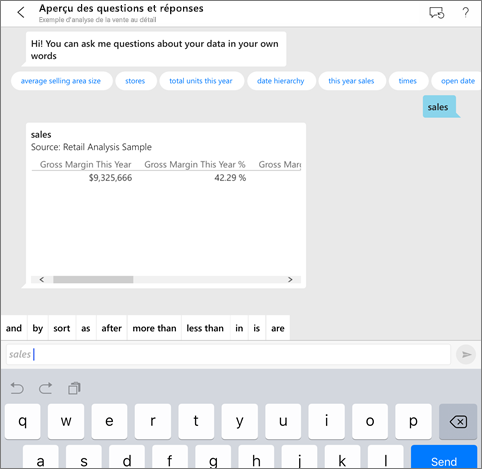
4. Appuyez sur **by** (par) dans les mots clés, sur **item** (élément) dans la liste de suggestions, puis sur **Envoyer** .

    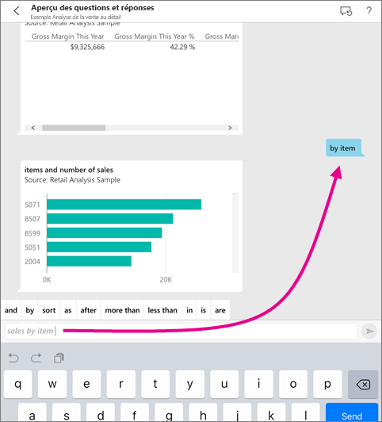
5. Appuyez sur **as** (en tant que) dans les mots clés, sur l’icône en forme d’histogramme , puis sur **Envoyer** .
6. Appuyez de façon prolongée sur le graphique qui s’ouvre, puis cliquez sur **Développer**.

    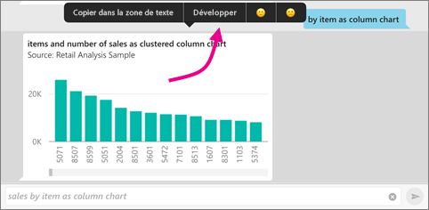

    Le graphique s’ouvre en mode focus dans l’application.

    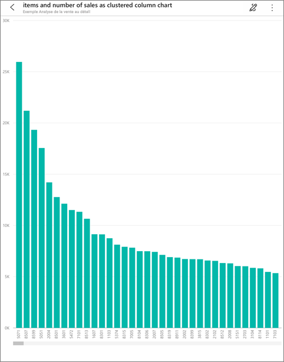
7. Appuyez sur la flèche dans l’angle supérieur gauche pour revenir à la fenêtre de conversation de l’analyste virtuel des questions et réponses.
8. Appuyez sur le X à droite de la zone de texte pour supprimer le texte et recommencer.
9. Essayez une nouvelle question : appuyez sur **top** (haut) dans les mots clés, sur **sale by avg $/unit ly** > **Envoyer** .

    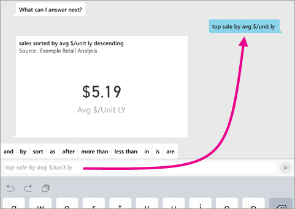
10. Choisissez **by** (par) dans les mots clés, appuyez sur **time** (heure) dans la liste de suggestions en haut, puis sur **Envoyer** .

     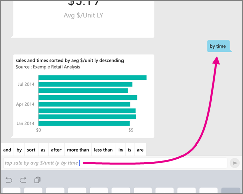
11. Tapez **as** (en tant que), choisissez l’icône de graphique en courbes  dans la liste de suggestions, puis appuyez sur **Envoyer** .

    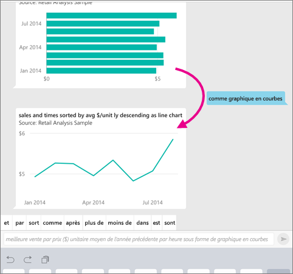

## Essayez d’énoncer vos questions
Vous pouvez maintenant poser des questions sur vos données dans l’application mobile Power BI en énonçant la question au lieu de la taper.

1. Appuyez sur l’icône de l’analyste virtuel des questions et réponses  à partir du menu d’action en bas de la page (en haut de la page sur iPad).
2. Appuyez sur l’icône de microphone .

    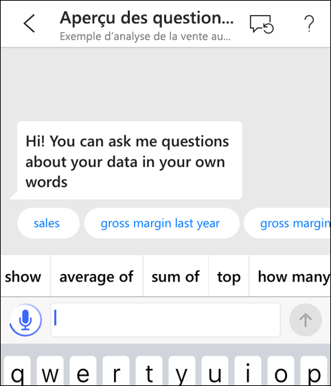

1. Lorsque celle-ci est active, commencez à parler. Par exemple, dites « prix unitaire moyen par heure », puis appuyez sur **Envoyer** .

    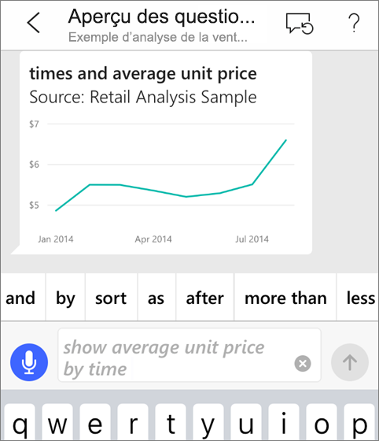

### Vous avez des questions concernant la confidentialité lors de l’utilisation de la reconnaissance de la parole-texte ?
Consultez la section relative à la reconnaissance vocale dans la page [Nouveautés iOS](https://go.microsoft.com/fwlink/?linkid=845624) du guide de développement Apple iOS.

## Aide et commentaires
* Vous avez besoin d’aide ? Dites « Hi » (Bonjour) ou « Help » (Aide) pour obtenir de l’aide pour démarrer une nouvelle question.
* Vous voulez formuler des commentaires sur les résultats ? Appuyez longuement sur un graphique ou un autre résultat, puis appuyez sur l’émoticône.

    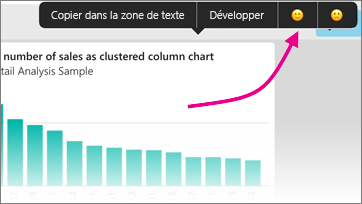

    Vos commentaires restent anonymes. Ils nous aident à améliorer nos réponses à vos questions.

## Améliorer les résultats de l’analyste virtuel des questions et réponses
Vous pouvez améliorer les résultats que vous et vos clients obtenez lorsque vous utilisez l’analyste virtuel des questions et réponses sur un jeu de données, soit en posant des questions plus ciblées, soit en améliorant le jeu de données.

### Comment poser des questions
* Suivez ces [conseils pour poser des questions dans Questions et réponses](../../service-q-and-a-tips.md) dans le service Power BI ou l’analyste virtuel des questions et réponses dans votre application mobile iOS.

### Comment améliorer le jeu de données
* Améliorez le jeu de données dans le service Power BI ou Power BI Desktop pour [que vos données fonctionnent bien avec Questions et réponses et l’analyste virtuel des questions et réponses](../../service-prepare-data-for-q-and-a.md).

## Étapes suivantes
* [Questions et réponses dans le service Power BI](../../power-bi-q-and-a.md)
* Vous avez des questions ? Consultez la [section Mobile Apps dans la communauté Power BI](https://go.microsoft.com/fwlink/?linkid=839277)
