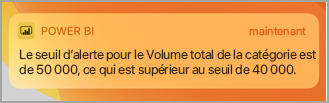
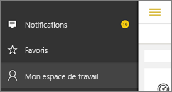
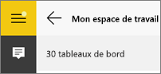
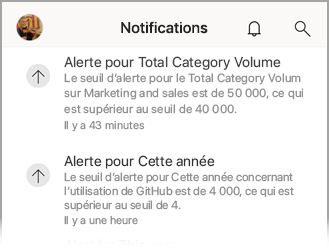
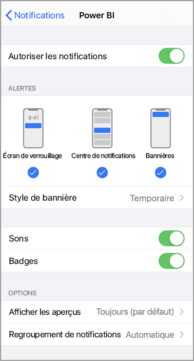
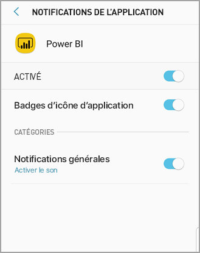
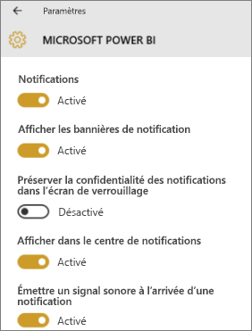

# Obtenir des notifications dans les applications mobiles Power BI
S’applique à :

|  |  |  |  |  |
|:--- |:--- |:--- |:--- |:--- |
| iPhone |iPad |Téléphones Android |Tablettes Android |Appareils Windows 10 |

Les notifications vous donnent directement des informations relatives à votre expérience Power BI, dans le service Power BI ou sur votre appareil mobile. Quand vous ouvrez les notifications, vous pouvez voir un flux séquentiel de messages sur les [alertes que vous avez définies](mobile-set-data-alerts-in-the-mobile-apps.md), les nouveaux tableaux de bord partagés avec vous, les modifications apportées à votre espace de travail de groupe, les informations sur les événements et réunions Power BI et bien plus encore.

> [!NOTE]
> Sur un appareil iOS, la première fois que vous vous connectez à la [version mise à jour des applications Power BI](https://powerbi.microsoft.com/mobile/), un message vous demande si vous souhaitez que Power BI envoie des notifications. Vous pouvez également configurer comment Power BI vous notifie dans les **Paramètres** de votre appareil. 
> 
> 

## Afficher les notifications sur votre appareil mobile
1. Quand vous recevez des notifications sur votre appareil mobile, par défaut Power BI émet un son et affiche une bannière de notification.
   
   
   
   Ou sur un iPad :
   
   
   
   Vous pouvez [modifier la manière dont Power BI vous notifie](mobile-apps-notification-center.md#change-or-turn-off-notifications-on-your-mobile-device).
2. Si vous avez reçu des notifications, quand vous vous connectez à Power BI sur votre appareil mobile, vous voyez un point jaune sur le bouton de navigation globale  (Android) ou sur l’icône **Notifications**. 
   
   
3. Sélectionnez l’icône Notifications  (Windows 10).
   
    Les notifications sont affichées avec les plus récentes en haut et les messages non lus en surbrillance. Les notifications sont conservées pendant 90 jours, sauf si vous les supprimez ou atteignez la limite maximale de 100.
   
   
4. Pour faire disparaître une notification, appuyez longuement dessus et sélectionnez **Ignorer**.

## Modifier ou désactiver les notifications sur votre appareil mobile
Vous pouvez modifier la manière dont Power BI vous notifie.

1. Sur un appareil iOS, accédez à **Paramètres** > **Notifications**. 
   
    Sur un téléphone Android, accédez à **Paramètres de notification**.
   
    Sur un appareil Windows, dans **Paramètres**, accédez à **Système** > **Notifications et actions**.
2. Dans la liste des applications, sélectionnez **Power BI**. 
3. Ici, vous pouvez désactiver les notifications complètement ou sélectionner celles à désactiver.
   
    **Sur un iPhone**
   
    
   
    **Sur un téléphone Android**
   
    

    **Sur un appareil Windows 10**

    

## Étapes suivantes
* [Alertes de données dans le service Power BI](../../service-set-data-alerts.md)
* [Définir des alertes de données dans l’application iPhone (Power BI pour iOS)](mobile-set-data-alerts-in-the-mobile-apps.md)
* [Définir des alertes dans l’application mobile Power BI pour Windows 10](mobile-set-data-alerts-in-the-mobile-apps.md)
* [Télécharger la dernière version des applications Power BI](https://powerbi.microsoft.com/mobile/) pour appareils mobiles

