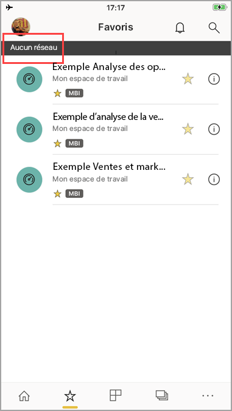

# Affichage de vos données hors connexion dans les applications mobiles Power BI
S’applique à :

|  |  |  |  |  |
|:--- |:--- |:--- |:--- |:--- |
| iPhone |iPad |Téléphones Android |Tablettes Android |Appareils Windows 10 |

L’affichage de Power BI dans une application mobile plutôt qu’un navigateur mobile offre l’avantage de visualiser vos données, même lorsque vous n’êtes connecté à aucun réseau. 

Par défaut, Power BI actualise fréquemment les données afin de toujours vous fournir des réponses à jour, même lorsque vous êtes en déplacement ou en itinérance.

## Accès aux données hors connexion
Quand vous êtes en mode hors connexion, vous pouvez accéder à tous les tableaux de bord auxquels vous avez accédé précédemment à partir de l’application mobile.

Vous avez également accès en lecture seule à tous les rapports Power BI auxquels vous avez précédemment accédés depuis l’application mobile. Vous pouvez voir le rapport complet, mais vous ne pouvez pas filtrer, effectuer un filtrage croisé, trier ou utiliser des segments.

## Actualisation des données en arrière-plan
L’actualisation en arrière-plan met à jour vos tableaux de bord favoris, ainsi que les tableaux de bord et les rapports que vous avez sélectionnés au cours des deux dernières semaines, avec les données sur le service Power BI (et pas la source de données). Si vous êtes connecté au Wi-Fi, l’actualisation en arrière-plan effectue une mise à jour toutes les 2 heures. Sinon, si vous êtes sur un réseau 3G, Power BI se met à jour toutes les 24 heures.

Vous pouvez désactiver l’actualisation en arrière-plan, par exemple pour éviter l’utilisation du réseau. Vérifiez les paramètres sur votre appareil.

> [!NOTE]
> Si vous utilisez l’application mobile Power BI sur un appareil iOS et que votre organisation a configuré Microsoft Intune MAM, l’actualisation des données en arrière-plan est désactivée. La prochaine fois que vous ouvrez l’application, Power BI actualise les données à partir du service Power BI sur le web.
> 
> En savoir plus sur la [configuration des applications mobiles Power BI avec Microsoft Intune](../../service-admin-mobile-intune.md). 
> 
> 

## Indicateurs hors connexion
Power BI fournit des indicateurs clairs lorsque vous entrez ou quittez le mode hors connexion, mais aussi en cas de tableaux de bord manquants, de rapports et de vignettes non disponibles hors connexion.

## Limites
Les restrictions suivantes peuvent s’appliquer en mode hors connexion avec Power BI sur un appareil mobile :

* Power BI peut mettre en cache jusqu’à 250 Mo de données hors connexion.
* Certains types de vignette demandent une connexion active au serveur et ne sont donc pas disponibles hors connexion. C’est le cas des vignettes Bing ou de certaines vignettes personnalisées, par exemple.
* Les classeurs Excel entiers dans Power BI ne sont pas disponibles en mode hors connexion.
* Vous ne pouvez voir les rapports mobiles Reporting Services et les indicateurs de performance clés en mode hors connexion que si vous les avez consultés en étant connecté. Ils ne s’actualisent pas en arrière-plan. Ils s’actualisent chaque fois que vous les ouvrez.
* Dans les applications mobiles Power BI, vous ne pouvez pas voir les fichiers Power BI Desktop (.pbix) enregistrés dans Power BI Report Server. 
* Les rapports paginés (RDL) ne sont pas disponibles quand le réseau est hors connexion.

## Étapes suivantes
Vos commentaires nous aident à développer les futurs processus d’implémentation. N’oubliez pas de voter pour les fonctionnalités que vous aimeriez voir dans les applications mobiles Power BI. 

* [Applications Power BI pour appareils mobiles](mobile-apps-for-mobile-devices.md)
* Suivez @MSPowerBI sur Twitter
* Rejoindre la conversation de la [Communauté Power BI](https://community.powerbi.com/)
* [Qu’est-ce que Power BI ?](../../fundamentals/power-bi-overview.md)