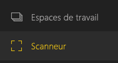
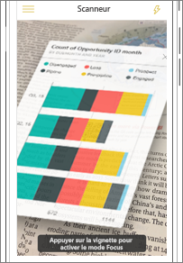
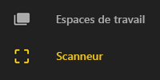
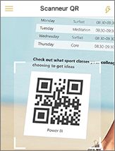
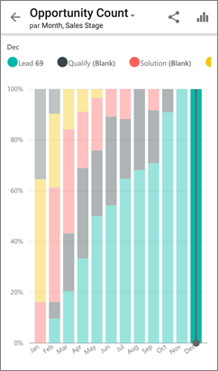

# Scanner un code QR Power BI à partir de votre appareil mobile
S’applique à :

|  |  |  |
|:--- |:--- |:--- |:--- |
| iPhone |Téléphones Android |Tablettes Android |

Les codes QR dans Power BI peuvent connecter n’importe quel élément du monde réel directement à des informations connexes en matière de décisionnel. Aucune navigation ni recherche n’est nécessaire.

Imaginons qu’un collègue ait [créé un code QR dans le service Power BI](../../service-create-qr-code-for-tile.md) pour un rapport ou une vignette dans un tableau de bord, qu’il ait partagé le tableau de bord ou le rapport avec vous et qu’il ait placé le code QR dans un emplacement clé, tel qu’un e-mail ou un élément spécifique. 

Vous pouvez scanner le code QR pour accéder directement à la vignette ou au rapport approprié depuis votre téléphone, à l’aide du scanner de l’application Power BI ou de tout autre scanner installé sur votre téléphone. 

Si votre collègue n’a pas partagé le rapport ou le tableau de bord avec vous, vous pouvez demander l’accès directement à partir de l’application mobile. 

> [!NOTE]
> Vous pouvez aussi [scanner le code QR d’un rapport avec l’application Power BI for Mixed Reality](mobile-mixed-reality-app.md#scan-a-report-qr-code-in-holographic-view).

## Scanner un code QR Power BI sur votre iPhone avec le scanner de Power BI
1. Dans l’application mobile Power BI, ouvrez le menu de navigation globale  en haut à gauche. 
2. Recherchez le **scanner** et sélectionnez-le. 
   
    
3. Si votre appareil photo n’est pas activé, vous devez autoriser l’application Power BI à l’utiliser. Il s’agit d’une autorisation à usage unique. 
4. Pointez le scanner vers le code QR Power BI. 
   
    
5. La vignette ou le rapport semble flotter sur l’arrière-plan en réalité augmentée.
   
    
6. Appuyez sur le rapport ou la vignette pour l’ouvrir en mode focus ou revenez au scanneur.

### Scanner un code QR avec un scanner externe sur votre iPhone
1. Avec un scanner installé sur votre téléphone, pointez vers le code QR Power BI approprié pour un accès immédiat à la vignette ou au rapport. 
2. Si l’application Power BI n’est pas installée, vous êtes redirigé vers l’[Apple Store pour la télécharger](http://go.microsoft.com/fwlink/?LinkId=522062) sur votre iPhone.

## Scanner un code QR Power BI sur votre appareil Android avec le scanner de Power BI
1. Dans l’application mobile Power BI, ouvrez le bouton de navigation globale  dans le coin supérieur gauche. 
2. Recherchez le **lecteur de codes QR** et sélectionnez-le.
   
    
3. Si votre appareil photo n’est pas activé, vous devez autoriser l’application Power BI à l’utiliser. Il s’agit d’une autorisation à usage unique. 
4. Pointez le scanner vers le code QR Power BI. 
   
    
5. La vignette ou le rapport s’ouvre automatiquement dans Power BI.
   
    

### Scanner un code QR avec un scanner externe sur votre appareil Android
1. Avec le scanner installé sur votre appareil Android, pointez vers le code QR Power BI approprié pour un accès immédiat à la vignette ou au rapport. 
2. Si l’application Power BI n’est pas installée, vous êtes redirigé vers [Google Play pour la télécharger](http://go.microsoft.com/fwlink/?LinkID=544867). 

## Étapes suivantes
* [Se connecter aux données Power BI réelles](mobile-apps-data-in-real-world-context.md) avec les applications mobiles
* [Créer un code QR pour une vignette dans le service Power BI](../../service-create-qr-code-for-tile.md)
* [Créer un code QR pour un rapport dans le service Power BI](../../service-create-qr-code-for-report.md)
* Vous pouvez aussi [scanner un code QR avec l’application Power BI for Mixed Reality](mobile-mixed-reality-app.md).
* Vous avez des questions ? [Essayez d’interroger la communauté Power BI](http://community.powerbi.com/)

